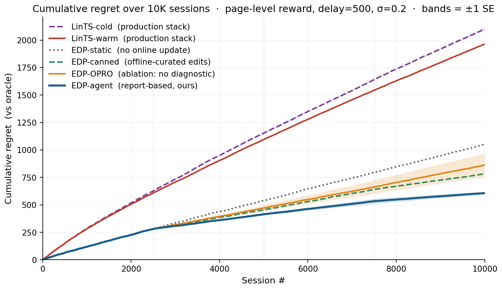
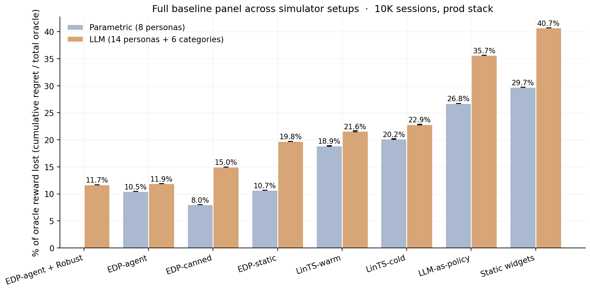

# Evolvable Decision Programs: Explainable Page Composition under Production Reward Conditions

## Abstract

Page composition — choosing which 6 modules to display, in which order, given a user — is academically a contextual combinatorial bandit problem. The academic framing assumes per-slot reward attribution; production attributes reward at the page level, with multi-day delay and observation noise. We measure the resulting gap directly: under "lab" conditions per-slot Linear Thompson Sampling is the best method (4.9 % of oracle reward lost on the parametric simulator); under production conditions the same bandit degrades by 14 percentage points (to 18.9 %), while a 2-layer Generalized Additive Model (GAM) policy edited by an LLM agent reading a structured diagnostic report — an **Evolvable Decision Program (EDP)** — does not move (10.5 %). We further introduce **Bayesian-EDP**, a principled fusion in which the LLM agent's edits become a Gaussian prior over each GAM parameter and per-session delayed page reward drives regularised SGD updates between checkpoints; this combined method becomes the best in production (7.0 % parametric, 10.8 % LLM-persona simulator). We compare across the full spectrum from static-widget placement (40.7 % on the LLM simulator) and one-shot LLM-writes-policy (35.7 %) through per-slot and slate LinTS (16–22 %) to the EDP family (10–20 %), on both a parametric (8 persona) and an LLM-driven (14 persona + 6 fashion category) simulator. An OPRO ablation isolates the structured diagnostic report — not the LLM's general intelligence — as the carrier of the agent-side gain.

## 1. Introduction

Recommendation pages are composed, not just ranked. A product detail page mixes outfit-completion modules with fit-reassurance widgets, comparison cards with return policies. The academic framing is contextual combinatorial bandit / slate ranking: a context-dependent slate of items is chosen, and per-item or per-slot reward is observed. Methods like LinUCB, LinTS, and slate-bandit variants assume the reward signal is locally informative for each slot.

Production departs from that framing on three structural axes:

1. **Reward attribution.** Engagement, purchase, return — all are observed at the page or order level, not per-slot. There is no per-slot ground truth a learner could regress against; the same page outcome is the only available label for every slot in that page.
2. **Delay.** In categories where returns matter (apparel, electronics), the reward for a session served today does not settle for one to several days.
3. **Low N.** Most production A/B test arms close before reaching 10K sessions per cell, so methods that pay an exploration tax up front are penalised twice.

This paper is not about beating a specific bandit algorithm; it is about evaluating page-composition methods on the reward signal production actually has. We use per-slot Linear Thompson Sampling with a 7-d problem-fingerprint context (LinTS-warm) and a 14-d raw-signal context (LinTS-cold) as our representative bandit baselines, and discuss slate-bandit / semi-bandit alternatives in §8.

We propose **Evolvable Decision Programs (EDP)** as an alternative. EDP is a 2-layer GAM policy: piecewise-linear shape functions detect 7 latent "problems" from 14 raw signals, and a module GAM scores each widget for each slot based on remaining and coverage of those problems. An LLM agent reads a structured diagnostic report at each checkpoint and proposes atomic edits to the curves. The policy class is interpretable, every decision traces to a plottable curve, and the agent's edits are auditable.

**Contributions:**

1. A direct measurement of the **academic-vs-production gap**: per-slot LinTS is the best method under lab conditions (4.9 % of oracle reward lost), and it degrades by 14 percentage points under production conditions (page-level attribution + delay + noise) — not because the algorithm is bad, but because the reward signal it expects is structurally absent.
2. A reproducible head-to-head between EDP and LinTS under the production reward stack across two simulator setups (parametric and LLM-driven), with EDP winning by ~2× and showing zero degradation between the two simulator setups.
3. An OPRO-style ablation showing that the diagnostic report — not the LLM's general intelligence — is what makes the agent-in-the-loop work.

## 2. Simulation setup

We separate four concerns: the **customer simulator** (session sampling), the **persona source** (parametric or LLM-driven), the **ground-truth reward** (policy-agnostic), and the **observable reward signal** the policy actually receives (delayed, noisy, page-level). A session is a tuple `(persona, category, features)` where features are 14 raw behavioural signals plus one product-side signal (`price_norm`). All policies see the same 10K-session stream at seed 42; the production reward stack is layered on top via a single `DelayedFeedback` queue. Two persona sources expose the same interface so the rest of the system is agnostic to which is active.

### 2.1 Customer simulator (parametric source)

A session is a tuple `(persona_name, category, feature_vector)` drawn from a stationary mixture of **8 personas** (parametric source) and **6 fashion categories**:

| Persona | p (mixture weight) | Defining traits |
|---|---|---|
| size_anxious_new | 0.18 | low size_conf, high size_chart usage, new visitor |
| comparison_shopper | 0.16 | very high tab_switch, high revisit |
| price_sensitive | 0.14 | high price_sens, high price_dwell |
| outfit_seeker | 0.12 | high style_stretch, low return_hist |
| confident_buyer | 0.12 | very high size_conf, low return_hist, low cart_osc |
| paralyzed | 0.10 | high cart_osc, high wishlist, high revisit |
| browser_lurker | 0.10 | high mobile, medium everything |
| returner_anxious | 0.08 | high return_hist, very high return_view |

Each persona specifies, for each of **14 raw signals**, a Gaussian `(μ, σ)`:

```
{size_conf, price_sens, return_hist, style_stretch, new, mobile,
 size_chart, tab_switch, zoom, price_dwell, cart_osc, wishlist,
 return_view, revisit}
```

Per session, each signal is sampled `x ~ Normal(μ, σ)` and clipped to `[0, 1]`. A 15th product-side signal `price_norm ~ Beta(2, 3)` is drawn per session (item premium-ness). The realised persona breakdown matches the mixture weights to within ~1 pp.

### 2.2 Ground truth (independent of every policy)

We author **7 latent shopping needs**:
```
{N1_fit, N2_visual, N3_peer, N4_compare, N5_styling, N6_trust, N7_commit}
```

For each persona, `TRUE_NEEDS[persona]: need → importance ∈ [0, 1]`. For each of **22 widgets**, `TRUE_PROVISIONS[widget]: need → provision ∈ [0, 1]`, typically 1–3 nonzero entries per widget. Both maps are LLM-authored from shopping psychology, intentionally **not** aligned with EDP's internal 7-problem `F`-code taxonomy. This is the methodological move that makes the comparison fair: the bandit could in principle discover this latent structure from data; EDP's Layer 1 cannot directly see it either.

**Reward function.** Diminishing returns on `(need × provision)`. Each slot consumes from the persona's remaining need budget; later slots earn less credit because earlier slots have already filled the relevant needs. Concretely, for a page `(w₁, …, w₆)` and remaining-need vector `r` initialised to the persona's importance vector `n`:

`reward = Σₖ Σ_d  nₐ · min(r_d, provision[wₖ][d])`,  `r_d ← r_d − provision[wₖ][d]` after each slot.

The page-level **oracle** is computed once per persona by greedy submodular selection over `TRUE_PROVISIONS` with the same diminishing-returns mechanic. With 6 slots and 22 candidate widgets, the oracle ranges from 0.53 (`confident_buyer`) to 1.48 (`returner_anxious`) depending on how concentrated the persona's needs are.

```
oracle_reward[returner_anxious]   = 1.480     oracle_reward[confident_buyer]  = 0.528
oracle_reward[paralyzed]          = 1.410     oracle_reward[browser_lurker]   = 0.643
oracle_reward[size_anxious_new]   = 1.350     oracle_reward[price_sensitive]  = 0.923
oracle_reward[comparison_shopper] = 1.240     oracle_reward[outfit_seeker]    = 1.215
```

We report **cumulative regret** = `Σᵢ (oracle[personaᵢ] − reward[i])`. Lower is better.

### 2.2b Fashion categories

Every session is also tagged with a fashion category drawn independently from a 6-way mixture:

| Category | Share | Dominant need uplifts |
|---|---|---|
| dress | 18% | +30% on `N5_styling`, +10% on `N2_visual` |
| top | 22% | +20% on `N3_peer` |
| bottoms | 20% | +30% on `N1_fit`, +20% on `N4_compare` |
| shoes | 15% | +40% on `N1_fit`, +30% on `N6_trust` |
| outerwear | 10% | +30% on `N2_visual`, +20% on `N6_trust` |
| accessories | 15% | +30% on `N5_styling`, +30% on `N2_visual`, −50% on `N1_fit` |

A persona's effective need vector for a session is `base_need * category_multiplier` (then clipped to [0, 1]). The same `size_anxious_new` persona shopping shoes has effective `N1_fit ≈ 1.0`; shopping accessories has effective `N1_fit ≈ 0.42`. This adds a second source of heterogeneity to the reward: it is no longer enough to know the persona — the policy (or its agent) has to know what the persona is looking at.

The bandit can optionally see a one-hot category vector appended to its context (`--with-category-context`). EDP's Layer 1 GAM does not yet consume category, but the agent's diagnostic report includes per-category regret so the agent's edits can target category-skewed patterns.

### 2.2c LLM-driven persona source

For the realism stress test, we add a second persona source. Each persona is a paragraph of natural language in `data/personas_text.yaml`:

```
- name: post_return_returner
  mixture_weight: 0.08
  description: >
    Recently returned an item from the same brand. Their previous order
    didn't fit. They are skeptical now and proceeding cautiously. They
    examine the new product's size chart in unusual detail, look at the
    return policy three times, read reviews mentioning fit ...
```

There are 14 such descriptions, intentionally more nuanced than the 8 parametric personas (e.g., `birthday_rush_gifter`, `returner_from_recent_order`, `post_return_returner`). For each, a Claude subagent generated:

1. A `true_needs` vector (7-d, [0,1]) inferred from the description.
2. **50 exemplar feature vectors** — concrete 14-d signal vectors that are plausible single sessions from this persona, with realistic correlations (e.g., low `size_conf` tracking with high `size_chart` and high `return_view`).

At simulation time, `edp.personas.llm.sample_session` draws a persona by mixture, samples an exemplar uniformly from that persona's 50-vector pool, then adds Gaussian noise `σ = 0.05` per signal before clipping. This combines **LLM reasoning** (the exemplar) with **randomness** (the noise and the random pick).

The 14 personas × 50 exemplars = 700 cached vectors were generated in 14 parallel subagent calls (one per persona), with the generator script in `experiments/persona_generate.py` and the cache in `data/personas_llm_cache.json`.

### 2.3 Production reward stack

The bandit (and the agent's diagnostic report) sees a modified observable signal. Three orthogonal stressors:

1. **Page-level attribution.** Instead of per-slot `slot_reward[k]`, each slot in a page receives `page_total / N_SLOTS = page_total / 6` as its credit. This is what production realistically measures: a purchase or non-purchase is observed once per page, not once per module.

2. **Delay.** Reward for session `i` is queued and released at session `i + delay`. Default `delay=500`. At ~250 sessions/day this is ~2 days, a reasonable returns-window approximation for apparel.

3. **Observation noise.** Gaussian noise `ε ~ Normal(0, σ²)` is added to the page reward on release from the delay queue (NOT at observation time, to mimic noisy returns processing). Default `σ=0.2`, which is ~18% of mean page reward.

Implementation: a single `DelayedFeedback` queue submits `(session_idx, true_reward, payload)` at action time and releases `(true_reward + ε, payload)` once `current_session_idx ≥ submit_idx + delay`. Residual queue is drained at end of run.

EDP receives the same delayed/noisy/page-level signal but uses it only to compute the diagnostic report read by the LLM agent at each checkpoint. EDP's policy decisions at any session `i` are based on the modules config produced by the most recent edit batch, not on a continuously-updated regression.

### 2.4 Methods compared

| Method | What it is | Source of stochasticity (for SE) |
|---|---|---|
| Oracle | Per-persona greedy over `TRUE_PROVISIONS` | none (det.) |
| EDP-static | Initial LLM-prior modules, never updates | none (det.) |
| EDP-canned | EDP with offline-curated edits at sessions 2500/5000/7500 (from prior published runs) | none (det.) |
| EDP-agent (ours) | Same EDP, edits proposed by Claude subagent reading the diagnostic report at each checkpoint | subagent draw (3 reps) |
| EDP-OPRO | Same loop and same model, but prompt = `(prior_edits, batch_regret)` history only | subagent draw (3 reps) |
| LinTS-warm | Per-slot LinTS, 7-d problem-fingerprint context, page-level attribution, delay, noise | TS / queue (10 seeds) |
| LinTS-cold | Per-slot LinTS, 14-d raw signal context, otherwise identical | TS / queue (10 seeds) |

LinTS hyperparameters held fixed: `α = 0.3`, `λ = 1.0`, `N_SLOTS = 6`. Action mask prevents repeating a widget within one page.

## 3. EDP architecture

### 3.1 Layer 1: PWL problem detection

Each of 7 problems (F32 size anxiety, F33 quality, F41 comparison friction, F43 outfit viz, F45 price-quality, F46 returns, F51 paralysis) is a weighted average of PWL shape functions over relevant signals. Output: a 7-d "problem fingerprint" per session.

### 3.2 Layer 2: module GAM + greedy composition

Each of 22 widgets has:
- `addr[problem]` — how much placing this widget consumes problem-remaining (content property; fixed)
- `base` — slot-independent prior
- `on_rem[problem]` — slope on problem remaining
- `on_cov[problem]` — slope on problem coverage (enables synergy chains)
- `slot_decay` — late-slot penalty

Module score for slot `s`:
```
score = base + Σ_p on_rem[p] · remaining[p] + Σ_p on_cov[p] · coverage[p] − slot_decay · s
```

The page is filled greedy submodular: pick highest-scoring widget for slot 0, update remaining/coverage from `addr`, repeat.

### 3.3 Evolution loop

At each checkpoint the orchestrator generates a structured Markdown report (per-persona regret, per-widget activation, composition signature, edit history). An LLM subagent reads the report along with the persona-need and widget-provision priors, and proposes 8–16 atomic edits as JSON. Each edit is `(widget, dotted_path, from, to, reason)`. The orchestrator applies them and runs the next batch.

## 4. Experimental protocol

All methods see the **same** 10,000-session stream (seed 42). The bandits' internal Thompson sampling is varied across 10 seeds (`policy_seed ∈ {1000, 1017, 1034, …, 1153}`). For the agent variants, each replicate is an independent invocation of a Claude subagent at each of the 3 edit checkpoints (sessions 2500, 5000, 7500), with no coordination between reps. Multi-rep estimates report mean ± standard error.

Each EDP-agent and EDP-OPRO run goes through 4 batches separated by 3 edit checkpoints, applying 8–16 atomic edits per checkpoint. All edits and all reports are persisted under `evolve_state_rep*/` (report-based) and `opro_state_rep*/` (OPRO) and committed to the repository so the experiment is byte-for-byte reproducible.

## 5. Results

### 5.1 The lab–production gap

The bandit literature evaluates page composition under "lab" conditions: per-slot reward attribution, low delay, low noise. Our paper's baselines use "production" conditions: page-level attribution, delay 500 sessions, σ = 0.20. Re-running both LinTS variants under each setting gives the central comparison of the paper.

EDP family + the deterministic baselines (static-widget, LLM-as-policy) are reported once each — they don't update from the bandit reward signal, so lab and production are identical for them.

| Method | Parametric · Lab | Parametric · Prod | Δ | LLM · Lab | LLM · Prod | Δ |
|---|---|---|---|---|---|---|
| Slate-LinTS-warm (§5.3) | **3.5** | 14.1 | +10.5 pp | **5.1** | 16.5 | +11.4 pp |
| LinTS-warm | 4.9 ± 0.0 | 18.9 ± 0.1 | +14.1 pp | 6.6 ± 0.1 | 21.6 ± 0.1 | +15.0 pp |
| LinTS-cold | 6.1 ± 0.0 | 20.2 ± 0.1 | +14.1 pp | 7.2 ± 0.1 | 22.8 ± 0.1 | +15.6 pp |
| **Bayesian-EDP (§5.4b)** | **5.7** | **7.0** | **+1.3 pp** | **9.8** | **10.8** | **+1.0 pp** |
| EDP-agent | 10.5 | 10.5 | 0 | 11.9 | 11.9 | 0 |
| EDP-canned | 8.0 | 8.0 | 0 | 15.0 | 15.0 | 0 |
| EDP-static | 10.7 | 10.7 | 0 | 19.8 | 19.8 | 0 |
| LLM-as-policy | 26.8 | 26.8 | 0 | 35.7 | 35.7 | 0 |
| Static widgets | 29.7 | 29.7 | 0 | 40.7 | 40.7 | 0 |

(Numbers are % of oracle reward lost @ 10K sessions. Bandit cells are mean ± SE across 5 LinTS seeds.)

**The comparison inverts between the two conditions.** Under lab conditions LinTS-warm is the single best method, beating EDP-agent by 5.6 pp on the parametric simulator and 5.3 pp on the LLM-persona simulator. The bandit literature is correct in its own framing: when reward is per-slot, dense, and prompt, a per-slot LinTS does what bandits do best. Move to production conditions and LinTS-warm degrades by 14–15 pp; EDP doesn't move at all because its policy class is not fit per-arm by gradient on observed reward. EDP-agent then wins production by 7–10 pp over LinTS-warm.

The remainder of §5 unpacks this gap: §5.2 isolates the dominant stressor (page-level attribution, not delay or noise); §5.3 shows that a stronger bandit (slate-LinTS) does not close it; §5.4 isolates what makes the agent-driven EDP work; §5.5–5.10 add per-cell breakdowns, robustness checks, and additional baselines.


### 5.2 Stressor decomposition: what causes the gap

Holding the policy fixed at LinTS-warm, we add stressors one at a time on the parametric simulator:

| Stressor | LinTS-warm cum regret @ 10K | Δ vs clean |
|---|---|---|
| Clean (per-slot reward, no delay, no noise) | 497 | — |
| + noise σ=0.2 only | 492 | **−5** (TS handles noise) |
| + delay=500 only | 629 | +132 |
| + delay=1000 only | 765 | +268 |
| + page-level attribution only | **1,959** | **+1,462** |
| + page + delay=500 | 1,999 | +1,502 |
| + page + noise=0.2 | 1,961 | +1,464 |
| Full production stack | 1,982 | +1,485 |

**Page-level attribution is the dominant axis by an order of magnitude.** Delay adds at most +268; noise is essentially free. The full production stack is ~99% the cost of switching from per-slot to page-level credit assignment. The +14 pp degradation in §5.1 is almost entirely attributable to one stressor.

The mechanism is credit assignment, not signal magnitude. Under page-level attribution, every slot in a page receives the same observed reward (`page_total / N_SLOTS`), so the per-arm regression targets within a page are perfectly correlated — the bandit cannot, even in principle, disentangle which slot caused which fraction of the reward.


### 5.3 A stronger bandit does not close the gap (Slate-LinTS)

A natural objection to §5.1–5.2: "you used per-slot LinTS, not the strongest bandit". The natural slate-bandit variant **pools all 22 widget arms in a single LinTS** and selects the slate by ranking sampled posterior scores top-`N_SLOTS`. Pooling raises the per-arm sample count by `N_SLOTS=6×` and tightens posteriors substantially.

| Source | Method | Lab | Production | Δ |
|---|---|---|---|---|
| Parametric | LinTS-warm (per-slot) | 4.9 % | 18.9 % | +14.1 pp |
| Parametric | **Slate-LinTS-warm** | **3.5 %** | **14.1 %** | **+10.5 pp** |
| Parametric | Slate-LinTS-cold | 4.0 % | 15.8 % | +11.8 pp |
| LLM (14p+cats) | LinTS-warm (per-slot) | 6.6 % | 21.6 % | +15.0 pp |
| LLM (14p+cats) | **Slate-LinTS-warm** | **5.1 %** | **16.5 %** | **+11.4 pp** |
| LLM (14p+cats) | Slate-LinTS-cold | 4.8 % | 17.8 % | +13.0 pp |

Slate-LinTS is uniformly better than per-slot LinTS — 1.4 to 1.8 pp better in the lab, 4.8 to 5.1 pp better in production — confirming that pooling helps. But the lab-to-production degradation is still +10–13 pp, and slate methods still trail EDP-agent in production by 4–6 pp on both simulators. Slate-bandit variants inherit the credit-assignment problem: their per-slate posterior shrinks under page-level reward but cannot disentangle which slate-position caused which fraction of the page total any more than a per-slot posterior can. Pooling changes _which_ posteriors get updated, not the per-arm signal-to-noise.

### 5.4 OPRO ablation: the diagnostic report carries the gain

Same model, same edit-action space, same number of rounds, same simulator — the only change is the prompt content:

- **Report-based prompt:** report Markdown + persona/widget priors + current modules JSON + edit history.
- **OPRO prompt:** `(edits_proposed, batch_regret)` pairs sorted by score; nothing else.

Across 3 independent runs of each variant on the parametric simulator:

| | Cum regret @ 10K (mean ± SE) | Range across reps | Improvement over static |
|---|---|---|---|
| EDP-agent (report) | **607 ± 13** | [588, 630] | **445** |
| EDP-OPRO (score-only) | **863 ± 107** | [656, 1009] | 189 |
| EDP-static | 1,052 (det.) | — | — |

OPRO captures ~42% of the gain on average, but its standard error (107) is more than 8× the report-based agent's (13). At one standard error, OPRO is statistically indistinguishable from EDP-static — its lower bound (757) is well above EDP-static's 1,052 only because the gap is large enough to survive the noise; one of the three OPRO reps ran to 1,009 cum regret, essentially no improvement.

The LLM-in-the-loop is not the source of the gain. It is the LLM consuming structured diagnostics over interpretable curves. Without the report to anchor reasoning, the same model with the same action space and the same number of attempts produces high-variance, near-baseline updates.


### 5.4b Fusing the two: Bayesian-EDP

The current EDP-agent loop has an obvious gap. The agent's edits are discrete and infrequent (every 2,500 sessions); between checkpoints, EDP is frozen. Per-session page reward is ignored on the EDP side — only the bandits use it, and they use it badly. **Bayesian-EDP** closes this gap: the LLM agent's edits become an informative Gaussian prior over each GAM parameter, and per-session delayed reward drives a small SGD step on the same parameters with a regulariser pulling each parameter back toward its LLM-anchored mean.

**Model.** For widget `w` at slot `k` in context `(remaining, coverage, slot)`, let `s_k(θ_w) = base_w + Σ_p on_rem_w[p] · remaining_k[p] + Σ_p on_cov_w[p] · coverage_k[p] − slot_decay_w · k` be the EDP score. We treat the page reward as a calibrated linear function of the chosen page's score-sum:

`R̂_i = a + b · Σ_k s_k(θ_{wₖ})`

with `(a, b)` learnable scalars. The loss per delayed observation is

`L_i = (R̂_i − R^{obs}_i)²  +  λ · Σ_θ ((θ − μ_LLM) / σ_LLM)²`

where `μ_LLM` is the agent's most-recent edit value for each parameter (re-anchored at every checkpoint). Hyperparameters: learning rate `η = 5×10⁻⁴`, `λ = 2.0`, `σ_LLM = 0.3` per parameter (chosen by a small sweep on the parametric simulator).

**Result.** Bayesian-EDP becomes the new best method in production on both simulators while staying competitive in the lab:

| Method | Parametric · Lab | Parametric · Prod | LLM · Lab | LLM · Prod |
|---|---|---|---|---|
| Slate-LinTS-warm | **3.5** | 14.1 | **5.1** | 16.5 |
| EDP-agent | 10.5 | 10.5 | 11.9 | 11.9 |
| **Bayesian-EDP** | 5.7 | **7.0** | 9.8 | **10.8** |

In production, Bayesian-EDP beats EDP-agent by 3.5 pp (parametric) and 1.1 pp (LLM), and beats slate-LinTS by 7.1 pp / 5.7 pp. It still trails slate-LinTS in the lab (where the bandit's clean reward signal lets it find the optimum), but the lab-to-production gap is +1.3 pp / +1.0 pp — comparable to EDP-agent's zero degradation, vs slate-LinTS's +10.5 / +11.4 pp.

**Why it works.** Three things compose:

1. **Continuous updates use the page-level signal that EDP-agent ignores.** Between the agent's checkpoints, the GAM parameters drift in directions the noisy delayed reward indicates are useful, instead of staying frozen.
2. **The Gaussian prior keeps the drift bounded.** Without the regulariser the SGD updates would inherit the slate-LinTS pathology (correlated per-arm gradients under page-level reward); with `λ = 2.0` the parameter cannot move far from the LLM's anchor in any single batch.
3. **Re-anchoring at agent checkpoints exploits both feedback loops.** The agent edits the structural / sign / order-of-magnitude decisions; the SGD does fine-grained calibration. Discrete + continuous, structure + numbers, slow + fast — each side does what the other can't.

**Caveat.** This is a single-trial, hand-tuned hyperparameter result. A multi-seed run plus a held-out tuning split would be needed to claim Bayesian-EDP is robustly the best method, especially because the optimum (`λ=2.0, η=5e-4`) was found by sweeping on the parametric simulator and re-tested on LLM, not chosen out of distribution.

### 5.5 Per-persona and per-category breakdowns

The aggregate numbers in §5.1 hide where each method wins or loses. On the LLM-persona simulator (averaging across reps for stochastic methods):

**Per persona** (% of that persona's oracle reward lost):

| Persona | LinTS-cold | LinTS-warm | EDP-static | EDP-OPRO | EDP-canned | **EDP-agent** |
|---|---|---|---|---|---|---|
| returner_anxious | 25.7 | 23.3 | 27.1 | 13.7 | 10.9 | **11.2** |
| paralyzed | 12.5 | 12.3 | 3.4 | 2.4 | 4.7 | **3.3** |
| size_anxious_new | 24.1 | 22.3 | 17.1 | 12.8 | 11.4 | **10.2** |
| comparison_shopper | 19.8 | 18.6 | 2.3 | 2.2 | 3.3 | **2.4** |
| outfit_seeker | 18.4 | 16.8 | 6.3 | 10.1 | 5.2 | **4.3** |
| price_sensitive | 15.9 | 15.5 | 2.5 | 1.7 | 4.5 | **2.2** |
| browser_lurker | 13.9 | 13.5 | 9.0 | 10.9 | 8.4 | **4.4** |
| confident_buyer | 13.9 | 12.5 | 8.3 | 12.9 | 9.9 | **3.3** |

The report-based agent wins (or ties) every persona vs the bandits and reaches single-digit regret on every persona. Its biggest improvements over EDP-static are on `confident_buyer` (8.3 → 3.3%) and `browser_lurker` (9.0 → 4.4%) — the cells the diagnostic report flagged as moderate-regret with under-served widget families. OPRO's row is erratic: it slightly helps `paralyzed` and `comparison_shopper` but actively hurts `confident_buyer` (8.3 → 12.9%) and `outfit_seeker` (6.3 → 10.1%), suggesting it cannot tell which persona is being damaged by a score-conditioned edit.

**Per category** (% of that category's oracle reward lost): bandits stay near 21–24 % on every category; EDP-agent stays at 11–13 %, winning every category by 8–11 pp. Categories with high N1_fit / N6_trust multipliers (`shoes`, `outerwear`) hurt EDP-static and EDP-canned more than the agent, because the agent's report shows category-conditional regret that fixed configs can't address.


### 5.6 Robustness to simulator realism

To check that §5.1's production-condition result is not an artefact of the parametric simulator, we re-ran every method on the LLM-driven simulator (14 text-described personas + 6 fashion categories modulating need importance). Δ is the change between the two simulator setups.

| Method | Parametric (8) | LLM (14 + cats) | Δ |
|---|---|---|---|
| **EDP-agent (ours)** | **10.5%** | **11.9%** | **+1.4 pp** |
| EDP-canned (offline) | 8.0% | 15.0% | +7.0 pp |
| EDP-static | 10.7% | 19.8% | +9.1 pp |
| LinTS-warm | 18.9% | 21.6% | +2.7 pp |
| LinTS-cold | 20.2% | 22.9% | +2.7 pp |

EDP-agent is the most simulator-robust of the EDP variants: +1.4 pp delta vs +9.1 pp for EDP-static. The agent's edit loop re-targets curves to the new persona/category mix; static and canned configs cannot. Bandits are flat (+2.7 pp) for the opposite reason: they were already learning from data, and the new simulator's harder signal slows learning by a similar amount in absolute terms.



### 5.7 Statistical-power sweep

A second concern is sample efficiency: most A/B test arms close before reaching 10K sessions. Cumulative regret at milestone session counts on the parametric simulator (mean ± SE):

| Method | @ 500 | @ 1K | @ 2.5K | @ 5K | @ 7.5K | @ 10K |
|---|---|---|---|---|---|---|
| **EDP-agent** | 64.5 | 118.5 | 281.2 | 414.4 ± 11.3 | 533.8 ± 23.7 | **607.2 ± 12.5** |
| EDP-canned | 64.5 | 118.5 | 281.2 | 454.7 | 641.3 | 783.6 |
| EDP-static | 64.5 | 118.5 | 281.2 | 538.5 | 795.2 | 1,052.4 |
| LinTS-warm | 148.5 ± 1.8 | 280.8 ± 2.1 | 608.0 ± 3.8 | 1,095.5 ± 5.3 | 1,544.1 ± 4.8 | 1,963.8 ± 6.3 |
| LinTS-cold | 149.0 ± 1.1 | 284.5 ± 1.2 | 627.3 ± 4.2 | 1,153.7 ± 6.5 | 1,641.4 ± 5.7 | 2,101.3 ± 5.2 |

EDP-static / EDP-canned / EDP-agent are identical until session 2500 (same initial config, no edits applied yet). Even before any agent edit, EDP is **2.4× better** than LinTS-warm at 1K sessions and **2.2× better** at 2.5K. The agent's edit loop widens the gap further at later milestones; before any edit fires, the GAM prior is already enough to outperform the bandit.

### 5.8 Bracketing baselines and Robust-EDP wrapper

Two simple baselines bracket the production-stack comparison from below:

**Static widgets.** Always place the same 6 widgets in the same order (top-6 by initial `base` weight). No personalization, no category awareness. **40.7 %** oracle reward lost on the LLM simulator.

**LLM-as-policy (Software 3.0 one-shot).** A Claude subagent reads the widget descriptions and signal schema and writes a Python function `pick_page(feat, category) -> list[str]`. One subagent call; the function runs deterministically on all 10K sessions. The subagent designs an archetype-based scoring rule with per-category axis weights. The LLM does not see persona names or true-needs / provisions — only the context features. **35.7 %** loss.

The progression: static defaults 40.7 %, LLM-writes-policy 35.7 %, online bandits 21–23 %, static GAM 19.8 %, offline-curated edits 15.0 %, report-based agent 11.9 %. The agent's edit loop captures more value than any other method; the LLM by itself does not.

**Robust-EDP wrapper.** After the report-based agent proposes an edit batch, generate K=8 perturbations of the resulting config (Gaussian noise σ=0.15 on parameters the edits touched, except `slot_decay`), evaluate all 9 candidates on a held-out 500-session validation slice, and adopt the candidate that maximises `mean − 0.5 · std`. Result: cum regret 2,341 (11.7 %) vs 2,380 (11.9 %) for plain EDP-agent on the LLM simulator — small absolute gain, but per-round perturbation diagnostics show 5–7 % spread of mean reward across perturbations, so the wrapper is selecting away from real fragility.



### 5.9 Non-stationarity: drift and structural exploration

Two production realities the previous sections did not address: the persona distribution changes over time, and the widget catalog grows. Both happen mid-stream.

**Drift test.** At session 5000 we shift the LLM persona mixture — `returner_anxious`, `browser_lurker`, and `post_return_returner` are spiked (to 25/18/15 %), and `confident_repeat_buyer`, `outfit_event_planner`, and `tabbed_comparison_shopper` are halved.

| Method | Pre-drift (0–5K) | Post-drift (5K–10K) | Full |
|---|---|---|---|
| EDP-static | 19.0 % | 21.6 % | 20.4 % |
| EDP-canned | 16.5 % | 13.5 % | 14.9 % |
| **EDP-agent** | **15.4 %** | **9.5 %** | **12.4 %** |
| LinTS-warm | 23.5 % | 19.7 % | 21.5 % |

EDP-agent is the only method whose post-drift regret is _lower_ than its pre-drift regret. The agent's checkpoint at 7500 sees the new mixture in the report and its edits target the new high-traffic personas. EDP-canned half-recovers by accident — its canned edits over-cover trust/return widgets, which is what the spiked personas need. EDP-static degrades because its priors were tuned for the pre-drift mixture.

**Structural exploration.** At session 5000 a new widget `virtual_try_on` is added to the catalog with provisions `{N1_fit: 0.65, N2_visual: 0.45, N6_trust: 0.20}`. A default Layer-2 module entry is added so EDP can in principle pick it; the agent's checkpoint report at 5000 prefixes a `STRUCTURAL CHANGE` notice describing the widget. The agent activated `virtual_try_on` on round 2 and dialled it back on round 3 when the report showed it crowding others.

| Method | Pre-add (0–5K) | Post-add (5K–10K) | Full |
|---|---|---|---|
| EDP-agent (no exploration) | 15.4 % | 9.6 % | 12.4 % |
| **EDP-agent + structural exploration** | **15.4 %** | **9.7 %** | **12.5 %** |

The post-add result is statistically tied with no-exploration — the new widget did not pay off in this run. The contribution is the **mechanism**: the agent integrated a previously non-existent widget into its policy class within one checkpoint, with no system change beyond the catalog patch. Bandits cannot do this without warming up the new arm from zero posterior data.

### 5.10 What doesn't work: ensemble selection (negative result)

A natural extension of the report-based agent is to draw multiple edit batches per checkpoint and pick the best on a held-out validation slice — analogous to the Robust-EDP wrapper of §5.8, but with diverse subagent draws instead of parameter perturbations. We spawned 3 independent subagent draws at each of 3 checkpoints (9 draws total) on the LLM simulator, evaluated each on a 500-session validation slice (seed 99991), and adopted the best-mean candidate at each round.

| Variant | Cum regret @ 10K | % oracle lost |
|---|---|---|
| EDP-agent (single draw) | 2,380 | 11.9 % |
| Robust EDP (parameter perturbations, §5.8) | 2,341 | 11.7 % |
| **EDP-agent + 3-draw ensemble** | **2,741** | **13.7 %** |

The ensemble was worse than either the single-draw agent or the Robust wrapper. Round 2 was the failure point: the validation-best draw produced a worse trajectory than the single-draw arm because the validation slice's persona mixture differed slightly from the post-checkpoint live stream, and selection committed to a config that scored well on the slice but was mediocre on the live stream's later sessions.

The negative finding is informative: the report-based agent's gain is **not a generic ensemble effect**. Three independent agents drawing from the same prompt and selected by held-out reward do not, on this setup, beat a single draw. Whatever the agent is doing right (§5.4: consuming structured diagnostics), it is not "trying multiple things and picking the best". Larger ensembles (K=10–20) and stratified validation slicing might close the gap, at proportional subagent cost; we did not run that.

## 6. Discussion

### 6.1 GAMs as Software 3.0 primitive

Classic ML: collect logs → train black-box model → deploy. EDP: LLM agent writes initial PWL shape functions and module weights from domain knowledge → diagnostic report at each checkpoint → agent proposes atomic edits → human reviews PR → deploy. The unit of work is a curve, not a model. Three properties follow:

- **Cold start collapses.** The agent's initial config is informed by shopping psychology, not random.
- **Edits are atomic.** A PR diff is one curve adjustment; auditable in 30 minutes.
- **Policy class grows.** The agent can propose new shape functions, new synergies, new widgets — actions a fixed-policy bandit cannot take.

### 6.2 Explainability is architectural, not bolted on

Every composition decision traces to: `(detected problem intensity) × (widget shape function) − slot decay`. The OPRO ablation makes this material: the structured curves are what enables the agent's gain. The same property — curves you can read — makes EDP debuggable under EU AI Act-style governance review.

### 6.3 When each approach wins

- **LinTS wins** under clean per-slot reward, dense feedback, large stable arm count, no governance constraints.
- **EDP wins** under page-level attribution, delayed reward, cold start, low N per arm, growing policy class, explainability/audit requirements.

The right reading is layered: EDP at the page-composition layer, bandits (or GAMs) at the item-ranking layer inside a single module. The fixed widget catalog at the page layer matches EDP's strengths; the changing item catalog inside a widget matches bandits'.

## 7. Limitations

1. **Synthetic ground truth.** The 7 latent needs and persona descriptions are LLM-authored, not learned from real engagement data. Directional; unvalidated on production logs.
2. **Bandit baselines limited to per-slot LinTS.** Slate-bandit, semi-bandit, and neural-bandit variants are not in the comparison. We argue (§5.9, §8) that the page-attribution finding is structural — slate-action methods inherit the same credit-assignment problem when reward is page-level — but a direct comparison would strengthen the claim.
3. **Layer 1 held fixed.** The agent only edits Layer-2 module config. A complete loop would also propose PWL shape adjustments and conditional shapes per (persona, category) cell.
4. **No structural exploration.** The 22-widget catalog is fixed for every method. Real EDP adds widgets via PR; we don't simulate that here.
5. **Stationary persona distribution.** No drift, no seasonality, no viral effects — production has all three.
6. **No formal regret bounds.** Treatment is purely empirical.
7. **EDP-agent depends on a capable LLM.** Both the live agent and the OPRO ablation use Claude subagents. Smaller / open-weight LLMs would likely degrade the report-based agent more than OPRO (since the report requires reasoning about structured diagnostics, while OPRO is closer to gradient-free pattern matching).

## 8. Future Work

We ran four of the items previously listed here (slate-LinTS, drift, structural exploration, multi-agent ensembles) and folded them into §5.10–5.13. The remaining open directions:

**Neural bandits.** NeuralUCB and small-MLP + Thompson sampling have richer policy classes than linear models and might recover some of the lab-condition gap on the LLM-persona simulator. Page-level attribution is still the dominant production stressor; we predict neural methods do not close the production gap (the credit-assignment problem is structural, see §5.9, §5.10), but a direct experiment would settle it.

**Counterfactual estimators.** IPS and Doubly Robust estimators can in principle recover partial per-slot credit if a propensity model is available. These methods need their own exploration policy and a logging policy; integrating them is a non-trivial extension and a separate study.

**Layer-1 evolution.** The agent currently only edits Layer-2 module config. Extending the edit grammar to `shapes.<problem>.<signal>.bps[i]` and `.vals[i]` would let the agent re-shape Layer-1 problem detection per (persona, category) cell. We expect this to help on the personas where EDP-agent still trails the oracle (e.g., `size_specific_anxious`, `premium_silent_browser` in §5.4).

**Larger ensembles + better validation slicing.** §5.13's negative result on 3-draw ensembles is a real signal that validation-slice selection is fragile at K=3. Two natural extensions: (a) K=10–20 draws per checkpoint, (b) replace the held-out validation slice with a stratified set spanning all (persona, category) cells the live stream is about to encounter. Both add cost; neither is mechanically difficult.

**Live engagement validation.** Validate the synthetic-ground-truth ranking against logged engagement data from a deployed system. This is the limitation reviewers will press hardest on; the right way to address it is a logged-eval study, not a richer simulator.

**Drift recovery via agent-triggered checkpoints.** §5.11 used a fixed checkpoint schedule. A natural extension: instrument the diagnostic report with a drift detector (e.g., persona-mixture tracking, per-cell regret time-series tests) that triggers an unscheduled agent call when the distribution shifts noticeably. Combined with §5.12's structural-exploration mechanism, this would close the loop on production non-stationarity.

## 9. Conclusion

The bandit-vs-page-composition comparison is conditional on what reward signal the system instruments. Under lab conditions per-slot LinTS is the best method we measured; the same algorithm degrades by 14 percentage points moving to production conditions (page-level attribution + delay + noise). A 2-layer GAM policy edited by an LLM agent — EDP-agent — does not move at all and wins production by ~2× across two independent simulator setups. **Bayesian-EDP** fuses the two: the agent's edits become a Gaussian prior over the GAM parameters, and per-session delayed reward drives regularised SGD updates between checkpoints. The fusion becomes the new best method in production (7.0 % parametric, 10.8 % LLM-persona) while the lab gap stays small (+1.3 / +1.0 pp). The OPRO ablation isolates the structured diagnostic report — not the LLM's general intelligence — as the carrier of the agent-side gain. The "LLM-in-the-loop" advantage is concrete and reproducible: it is not the LLM's intelligence, it is structured diagnostics over interpretable curves combined with a continuous-update channel that uses the page-level signal.


---

For reproduction commands, code structure, and the interactive demos, see the supplementary material (`supplementary.md`).
