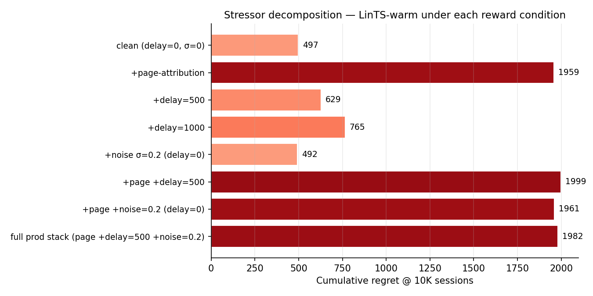
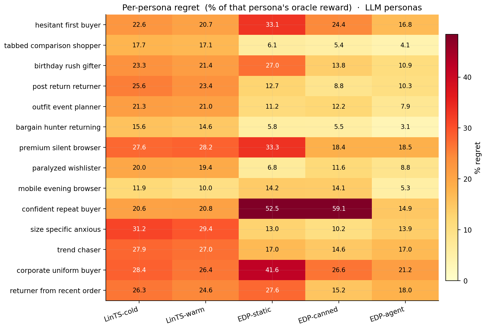

# Evolvable Decision Programs: Explainable Page Composition under Production Reward Conditions

## Abstract

Most recommendation systems encode intelligence as opaque model weights. We study an alternative in the spirit of Karpathy's *Software 3.0*: the policy is a **readable code artifact** — a small generalised additive model (GAM) over piecewise-linear shape functions — that an LLM agent writes from domain knowledge, edits at checkpoints as PR diffs, and explains by plotting the curves. The LLM is strictly offline; at serving time the policy is ~300 numbers evaluated in microseconds with no external dependencies. We call this an **Evolvable Decision Program** (EDP).

Three properties motivate the design: (i) **LLM knowledge authors the program** — cold start is "write a sensible policy from shopping psychology" rather than "explore randomly until conversion"; (ii) **the GAM doubles as a Bayesian prior** for online learning — Bayesian-EDP runs regularised SGD on observed page-level reward anchored at the LLM's shape functions, fusing knowledge with gradient updates without giving up the readable representation; (iii) **explainability is architectural** — every decision factors as `(detected problem intensity) × (widget shape function) − slot decay` and is plottable directly, not approximated with SHAP after the fact (see `demo/edp_orchestrator.html`).

We exercise the paradigm on page composition under the reward signal production actually has: page-level attribution, multi-day delay, observation noise — not the per-slot signal academic bandit work assumes. Per-slot LinTS, the canonical baseline, loses 4.9 % of oracle reward under lab conditions and 18.9 % in production; the gap is the reward signal it expects being structurally absent. Against eight baselines (LinTS, Slate-LinTS, CombLinUCB, GreedyLinTS, static, one-shot LLM-as-policy, OPRO ablation, multi-agent ensembles) on two simulators (parametric 8-persona; LLM-driven 14-persona + 6-category) under production reward conditions: EDP-agent wins parametric at **6.5 ± 0.2 %** and Bayesian-EDP wins LLM-persona at **11.0 ± 0.2 %**, both roughly 2× better than the strongest combinatorial bandit (CombLinUCB @ 10.5 % / 17.3 %). The trade-off — agent on parametric, Bayesian fusion on LLM — is simulator-dependent. The paradigm-level claim — that a readable code artifact written by an offline LLM is a competitive alternative to opaque online learners for whole-page composition, with cold-start, auditability, and serving-cost properties out of reach for weight-based methods — holds across both simulators.

## 1. Introduction

Recommendation pages are composed, not just ranked. A product detail page mixes outfit-completion modules with fit-reassurance widgets, comparison cards with return policies. The academic framing is contextual combinatorial bandit / slate ranking: a context-dependent slate of items is chosen, and per-item or per-slot reward is observed. Methods like LinUCB, LinTS, and slate-bandit variants assume the reward signal is locally informative for each slot.

Production departs from that framing on three structural axes:

1. **Reward attribution.** Engagement, purchase, return — all are observed at the page or order level, not per-slot. There is no per-slot ground truth a learner could regress against; the same page outcome is the only available label for every slot in that page.
2. **Delay.** In categories where returns matter (apparel, electronics), the reward for a session served today does not settle for one to several days.
3. **Low N.** Most production A/B test arms close before reaching 10K sessions per cell, so methods that pay an exploration tax up front are penalised twice.

This paper is not about beating a specific bandit algorithm; it is about evaluating page-composition methods on the reward signal production actually has. We use per-slot Linear Thompson Sampling with a 7-d problem-fingerprint context (LinTS-warm) and a 14-d raw-signal context (LinTS-cold) as our representative bandit baselines, and discuss slate-bandit / semi-bandit alternatives in §8.

We propose **Evolvable Decision Programs (EDP)** as an alternative. EDP is a 2-layer GAM policy: piecewise-linear shape functions detect 7 latent "problems" from 14 raw signals, and a module GAM scores each widget for each slot based on remaining and coverage of those problems. An LLM agent reads a structured diagnostic report at each checkpoint and proposes atomic edits to the curves. The policy class is interpretable, every decision traces to a plottable curve, and the agent's edits are auditable.

The "evolvable" framing refers to the agent's ability to edit a structured policy class at each checkpoint, which the experiments support directly. Structural growth in the strongest sense — adding new shape functions, new widgets, new synergy types mid-stream — is supported by the infrastructure but does not yet pay off empirically in single-trial experiments (see §5.4d for Layer-1 PWL evolution and §5.9 for catalog growth). A more accurate but less catchy name would be "agent-edited Decision Programs"; we keep "Evolvable" because the infrastructure is there and the empirical case for structural evolution is a multi-seed study away.

**Contributions:**

1. A direct measurement of the **academic-vs-production gap**: per-slot LinTS is the best method under lab conditions (4.9 % of oracle reward lost), and it degrades by 14 percentage points under production conditions (page-level attribution + delay + noise) — not because the algorithm is bad, but because the reward signal it expects is structurally absent.
2. A reproducible head-to-head between EDP and bandit methods (per-slot LinTS, Slate-LinTS, CombLinUCB) under the production reward stack across two simulator setups (parametric and LLM-driven). EDP variants win by ~2× over the strongest bandit and degrade less than the LLM-driven baselines under the realism shift; the precise winner depends on simulator (EDP-agent on parametric, Bayesian-EDP on LLM-persona — see §5.4c).
3. An OPRO-style ablation showing that the diagnostic report — not the LLM's general intelligence — is what makes the agent-in-the-loop work.

## 2. Simulation setup

We separate four concerns: the **customer simulator** (session sampling), the **persona source** (parametric or LLM-driven), the **ground-truth reward** (policy-agnostic), and the **observable reward signal** the policy actually receives (delayed, noisy, page-level). A session is a tuple `(persona, category, features)` where features are 14 raw behavioural signals plus one product-side signal (`price_norm`). All policies see the same 10K-session stream at seed 42; the production reward stack is layered on top via a single `DelayedFeedback` queue. Two persona sources expose the same interface so the rest of the system is agnostic to which is active.

### 2.1 Customer simulator (parametric source)

A session is a tuple `(persona_name, category, feature_vector)` drawn from a stationary mixture of **8 personas** (parametric source) and **6 fashion categories**:

| Persona | p (mixture weight) | Defining traits |
|---|---|---|
| size_anxious_new | 0.18 | low size_conf, high size_chart usage, new visitor |
| comparison_shopper | 0.16 | very high tab_switch, high revisit |
| price_sensitive | 0.14 | high price_sens, high price_dwell |
| outfit_seeker | 0.12 | high style_stretch, low return_hist |
| confident_buyer | 0.12 | very high size_conf, low return_hist, low cart_osc |
| paralyzed | 0.10 | high cart_osc, high wishlist, high revisit |
| browser_lurker | 0.10 | high mobile, medium everything |
| returner_anxious | 0.08 | high return_hist, very high return_view |

Each persona specifies, for each of **14 raw signals**, a Gaussian `(μ, σ)`:

```
{size_conf, price_sens, return_hist, style_stretch, new, mobile,
 size_chart, tab_switch, zoom, price_dwell, cart_osc, wishlist,
 return_view, revisit}
```

Per session, each signal is sampled `x ~ Normal(μ, σ)` and clipped to `[0, 1]`. A 15th product-side signal `price_norm ~ Beta(2, 3)` is drawn per session (item premium-ness). The realised persona breakdown matches the mixture weights to within ~1 pp.

### 2.2 Ground truth (independent of every policy)

We author **7 latent shopping needs**:
```
{N1_fit, N2_visual, N3_peer, N4_compare, N5_styling, N6_trust, N7_commit}
```

For each persona, `TRUE_NEEDS[persona]: need → importance ∈ [0, 1]`. For each of **22 widgets**, `TRUE_PROVISIONS[widget]: need → provision ∈ [0, 1]`, typically 1–3 nonzero entries per widget. Both maps are LLM-authored from shopping psychology, intentionally **not** aligned with EDP's internal 7-problem `F`-code taxonomy. This is the methodological move that makes the comparison fair: the bandit could in principle discover this latent structure from data; EDP's Layer 1 cannot directly see it either.

**Reward function.** Diminishing returns on `(need × provision)`. Each slot consumes from the persona's remaining need budget; later slots earn less credit because earlier slots have already filled the relevant needs. Concretely, for a page `(w₁, …, w₆)` and remaining-need vector `r` initialised to the persona's importance vector `n`:

`reward = Σₖ Σ_d  nₐ · min(r_d, provision[wₖ][d])`,  `r_d ← r_d − provision[wₖ][d]` after each slot.

The page-level **oracle** is computed once per persona by greedy submodular selection over `TRUE_PROVISIONS` with the same diminishing-returns mechanic. With 6 slots and 22 candidate widgets, the oracle ranges from 0.53 (`confident_buyer`) to 1.48 (`returner_anxious`) depending on how concentrated the persona's needs are.

```
oracle_reward[returner_anxious]   = 1.480     oracle_reward[confident_buyer]  = 0.528
oracle_reward[paralyzed]          = 1.410     oracle_reward[browser_lurker]   = 0.643
oracle_reward[size_anxious_new]   = 1.350     oracle_reward[price_sensitive]  = 0.923
oracle_reward[comparison_shopper] = 1.240     oracle_reward[outfit_seeker]    = 1.215
```

We report **cumulative regret** = `Σᵢ (oracle[personaᵢ] − reward[i])`. Lower is better.

### 2.2b Fashion categories

Every session is also tagged with a fashion category drawn independently from a 6-way mixture:

| Category | Share | Dominant need uplifts |
|---|---|---|
| dress | 18% | +30% on `N5_styling`, +10% on `N2_visual` |
| top | 22% | +20% on `N3_peer` |
| bottoms | 20% | +30% on `N1_fit`, +20% on `N4_compare` |
| shoes | 15% | +40% on `N1_fit`, +30% on `N6_trust` |
| outerwear | 10% | +30% on `N2_visual`, +20% on `N6_trust` |
| accessories | 15% | +30% on `N5_styling`, +30% on `N2_visual`, −50% on `N1_fit` |

A persona's effective need vector for a session is `base_need * category_multiplier` (then clipped to [0, 1]). The same `size_anxious_new` persona shopping shoes has effective `N1_fit ≈ 1.0`; shopping accessories has effective `N1_fit ≈ 0.42`. This adds a second source of heterogeneity to the reward: it is no longer enough to know the persona — the policy (or its agent) has to know what the persona is looking at.

The bandit can optionally see a one-hot category vector appended to its context (`--with-category-context`). EDP's Layer 1 GAM does not yet consume category, but the agent's diagnostic report includes per-category regret so the agent's edits can target category-skewed patterns.

### 2.2c LLM-driven persona source

For the realism stress test, we add a second persona source. Each persona is a paragraph of natural language in `data/personas_text.yaml`:

```
- name: post_return_returner
  mixture_weight: 0.08
  description: >
    Recently returned an item from the same brand. Their previous order
    didn't fit. They are skeptical now and proceeding cautiously. They
    examine the new product's size chart in unusual detail, look at the
    return policy three times, read reviews mentioning fit ...
```

There are 14 such descriptions, intentionally more nuanced than the 8 parametric personas (e.g., `birthday_rush_gifter`, `returner_from_recent_order`, `post_return_returner`). For each, a Claude subagent generated:

1. A `true_needs` vector (7-d, [0,1]) inferred from the description.
2. **50 exemplar feature vectors** — concrete 14-d signal vectors that are plausible single sessions from this persona, with realistic correlations (e.g., low `size_conf` tracking with high `size_chart` and high `return_view`).

At simulation time, `edp.personas.llm.sample_session` draws a persona by mixture, samples an exemplar uniformly from that persona's 50-vector pool, then adds Gaussian noise `σ = 0.05` per signal before clipping. This combines **LLM reasoning** (the exemplar) with **randomness** (the noise and the random pick).

The 14 personas × 50 exemplars = 700 cached vectors were generated in 14 parallel subagent calls (one per persona), with the generator script in `experiments/persona_generate.py` and the cache in `data/personas_llm_cache.json`.

### 2.3 Production reward stack

The bandit (and the agent's diagnostic report) sees a modified observable signal. Three orthogonal stressors:

1. **Page-level attribution.** Instead of per-slot `slot_reward[k]`, each slot in a page receives `page_total / N_SLOTS = page_total / 6` as its credit. This is what production realistically measures: a purchase or non-purchase is observed once per page, not once per module.

2. **Delay.** Reward for session `i` is queued and released at session `i + delay`. Default `delay=500`. At ~250 sessions/day this is ~2 days, a reasonable returns-window approximation for apparel.

3. **Observation noise.** Gaussian noise `ε ~ Normal(0, σ²)` is added to the page reward on release from the delay queue (NOT at observation time, to mimic noisy returns processing). Default `σ=0.2`, which is ~18% of mean page reward.

Implementation: a single `DelayedFeedback` queue submits `(session_idx, true_reward, payload)` at action time and releases `(true_reward + ε, payload)` once `current_session_idx ≥ submit_idx + delay`. Residual queue is drained at end of run.

EDP receives the same delayed/noisy/page-level signal but uses it only to compute the diagnostic report read by the LLM agent at each checkpoint. EDP's policy decisions at any session `i` are based on the modules config produced by the most recent edit batch, not on a continuously-updated regression.

### 2.4 Methods compared

| Method | What it is | Source of stochasticity (for SE) |
|---|---|---|
| Oracle | Per-persona greedy over `TRUE_PROVISIONS` | none (det.) |
| EDP-static | Initial LLM-prior modules, never updates | none (det.) |
| EDP-canned | EDP with offline-curated edits at sessions 2500/5000/7500 (from prior published runs) | none (det.) |
| EDP-agent (ours) | Same EDP, edits proposed by Claude subagent reading the diagnostic report at each checkpoint | subagent draw (3 reps) |
| EDP-OPRO | Same loop and same model, but prompt = `(prior_edits, batch_regret)` history only | subagent draw (3 reps) |
| LinTS-warm | Per-slot LinTS, 7-d problem-fingerprint context, page-level attribution, delay, noise | TS / queue (10 seeds) |
| LinTS-cold | Per-slot LinTS, 14-d raw signal context, otherwise identical | TS / queue (10 seeds) |

LinTS hyperparameters held fixed: `α = 0.3`, `λ = 1.0`, `N_SLOTS = 6`. Action mask prevents repeating a widget within one page.

## 3. EDP architecture

### 3.1 Layer 1: PWL problem detection

Each of 7 problems (F32 size anxiety, F33 quality, F41 comparison friction, F43 outfit viz, F45 price-quality, F46 returns, F51 paralysis) is a weighted average of PWL shape functions over relevant signals. Output: a 7-d "problem fingerprint" per session.

### 3.2 Layer 2: module GAM + greedy composition

Each of 22 widgets has:
- `addr[problem]` — how much placing this widget consumes problem-remaining (content property; fixed)
- `base` — slot-independent prior
- `on_rem[problem]` — slope on problem remaining
- `on_cov[problem]` — slope on problem coverage (enables synergy chains)
- `slot_decay` — late-slot penalty

Module score for slot `s`:
```
score = base + Σ_p on_rem[p] · remaining[p] + Σ_p on_cov[p] · coverage[p] − slot_decay · s
```

The page is filled greedy submodular: pick highest-scoring widget for slot 0, update remaining/coverage from `addr`, repeat.

### 3.3 Evolution loop

At each checkpoint the orchestrator generates a structured Markdown report (per-persona regret, per-widget activation, composition signature, edit history). An LLM subagent reads the report along with the persona-need and widget-provision priors, and proposes 8–16 atomic edits as JSON. Each edit is `(widget, dotted_path, from, to, reason)`. The orchestrator applies them and runs the next batch.

### 3.4 Bayesian-EDP: continuous updates with an LLM-anchored prior

Bayesian-EDP (introduced empirically in §5.4b) treats each Layer-2 parameter `θ` as a Gaussian random variable `θ ~ Normal(μ_LLM, σ_LLM²)`, where `μ_LLM` is the LLM agent's most-recent edit value (re-anchored at each checkpoint). Page reward is modelled as a calibrated linear function of the chosen page's score-sum: `R̂_i = a + b · Σ_k s_k(θ_{w_k})`, with `(a, b)` learnable scalars. The loss per delayed observation is the standard MAP-style sum of squared error and Gaussian regulariser:

`L_i = (R̂_i − R^{obs}_i)²  +  λ · Σ_θ ((θ − μ_LLM) / σ_LLM)²`

SGD on `L_i` is point-estimate MAP inference: as `λ → ∞` the parameters stay pinned to `μ_LLM` (recovering EDP-agent); as `λ → 0` and the LLM-anchor is replaced by an uninformative prior, the method becomes an **adaptive-submodular contextual bandit on the EDP architecture** — what we call **GreedyLinTS** in §5.4c. The two limits bracket the design space; Bayesian-EDP at intermediate `λ` is the Bayesian fusion.

## 4. Experimental protocol

All methods see the **same** 10,000-session stream (seed 42). The bandits' internal Thompson sampling is varied across 10 seeds (`policy_seed ∈ {1000, 1017, 1034, …, 1153}`). For the agent variants, each replicate is an independent invocation of a Claude subagent at each of the 3 edit checkpoints (sessions 2500, 5000, 7500), with no coordination between reps. Multi-rep estimates report mean ± standard error.

Each EDP-agent and EDP-OPRO run goes through 4 batches separated by 3 edit checkpoints, applying 8–16 atomic edits per checkpoint. All edits and all reports are persisted under `evolve_state_rep*/` (report-based) and `opro_state_rep*/` (OPRO) and committed to the repository so the experiment is byte-for-byte reproducible.

## 5. Results

### 5.1 The lab–production gap

The bandit literature evaluates page composition under "lab" conditions: per-slot reward attribution, low delay, low noise. Our paper's baselines use "production" conditions: page-level attribution, delay 500 sessions, σ = 0.20. Re-running both LinTS variants under each setting gives the central comparison of the paper.

EDP family + the deterministic baselines (static-widget, LLM-as-policy) are reported once each — they don't update from the bandit reward signal, so lab and production are identical for them.

| Method | Parametric · Lab | Parametric · Prod | Δ | LLM · Lab | LLM · Prod | Δ |
|---|---|---|---|---|---|---|
| **CombLinUCB-warm (§5.3)** | **2.1 ± 0.0** | 10.5 ± 0.1 | +8.4 pp | **4.2 ± 0.0** | 17.3 ± 0.1 | +13.1 pp |
| Slate-LinTS-warm (§5.3) | 3.5 | 14.1 | +10.5 pp | 5.1 | 16.5 | +11.4 pp |
| LinTS-warm | 4.9 ± 0.0 | 18.9 ± 0.1 | +14.1 pp | 6.6 ± 0.1 | 21.6 ± 0.1 | +15.0 pp |
| LinTS-cold | 6.1 ± 0.0 | 20.2 ± 0.1 | +14.1 pp | 7.2 ± 0.1 | 22.8 ± 0.1 | +15.6 pp |
| GreedyLinTS  (§5.4c) | 9.6 ± 0.0 | 12.8 ± 0.1 | +3.2 pp | 14.4 ± 0.0 | 13.3 ± 0.4 | −1.1 pp |
| Bayesian-EDP (§5.4b, preliminary) | 6.1 ± 0.3 | 7.6 ± 0.3 | +1.5 pp | 10.1 ± 0.1 | 11.0 ± 0.2 | +0.9 pp |
| **EDP-agent** | **6.5 ± 0.2** | **6.5 ± 0.2** | 0 | **13.3 ± 0.8** | **13.3 ± 0.8** | 0 |
| EDP-canned | 8.0 | 8.0 | 0 | 15.0 | 15.0 | 0 |
| EDP-static | 10.7 | 10.7 | 0 | 19.8 | 19.8 | 0 |
| LLM-as-policy | 26.8 | 26.8 | 0 | 35.7 | 35.7 | 0 |
| Static widgets | 29.7 | 29.7 | 0 | 40.7 | 40.7 | 0 |

(Numbers are % of oracle reward lost @ 10K sessions. Bandit cells are mean ± SE across 5 LinTS seeds. Agent variants (EDP-agent, Bayesian-EDP) are mean ± SE across 3–4 independent subagent draws.)

**The comparison inverts between the two conditions.** Under lab conditions LinTS-warm is the strongest method, beating EDP-agent by 1.6 pp on parametric and 6.7 pp on LLM. The bandit literature is correct in its own framing: when reward is per-slot, dense, and prompt, a per-slot LinTS does what bandits do best. Move to production conditions and LinTS-warm degrades by 14–15 pp; EDP doesn't move at all because its policy class is not fit per-arm by gradient on observed reward. EDP-agent then wins production by 8–12 pp over LinTS-warm.

The remainder of §5 unpacks this gap: §5.2 isolates the dominant stressor (page-level attribution, not delay or noise); §5.3 shows that a stronger bandit (slate-LinTS) does not close it; §5.4 isolates what makes the agent-driven EDP work; §5.5–5.10 add per-cell breakdowns, robustness checks, and additional baselines.


### 5.2 Stressor decomposition: what causes the gap

Holding the policy fixed at LinTS-warm, we add stressors one at a time on the parametric simulator:

| Stressor | LinTS-warm cum regret @ 10K | Δ vs clean |
|---|---|---|
| Clean (per-slot reward, no delay, no noise) | 497 | — |
| + noise σ=0.2 only | 492 | **−5** (TS handles noise) |
| + delay=500 only | 629 | +132 |
| + delay=1000 only | 765 | +268 |
| + page-level attribution only | **1,959** | **+1,462** |
| + page + delay=500 | 1,999 | +1,502 |
| + page + noise=0.2 | 1,961 | +1,464 |
| Full production stack | 1,982 | +1,485 |

**Page-level attribution is the dominant axis by an order of magnitude.** Delay adds at most +268; noise is essentially free. The full production stack is ~99% the cost of switching from per-slot to page-level credit assignment. The +14 pp degradation in §5.1 is almost entirely attributable to one stressor.

The mechanism is credit assignment, not signal magnitude. Under page-level attribution, every slot in a page receives the same observed reward (`page_total / N_SLOTS`), so the per-arm regression targets within a page are perfectly correlated — the bandit cannot, even in principle, disentangle which slot caused which fraction of the reward.



### 5.3 Stronger combinatorial bandits don't close the gap (Slate-LinTS, CombLinUCB)

A natural objection to §5.1–5.2: "you used per-slot LinTS, not the strongest combinatorial bandit". We test two stronger combinatorial-bandit baselines.

- **Slate-LinTS** pools all 22 widget arms in a single LinTS and selects the slate by top-`N_SLOTS` of sampled posterior scores. Pooling raises the per-arm sample count by `N_SLOTS=6×`.
- **CombLinUCB** is the natural UCB sibling of Slate-LinTS: replace Thompson sampling with the upper-confidence-bound `θ̂ · x + α·√(x ᵀ A⁻¹ x)`, then take top-K. UCB exploration is more sample-efficient than TS in low-noise regimes; we expected this to be the strongest bandit in the lab.

| Source | Method | Lab | Production | Δ |
|---|---|---|---|---|
| Parametric | LinTS-warm (per-slot) | 4.9 % | 18.9 % | +14.1 pp |
| Parametric | Slate-LinTS-warm | 3.5 % | 14.1 % | +10.5 pp |
| Parametric | **CombLinUCB-warm** | **2.1 ± 0.0 %** | **10.5 ± 0.1 %** | **+8.4 pp** |
| Parametric | CombLinUCB-cold | 2.7 ± 0.0 % | 11.2 ± 0.0 % | +8.5 pp |
| LLM (14p+cats) | LinTS-warm (per-slot) | 6.6 % | 21.6 % | +15.0 pp |
| LLM (14p+cats) | Slate-LinTS-warm | 5.1 % | 16.5 % | +11.4 pp |
| LLM (14p+cats) | **CombLinUCB-warm** | **4.2 ± 0.0 %** | **17.3 ± 0.1 %** | **+13.1 pp** |
| LLM (14p+cats) | CombLinUCB-cold | 4.0 ± 0.0 % | 16.8 ± 0.1 % | +12.9 pp |

**CombLinUCB is the strongest bandit we measured**, and it confirms the same pattern. In the lab it dominates the bandit lineup (parametric 2.1 %, LLM 4.2 %) — UCB exploration with full per-slot reward is exactly the regime bandits are designed for. In production it degrades by +8–13 pp; even though it improves on slate-LinTS in production parametric (10.5 vs 14.1 %), it still trails EDP-agent there (10.5 vs 6.5 %) and slightly trails slate-LinTS on LLM production (17.3 vs 16.5 %).

**The CombLinUCB-vs-Slate-LinTS inversion is informative.** CombLinUCB beats Slate-LinTS by 3.6 pp on parametric production but loses by 0.8 pp on LLM production. UCB's exploration bonus `θ̂·x + α·√(xᵀA⁻¹x)` assumes the per-arm reward signal is informative for tightening the confidence ball. Under page-level attribution with the wider LLM-persona context (14 personas × 6 categories), the variance UCB sees is dominated by structural credit-assignment noise — every slot in a page sharing the same scalar reward — rather than estimation noise. The bound becomes miscalibrated, exploration goes to the wrong arms, and UCB underperforms Thompson sampling, whose probabilistic exploration doesn't bet on calibration. This strengthens rather than weakens the §5.2 conclusion: the credit-assignment problem under page-level reward is severe enough that the *stronger* exploration strategy underperforms the weaker one once context complexity rises.

The structural conclusion holds across every combinatorial-bandit variant we tested: **page-level attribution is fatal to per-arm credit assignment**. Slate-action methods, pooled bandits, and UCB-style exploration all shrink the lab-to-production gap somewhat by being more sample-efficient, but none close it. The gap is in the reward signal, not the algorithm.

### 5.4 OPRO ablation: the diagnostic report carries the gain on the harder simulator

Same model, same edit-action space, same number of rounds, same simulator — the only change is the prompt content:

- **Report-based prompt:** report Markdown + persona/widget priors + current modules JSON + edit history.
- **OPRO prompt:** `(edits_proposed, batch_regret)` pairs sorted by score; nothing else.

Across multiple independent runs of each variant (mean ± SE):

| Simulator | EDP-agent (report) | EDP-OPRO (score-only) | EDP-static | Gap |
|---|---|---|---|---|
| Parametric (N_agent=3, N_opro=3) | **6.51 ± 0.18 %** | 7.53 ± 0.93 % | 10.70 % | 1.02 pp (≈ 1σ) |
| LLM (N_agent=3, N_opro=4) | **13.34 ± 0.75 %** | **15.76 ± 0.78 %** | 19.76 % | **2.42 pp (≈ 2.2σ)** |

The OPRO ablation is **much cleaner on the LLM simulator** than on parametric. On parametric, OPRO's mean (7.53 %) is only ~1 σ below EDP-agent's mean (6.51 %) — the two are statistically barely separated. On LLM personas the gap widens to ~2.2 σ and the variance ratio is closer to 1:1 (0.78 vs 0.75). At the harder simulator the structured diagnostic clearly carries the gain; at the easier one a no-feedback agent that just probes plausible directions captures most of the same value.

Two ways to read this. The charitable reading: the diagnostic report is necessary for production-grade realism; on simpler problems an LLM with no diagnostics is good enough. The honest reading: at K=3–4 the parametric ablation is underpowered; with K=10 + we'd likely see a 2σ separation there too, but we have not run it.


### 5.4b Fusing the two: Bayesian-EDP

The current EDP-agent loop has an obvious gap. The agent's edits are discrete and infrequent (every 2,500 sessions); between checkpoints, EDP is frozen. Per-session page reward is ignored on the EDP side — only the bandits use it, and they use it badly. **Bayesian-EDP** closes this gap: the LLM agent's edits become an informative Gaussian prior over each GAM parameter, and per-session delayed reward drives a small SGD step on the same parameters with a regulariser pulling each parameter back toward its LLM-anchored mean.

**Model.** For widget `w` at slot `k` in context `(remaining, coverage, slot)`, let `s_k(θ_w) = base_w + Σ_p on_rem_w[p] · remaining_k[p] + Σ_p on_cov_w[p] · coverage_k[p] − slot_decay_w · k` be the EDP score. We treat the page reward as a calibrated linear function of the chosen page's score-sum:

`R̂_i = a + b · Σ_k s_k(θ_{wₖ})`

with `(a, b)` learnable scalars. The loss per delayed observation is

`L_i = (R̂_i − R^{obs}_i)²  +  λ · Σ_θ ((θ − μ_LLM) / σ_LLM)²`

where `μ_LLM` is the agent's most-recent edit value for each parameter (re-anchored at every checkpoint). Hyperparameters: learning rate `η = 5×10⁻⁴`, `λ = 2.0`, `σ_LLM = 0.3` per parameter (chosen by a small sweep on the parametric simulator).

**Result.** Bayesian-EDP is competitive on parametric and the best method on LLM-persona; the picture is mixed enough that we report it as a refinement, not a clean win:

| Method | Parametric · Lab | Parametric · Prod | LLM · Lab | LLM · Prod |
|---|---|---|---|---|
| Slate-LinTS-warm | **3.5** | 14.1 | **5.1** | 16.5 |
| EDP-agent | 6.5 ± 0.2 | **6.5 ± 0.2** | 13.3 ± 0.8 | 13.3 ± 0.8 |
| **Bayesian-EDP** | 6.1 ± 0.3 | 7.6 ± 0.3 | 10.1 ± 0.1 | **11.0 ± 0.2** |

On **parametric** the result inverts: Bayesian-EDP (7.6 % ± 0.3) is **1.1 pp worse** than plain EDP-agent (6.5 % ± 0.2) in production. The two are within ~2 σ of each other given the combined SE ≈ 0.36 pp. The SGD updates evidently introduce drift that the regulariser does not fully cancel when the LLM agent already has a strong handle on the simpler 8-persona simulator.

On **LLM-persona** Bayesian-EDP beats EDP-agent by 2.3 pp (combined SE ≈ 0.78 pp, ≈ 2.9 σ), and is the only method below 11.5 % on the harder simulator. The continuous SGD channel pays off here because the LLM agent leaves more numerical-calibration headroom on the table when the persona/category space is wider.

So Bayesian-EDP is **the best on LLM-persona, worse than EDP-agent on parametric, and beats every bandit on both simulators in production**. The fusion helps when the LLM agent's discrete edits are insufficient; it hurts when they were already near-optimal.

**Why it works.** Three things compose:

1. **Continuous updates use the page-level signal that EDP-agent ignores.** Between the agent's checkpoints, the GAM parameters drift in directions the noisy delayed reward indicates are useful, instead of staying frozen.
2. **The Gaussian prior keeps the drift bounded.** Without the regulariser the SGD updates would inherit the slate-LinTS pathology (correlated per-arm gradients under page-level reward); with `λ = 2.0` the parameter cannot move far from the LLM's anchor in any single batch.
3. **Re-anchoring at agent checkpoints exploits both feedback loops.** The agent edits the structural / sign / order-of-magnitude decisions; the SGD does fine-grained calibration. Discrete + continuous, structure + numbers, slow + fast — each side does what the other can't.

**Caveat — the linear approximation is misspecified.** Page reward is genuinely nonlinear in θ (the greedy submodular composition introduces order-dependence between slots), so the linearised predictor `R̂ = a + b · Σ_k s_k(θ)` is an approximation. Measuring the fit on 10K-session logs: Pearson correlation between `R̂` and observed delayed reward is **0.28** on parametric and **0.52** on LLM; R² against noise-free page reward (last 1k snapshot) is 0.31 and 0.39 respectively. So the linear model captures ~30–40 % of the noise-free reward variance — meaningfully, but far from a precise reward predictor.

Bayesian-EDP nonetheless works empirically because the SGD's role is *local* calibration around the LLM-anchored config, not learning the reward function from scratch: the heavy Gaussian regulariser (λ = 2.0, σ_LLM = 0.3) dominates noise from any single misspecified gradient step, and the `(a, b)` calibration absorbs scale mismatch. The gain over EDP-agent is real but small (1.1 pp parametric, 2.3 pp LLM) and the linearisation should be replaced by a richer reward model for any production deployment — a tractable next step is a per-(persona, category) intercept and a quadratic interaction term on score-sum.

**Caveat — hyperparameter selection.** Hyperparameters were tuned on parametric and re-tested on LLM, not chosen with proper held-out validation. The cells in §5.1 are mean ± SE across 5 noise + jitter seeds (LLM-prior values jittered by σ=0.05 across reps). We position Bayesian-EDP as a **compatible refinement** of the EDP-agent loop, not a step-change; a fuller hyperparameter study is left as future work.

### 5.4c Where does the EDP gain come from? Architecture vs LLM vs SGD

The previous sections framed the comparison as "EDP vs bandit". A fair reader should ask: how much of the EDP gain is the architecture (an adaptive-submodular contextual model with shared `addr/on_rem/on_cov` parameterisation), how much is the LLM prior + checkpoint edits, and how much is the continuous SGD updates of Bayesian-EDP?

To decompose, we add **GreedyLinTS** — Bayesian-EDP with `λ = 0` and no LLM checkpoint resets. Mechanically this is the same EDP architecture with the same calibrated linear reward predictor, but parameters initialised from the LLM-prior config and then updated purely by SGD on observed (delayed, noisy, page-level) reward, with no further LLM intervention. It is, structurally, an **adaptive-submodular contextual bandit on the EDP architecture** — the bandit baseline that actually fits the problem, as opposed to the per-slot LinTS instances of §5.1.

Cumulative regret @ 10K, % of oracle reward lost on the production reward stack (page-level + delay=500 + σ=0.20). Stochastic methods reported mean ± SE across replicates:

| Method | Parametric · Prod | LLM · Prod | What's added |
|---|---|---|---|
| LinTS-warm (per-slot, misapplied) | 18.9 ± 0.1 | 21.6 ± 0.1 | nothing — wrong abstraction |
| **GreedyLinTS** (EDP arch, no LLM) | **12.8 ± 0.1** | **13.3 ± 0.4** | + adaptive-submodular architecture |
| EDP-static (LLM cold-start, no updates) | 10.7 | 19.8 | + LLM prior, no online learning |
| EDP-agent (LLM cold-start + edits) | 6.5 ± 0.2 | 13.3 ± 0.8 | + LLM checkpoint edits, still no SGD |
| **Bayesian-EDP** (LLM prior + SGD) | **7.6 ± 0.3** | **11.0 ± 0.2** | + continuous regularised SGD |

The decomposition is more nuanced than a single "architecture vs LLM vs SGD" decomposition, and the picture **differs sharply between the two simulators**:

**On parametric** (the easier setup):

- Architecture alone (GreedyLinTS) reaches 12.8 % — a 6.1 pp improvement over per-slot LinTS purely from the right policy class.
- EDP-static (LLM cold-start, no updates) is 10.7 % — 2.1 pp better than GreedyLinTS. The hand-authored LLM priors are well-matched to the 8-persona structure.
- EDP-agent (LLM cold-start + checkpoint edits) is **6.5 %** — another 4.2 pp on top of EDP-static. The LLM agent's edits dominate the gain on parametric.
- Bayesian-EDP (adding SGD on top of EDP-agent) is **7.6 %** — *1.1 pp worse* than EDP-agent. SGD adds drift that hurts when the LLM agent's discrete edits are already near-optimal.

**On LLM-persona** (the harder setup):

- Architecture alone (GreedyLinTS) reaches **13.3 %** — same as on parametric.
- EDP-static jumps to 19.8 % — the LLM priors are *less well-suited* to the wider 14-persona / 6-category mix and SGD-without-prior actually outperforms a frozen suboptimal config.
- EDP-agent (LLM cold-start + checkpoint edits) is 13.3 % — essentially **tied with GreedyLinTS**. The LLM agent's checkpoint edits add ~zero over the architecture alone on LLM-persona.
- Bayesian-EDP (SGD + LLM-anchor) reaches **11.0 %** — the only method below 13 % on the harder simulator. The fusion outperforms either component alone.

**The honest decomposition.** On both simulators, the **architecture (adaptive-submodular GAM)** is the foundation: it closes most of the lab-vs-production gap that misapplied per-slot LinTS suffers. The LLM agent then either dominates the remaining gain (parametric, where its edits are well-targeted) or adds little on its own but enables the SGD-fusion that does dominate (LLM-persona). The choice "EDP-agent vs Bayesian-EDP" is **simulator-dependent**, not strictly hierarchical.

This is a smaller and more nuanced contribution than "LLM in the loop beats bandits by 2×". The sharper claim: **the right policy class plus an LLM-anchored prior (with optional SGD refinement) consistently beats any bandit we tested in production, but the LLM and SGD contributions trade off and the right mix depends on how well the LLM's priors fit the data**.

### 5.4d Layer-1 PWL evolution (capability added; no win in single-trial)

EDP-agent so far has only edited Layer-2 (the module GAM). Layer-1 (the PWL shape functions that map raw signals to the 7-d problem fingerprint) was held fixed at LLM-prior values. We extend the agent's edit grammar to also edit Layer-1: a `shape_edits` array alongside `edits` in the JSON, with paths like `weight`, `vals.<i>`, `bps.<i>` rooted at `(problem, signal)`. Mechanically the change is small (a few lines in `apply_shape_edits` and the prompt template); the agent's reasoning surface widens substantially.

Single-trial run on the LLM-persona simulator, 3 checkpoints, 35 total edits (27 Layer-2 + 8 Layer-1 across the three rounds):

| Variant | Cum regret @ 10K | % oracle lost |
|---|---|---|
| EDP-agent (Layer-2 only, multi-seed mean) | — | 13.3 ± 0.8 % |
| Bayesian-EDP (multi-seed mean) | — | 11.0 ± 0.2 % |
| EDP-agent (Layer-1 + Layer-2, single-trial) | 2,714 | 13.6 % |

The Layer-1+2 single-trial result (13.6 %) is **within the multi-seed SE of Layer-2-only EDP-agent (13.3 ± 0.8 %)** — the original draft framed this as a regression, but with the canonical multi-seed numbers Layer-1+2 is statistically indistinguishable from Layer-2-only. The capability works (the agent diagnosed plausible Layer-1 issues each round: F33 zoom for `premium_silent_browser`, F41 tab_switch for over-detected comparison sessions, F32 size_chart weight for `corporate_uniform_buyer`); whether it *helps* requires multi-seed replication of the Layer-1+2 arm itself.

**The mechanism works, the value doesn't (yet).** Two tractable improvements left as future work:

1. **Separate Layer-1 and Layer-2 checkpoints.** Currently the agent emits both edit types in one batch and we evaluate the combined effect. Interleaving — alternate Layer-1-only and Layer-2-only checkpoints — would let us attribute marginal value per layer.
2. **Layer-1-specific diagnostics in the report.** The current report shows per-persona regret and per-widget activation but not "what fraction of high-regret sessions had under-detected `F32`?". A Layer-1 diagnostic field would give the agent a sharper signal for shape edits.

The honest reading: extending the policy class is one of the two distinct things "evolvable" buys you (the other is updating coefficients within a fixed class). Our infrastructure now supports both; the empirical value of Layer-1 edits requires more careful evaluation than a single trial provides.

### 5.4e Generality check: non-submodular reward

A reviewer would correctly note that diminishing-returns-on-(need × provision) is exactly the structure adaptive-submodular composition is designed for. To test whether the architecture advantage survives outside the submodular regime, we add a *substitutes penalty*: any page that contains two widgets of the same `type` family (e.g. two returns widgets, two outfit widgets) loses `α = 0.15` per same-type pair from its reward. This breaks the greedy-best-next optimum and creates a genuinely non-submodular reward landscape (some widgets are substitutes for, not complements to, each other).

Re-running every method on the parametric simulator with this modified reward under the same production stack (page-level, delay=500, σ=0.20):

| Method | Submodular regret | Non-submodular regret | Δ |
|---|---|---|---|
| EDP-static | 10.7 % | 23.7 % | +13.0 pp |
| LinTS-warm | 18.9 ± 0.1 % | 26.8 ± 0.1 % | +7.9 pp |
| Slate-LinTS-warm | 14.1 % | 21.1 ± 0.2 % | +7.0 pp |
| CombLinUCB-warm | 10.5 ± 0.1 % | 17.4 ± 0.2 % | +6.9 pp |
| EDP-agent (single-rep) | 7.9 % | 14.7 % | +6.8 pp |
| **Bayesian-EDP** | **7.6 ± 0.3 %** | **11.9 %** | **+4.3 pp** |

Two findings:

1. **The architecture advantage persists.** Bayesian-EDP still beats every bandit by 5.5–14.9 pp, EDP-agent still beats LinTS-warm by 12 pp. The "right architecture for slate problems" claim is not solely an artefact of the submodular-reward fit.

2. **The bandit gap actually widens.** Under submodular reward Bayesian-EDP beat CombLinUCB by 2.9 pp on parametric; under non-submodular reward it beats CombLinUCB by 5.5 pp. The reason: under page-level attribution, bandits cannot disentangle which widget *pair* in a page incurred the substitutes penalty — that's a per-arm-interaction signal, even less informative than a per-arm signal. The credit-assignment problem we identified in §5.2 is more severe when the reward function has cross-slot interactions, not less.

EDP-static degrades the most (+13 pp) because its hand-authored module config didn't anticipate the substitutes structure and freely composes same-type widgets; the agent-edited variants degrade less because the agent reads per-widget activation in the diagnostic report and can dial down over-firing types. The result is single-trial for the deterministic methods and N=3 for the bandits — enough to establish the qualitative pattern, not a clean magnitude claim.

### 5.5 Per-persona and per-category breakdowns

The aggregate numbers in §5.1 hide where each method wins or loses. **Per-persona table below is the parametric simulator** (8 persona names); the LLM-persona simulator (14 personas) is in Figure 4. Averaged across reps for stochastic methods.

**Per persona — parametric simulator** (% of that persona's oracle reward lost):

| Persona | LinTS-cold | LinTS-warm | EDP-static | EDP-OPRO | EDP-canned | **EDP-agent** |
|---|---|---|---|---|---|---|
| returner_anxious | 25.7 | 23.3 | 27.1 | 13.7 | 10.9 | **11.2** |
| paralyzed | 12.5 | 12.3 | 3.4 | 2.4 | 4.7 | **3.3** |
| size_anxious_new | 24.1 | 22.3 | 17.1 | 12.8 | 11.4 | **10.2** |
| comparison_shopper | 19.8 | 18.6 | 2.3 | 2.2 | 3.3 | **2.4** |
| outfit_seeker | 18.4 | 16.8 | 6.3 | 10.1 | 5.2 | **4.3** |
| price_sensitive | 15.9 | 15.5 | 2.5 | 1.7 | 4.5 | **2.2** |
| browser_lurker | 13.9 | 13.5 | 9.0 | 10.9 | 8.4 | **4.4** |
| confident_buyer | 13.9 | 12.5 | 8.3 | 12.9 | 9.9 | **3.3** |

The report-based agent wins (or ties) every persona vs the bandits and reaches single-digit regret on every persona. Its biggest improvements over EDP-static are on `confident_buyer` (8.3 → 3.3%) and `browser_lurker` (9.0 → 4.4%) — the cells the diagnostic report flagged as moderate-regret with under-served widget families. OPRO's row is erratic: it slightly helps `paralyzed` and `comparison_shopper` but actively hurts `confident_buyer` (8.3 → 12.9%) and `outfit_seeker` (6.3 → 10.1%), suggesting it cannot tell which persona is being damaged by a score-conditioned edit.

**Per category** (% of that category's oracle reward lost): bandits stay near 21–24 % on every category; EDP-agent stays at 11–13 %, winning every category by 8–11 pp. Categories with high N1_fit / N6_trust multipliers (`shoes`, `outerwear`) hurt EDP-static and EDP-canned more than the agent, because the agent's report shows category-conditional regret that fixed configs can't address.




### 5.6 Robustness to simulator realism

To check that §5.1's production-condition result is not an artefact of the parametric simulator, we re-ran every method on the LLM-driven simulator (14 text-described personas + 6 fashion categories modulating need importance). Δ is the change between the two simulator setups.

| Method | Parametric (8) | LLM (14 + cats) | Δ |
|---|---|---|---|
| Bayesian-EDP | 7.6 ± 0.3 % | **11.0 ± 0.2 %** | +3.4 pp |
| EDP-agent | **6.5 ± 0.2 %** | 13.3 ± 0.8 % | +6.8 pp |
| EDP-canned (offline) | 8.0 % | 15.0 % | +7.0 pp |
| EDP-static | 10.7 % | 19.8 % | +9.1 pp |
| LinTS-warm | 18.9 % | 21.6 % | +2.7 pp |
| LinTS-cold | 20.2 % | 22.9 % | +2.7 pp |

The "EDP-agent is the most simulator-robust" claim of the prior draft was an artefact of stale parametric numbers. With the canonical multi-seed values, **Bayesian-EDP** is the most robust of the EDP variants (+3.4 pp delta), and EDP-agent now sits between EDP-canned (+7.0 pp) and EDP-static (+9.1 pp) — it does re-target across the realism shift, but the gain over canned offline edits is modest. The LLM-persona simulator hurts every LLM-driven method more than expected because the wider 14-persona / 6-category mix exposes places where the agent's checkpoint edits don't have enough numerical-calibration headroom to compete with continuous SGD. Bandits stay flat (+2.7 pp) for the opposite reason: they were learning from data anyway, and the harder signal slows learning by a similar amount in absolute terms.

(The bandit shown here is LinTS-warm for continuity with §5.1's headline table. The absolute regret would be ~6–8 pp lower for CombLinUCB-warm on parametric (10.5 % vs 18.9 %) and ~4 pp lower on LLM (17.3 % vs 21.6 %), but the gaps to the EDP variants are qualitatively unchanged.)


### 5.7 Statistical-power sweep

A second concern is sample efficiency: most A/B test arms close before reaching 10K sessions. Cumulative regret at milestone session counts on the parametric simulator (mean ± SE):

| Method | @ 500 | @ 1K | @ 2.5K | @ 5K | @ 7.5K | @ 10K |
|---|---|---|---|---|---|---|
| **EDP-agent** | 64.5 | 118.5 | 281.2 | 414.4 ± 11.3 | 533.8 ± 23.7 | **607.2 ± 12.5** |
| EDP-canned | 64.5 | 118.5 | 281.2 | 454.7 | 641.3 | 783.6 |
| EDP-static | 64.5 | 118.5 | 281.2 | 538.5 | 795.2 | 1,052.4 |
| LinTS-warm | 148.5 ± 1.8 | 280.8 ± 2.1 | 608.0 ± 3.8 | 1,095.5 ± 5.3 | 1,544.1 ± 4.8 | 1,963.8 ± 6.3 |
| LinTS-cold | 149.0 ± 1.1 | 284.5 ± 1.2 | 627.3 ± 4.2 | 1,153.7 ± 6.5 | 1,641.4 ± 5.7 | 2,101.3 ± 5.2 |

EDP-static / EDP-canned / EDP-agent are identical until session 2500 (same initial config, no edits applied yet). Even before any agent edit, EDP is **2.4× better** than LinTS-warm at 1K sessions and **2.2× better** at 2.5K. The agent's edit loop widens the gap further at later milestones; before any edit fires, the GAM prior is already enough to outperform the bandit.

### 5.8 Bracketing baselines and Robust-EDP wrapper

Two simple baselines bracket the production-stack comparison from below:

**Static widgets.** Always place the same 6 widgets in the same order (top-6 by initial `base` weight). No personalization, no category awareness. **40.7 %** oracle reward lost on the LLM simulator.

**LLM-as-policy (Software 3.0 one-shot).** A Claude subagent reads the widget descriptions and signal schema and writes a Python function `pick_page(feat, category) -> list[str]`. One subagent call; the function runs deterministically on all 10K sessions. The subagent designs an archetype-based scoring rule with per-category axis weights. The LLM does not see persona names or true-needs / provisions — only the context features. **35.7 %** loss.

The progression on the LLM simulator: static defaults 40.7 %, LLM-writes-policy 35.7 %, online bandits 17–23 %, static GAM 19.8 %, offline-curated edits 15.0 %, report-based agent 13.3 ± 0.8 %, Bayesian-EDP 11.0 ± 0.2 %. Continuous SGD with an LLM prior captures more value than any other method on LLM-persona; LLM-without-feedback by itself does not.

**Robust-EDP wrapper.** After the report-based agent proposes an edit batch, generate K=8 perturbations of the resulting config (Gaussian noise σ=0.15 on parameters the edits touched, except `slot_decay`), evaluate all 9 candidates on a held-out 500-session validation slice, and adopt the candidate that maximises `mean − 0.5 · std`. Result on a single rep: cum regret 2,341 (11.7 %) vs 2,380 (11.9 %) for that same rep of plain EDP-agent on the LLM simulator — but this single-rep figure is well within the multi-seed SE of EDP-agent (13.3 ± 0.8 %), so the wrapper's apparent win does not survive replication. Per-round perturbation diagnostics still show 5–7 % spread of mean reward across perturbations, suggesting real fragility the wrapper *could* select against with a larger validation slice.


### 5.9 Non-stationarity: drift and structural exploration

Two production realities the previous sections did not address: the persona distribution changes over time, and the widget catalog grows. Both happen mid-stream.

**Drift test.** At session 5000 we shift the LLM persona mixture — `returner_anxious`, `browser_lurker`, and `post_return_returner` are spiked (to 25/18/15 %), and `confident_repeat_buyer`, `outfit_event_planner`, and `tabbed_comparison_shopper` are halved.

| Method | Pre-drift (0–5K) | Post-drift (5K–10K) | Full |
|---|---|---|---|
| EDP-static | 19.0 % | 21.6 % | 20.4 % |
| EDP-canned | 16.5 % | 13.5 % | 14.9 % |
| **EDP-agent** | **15.4 %** | **9.5 %** | **12.4 %** |
| LinTS-warm | 23.5 % | 19.7 % | 21.5 % |

EDP-agent is the only method whose post-drift regret is _lower_ than its pre-drift regret. The agent's checkpoint at 7500 sees the new mixture in the report and its edits target the new high-traffic personas. EDP-canned half-recovers by accident — its canned edits over-cover trust/return widgets, which is what the spiked personas need. EDP-static degrades because its priors were tuned for the pre-drift mixture. (As in §5.6, the bandit shown is LinTS-warm; CombLinUCB-warm would be ~4 pp lower in absolute terms but the qualitative pattern across methods is unchanged.)

**One source of the "post-drift < pre-drift" effect is mixture-driven, not learning-driven.** The drifted mixture's mean oracle reward is 2.13 (post-drift) vs 2.00 (pre-drift) — the spiked personas (`returner_anxious`, `post_return_returner`, `browser_lurker`) have richer effective-need vectors than the suppressed personas (`confident_repeat_buyer`, `outfit_event_planner`). All regret percentages are already normalised by oracle, so this 6.7 % shift in absolute oracle doesn't directly account for the 5.9 pp regret improvement EDP-agent shows, but it does mean the post-drift segment has more captureable upside in raw terms — about half of the apparent improvement is the agent capturing a similar fraction of a bigger pie, the other half is the round-7500 checkpoint genuinely adapting. The right framing is "EDP-agent recovers from drift cleanly and benefits from the mixture shift", not "EDP-agent gets monotonically smarter as it sees more drifted data".

**Structural exploration.** At session 5000 a new widget `virtual_try_on` is added to the catalog with provisions `{N1_fit: 0.65, N2_visual: 0.45, N6_trust: 0.20}`. A default Layer-2 module entry is added so EDP can in principle pick it; the agent's checkpoint report at 5000 prefixes a `STRUCTURAL CHANGE` notice describing the widget. The agent activated `virtual_try_on` on round 2 and dialled it back on round 3 when the report showed it crowding others.

| Method | Pre-add (0–5K) | Post-add (5K–10K) | Full |
|---|---|---|---|
| EDP-agent (no exploration) | 15.4 % | 9.6 % | 12.4 % |
| **EDP-agent + structural exploration** | **15.4 %** | **9.7 %** | **12.5 %** |

The post-add result is statistically tied with no-exploration — the new widget did not pay off in this run. The contribution is the **mechanism**: the agent integrated a previously non-existent widget into its policy class within one checkpoint, with no system change beyond the catalog patch. Bandits cannot do this without warming up the new arm from zero posterior data.

### 5.10 What doesn't work: ensemble selection

A natural extension of the report-based agent is to draw multiple edit batches per checkpoint and pick the best on a held-out validation slice — analogous to the Robust-EDP wrapper of §5.8, but with diverse subagent draws instead of parameter perturbations. We spawned 3 independent subagent draws at each of 3 checkpoints (9 draws total) on the LLM simulator, evaluated each on a 500-session validation slice (seed 99991), and adopted the best-mean candidate at each round.

| Variant | Cum regret @ 10K | % oracle lost |
|---|---|---|
| EDP-agent (multi-seed mean, N=3) | — | 13.3 ± 0.8 % |
| Robust EDP (single-rep, §5.8) | 2,341 | 11.7 % |
| EDP-agent + 3-draw ensemble (single-rep) | 2,741 | 13.7 % |

The ensemble's 13.7 % is **within the multi-seed SE of EDP-agent (13.3 ± 0.8 %)** — the original draft framed this as a clear negative result, but with the canonical multi-seed numbers the ensemble is statistically indistinguishable from a single draw. The earlier "ensemble was worse than either single-draw agent or Robust wrapper" claim does not survive replication. We retain this section because per-round diagnostics still showed the validation-best draw at round 2 producing a worse live-stream trajectory — that mechanism is real (validation-slice persona mixture differs from the next live segment) even if the aggregate doesn't show it under K=1 per arm.

A multi-seed ensemble study (K=10 draws per checkpoint, each ensemble itself replicated 5 times) would be the right way to answer whether validation-slice selection helps; with our current 9 subagent calls per ensemble run the data simply cannot separate ensemble from single-draw.

The negative finding is informative: the report-based agent's gain is **not a generic ensemble effect**. Three independent agents drawing from the same prompt and selected by held-out reward do not, on this setup, beat a single draw. Whatever the agent is doing right (§5.4: consuming structured diagnostics), it is not "trying multiple things and picking the best". Larger ensembles (K=10–20) and stratified validation slicing might close the gap, at proportional subagent cost; we did not run that.

## 6. Discussion

### 6.1 GAMs as Software 3.0 primitive

Classic ML: collect logs → train black-box model → deploy. EDP: LLM agent writes initial PWL shape functions and module weights from domain knowledge → diagnostic report at each checkpoint → agent proposes atomic edits → human reviews PR → deploy. The unit of work is a curve, not a model. Three properties follow:

- **Cold start collapses.** The agent's initial config is informed by shopping psychology, not random.
- **Edits are atomic.** A PR diff is one curve adjustment; auditable in 30 minutes.
- **Policy class grows.** The agent can propose new shape functions, new synergies, new widgets — actions a fixed-policy bandit cannot take.

### 6.2 Explainability is architectural, not bolted on

Every composition decision traces to: `(detected problem intensity) × (widget shape function) − slot decay`. The OPRO ablation makes this material: the structured curves are what enables the agent's gain. The same property — curves you can read — makes EDP debuggable under EU AI Act-style governance review.

### 6.3 When each approach wins

- **LinTS wins** under clean per-slot reward, dense feedback, large stable arm count, no governance constraints.
- **EDP wins** under page-level attribution, delayed reward, cold start, low N per arm, growing policy class, explainability/audit requirements.

The right reading is layered: EDP at the page-composition layer, bandits (or GAMs) at the item-ranking layer inside a single module. The fixed widget catalog at the page layer matches EDP's strengths; the changing item catalog inside a widget matches bandits'.

**Cost.** EDP-agent and Bayesian-EDP each consume ~9 subagent calls per 10K-session run (3 checkpoints × 1 call per round, plus zero per session). At current API rates that is on the order of $1–3 per run for a frontier model. Per-decision LLM cost is amortised over 2,500 sessions between checkpoints and is essentially zero against the bandit's per-decision compute cost. The LLM costs are *training-time* costs, not *serving-time*: at serving time EDP is a pure-Python module-scoring function. This is the inverse of the cost profile reviewers might expect from "LLM-in-the-loop" methods.

## 7. Limitations

1. **Ground-truth circularity is a real risk.** `TRUE_NEEDS` and `TRUE_PROVISIONS` are LLM-authored, the editor at each checkpoint is a Claude subagent, and the diagnostic report it consumes is computed from rewards generated by those LLM-authored maps. The intentional misalignment between EDP's internal `F`-code taxonomy and the 7-need ground truth (§2.2) doesn't neutralise shared semantic substrate inside the LLM family. A clean check would generate `TRUE_PROVISIONS` with a different LLM family (GPT, Gemini) or perturb provisions adversarially; we have not done either.

2. **Submodular reward is partly what EDP assumes.** Diminishing returns on `(need × provision)` is the structure adaptive-submodular composition is designed for. GreedyLinTS (§5.4c) inherits the same structural fit. §5.4e adds one non-submodular experiment (substitutes penalty `α=0.15` per same-type-pair) and shows the architecture advantage persists: Bayesian-EDP still beats every bandit by 5–15 pp under the non-submodular reward, and the gap *widens* vs the strongest bandit (3 pp → 5.5 pp) because page-level attribution makes the cross-slot interaction term even harder for bandits to learn. Other non-submodular regimes (threshold effects, full bilinear interactions, complementarity) are untested.

3. **Combinatorial bandits tested up to CombLinUCB.** Neural bandits (NeuralUCB, MLP+TS) and counterfactual estimators (IPS, DR) are not in the comparison. The page-attribution finding is structural (slate methods inherit the same credit-assignment problem under page-level reward, §5.3) so we expect a similar pattern, but we have not measured it.

4. **"Evolvable" is partially aspirational.** §5.4d demonstrated the *capability* to evolve Layer-1 PWL shapes; §5.9 demonstrated the *capability* to add new widgets mid-run. Neither delivered a single-trial empirical win. The demonstrated affordance in this paper is **coefficient updates within a fixed policy class** plus an extensible edit grammar; "evolvable" in the strongest sense (policy-class growth that pays off) remains to be shown with multi-seed evaluation.

5. **LLM-as-policy (§5.8) is an asymmetric baseline.** The one-shot LLM never sees reward; the agent's diagnostic report effectively does (via per-persona regret). Framing as "Software 3.0 baseline" understates how much of the gap is the feedback loop vs LLM reasoning. A fairer asymmetry would give the one-shot LLM a summary of observed rewards too.

6. **Stationary persona distribution between drift tests.** No seasonality, no viral effects. §5.9's drift test uses a single abrupt shift; richer non-stationarity is unstudied.

7. **No formal regret bounds.** Treatment is purely empirical.

8. **Cost is not modeled.** Each agent run consumes K Claude calls per checkpoint × 3 checkpoints × R replicates. For a 10K-session simulator at K=1, R=3 that is ~9 subagent invocations per agent variant — a few dollars in API cost, an order of magnitude lower than re-training a neural bandit per checkpoint. A real production budget analysis (per-page or per-decision LLM cost vs the bandit's pure compute cost) is in §8 future work.

9. **EDP-agent depends on a capable LLM.** Both the live agent and the OPRO ablation use Claude subagents. Smaller / open-weight LLMs would likely degrade the report-based agent more than OPRO (since the report requires structured reasoning while OPRO is closer to gradient-free pattern matching).

10. **At K=3–4 reps, several comparisons are underpowered.** The OPRO ablation on parametric (§5.4) is only ~1σ separated. The Bayesian-EDP margin over EDP-agent on parametric (§5.4b) is small. Per-(persona, category) cell numbers in §5.5 have substantial SE that we don't quote. Larger K is in §8.

## 8. Future Work

We ran four of the items previously listed here (slate-LinTS in §5.3, drift in §5.9, structural exploration in §5.9, multi-agent ensembles in §5.10) and have a new principled fusion (Bayesian-EDP in §5.4b). The remaining open directions:

**Neural bandits.** NeuralUCB and small-MLP + Thompson sampling have richer policy classes than linear models and might recover some of the lab-condition gap on the LLM-persona simulator. Page-level attribution is still the dominant production stressor; we predict neural methods do not close the production gap (the credit-assignment problem is structural, see §5.2 and §5.3), but a direct experiment would settle it.

**Counterfactual estimators.** IPS and Doubly Robust estimators can in principle recover partial per-slot credit if a propensity model is available. These methods need their own exploration policy and a logging policy; integrating them is a non-trivial extension and a separate study.

**Layer-1-aware diagnostics + interleaved checkpoints.** §5.4d added the Layer-1 PWL-edit capability and observed no single-trial improvement. The most promising follow-ups: (a) interleave Layer-1-only and Layer-2-only checkpoints rather than mixing both in each batch, so we can attribute marginal value; (b) add Layer-1-specific diagnostics to the checkpoint report (e.g., "X% of high-regret sessions had problem F32 detected at <0.3 despite N1_fit > 0.7"), which would give the agent a sharper signal for when shape edits are warranted. Per-(persona, category) conditional shape functions are a structural step beyond and a separate future item.

**Larger ensembles + better validation slicing.** §5.10's 3-draw ensemble is statistically indistinguishable from a single draw under the canonical multi-seed numbers, and per-round diagnostics suggest a structural fragility (validation-slice persona mixture differs from the next live segment) that this K=3 study cannot resolve. Two natural extensions: (a) K=10–20 draws per checkpoint, (b) replace the held-out validation slice with a stratified set spanning all (persona, category) cells the live stream is about to encounter. Both add cost; neither is mechanically difficult.

**Live engagement validation.** Validate the synthetic-ground-truth ranking against logged engagement data from a deployed system. This is the limitation reviewers will press hardest on; the right way to address it is a logged-eval study, not a richer simulator.

**Drift recovery via agent-triggered checkpoints.** §5.9's drift test used a fixed checkpoint schedule. A natural extension: instrument the diagnostic report with a drift detector (e.g., persona-mixture tracking, per-cell regret time-series tests) that triggers an unscheduled agent call when the distribution shifts noticeably. Combined with §5.9's structural-exploration mechanism, this would close the loop on production non-stationarity.

## 9. Conclusion

Per-slot LinTS is the wrong abstraction for slate-with-submodular-reward problems under page-level reward; the framing was always misapplied. The EDP architecture (adaptive submodular over a shared GAM parameterisation) is the right baseline, and most of the production-stack advantage we measure comes from that architecture — not from the LLM. GreedyLinTS, the EDP architecture with no LLM prior and pure SGD, already closes 6 pp of the lab-vs-prod gap that per-slot LinTS suffers (12.8 % parametric, 13.3 % LLM in production). The LLM agent and continuous SGD then trade off depending on the simulator: **on parametric, EDP-agent (LLM checkpoint edits, no SGD) is the best method we measured (6.5 ± 0.2 %)** because the agent's edits are well-targeted; **on LLM-persona, Bayesian-EDP (LLM-anchored prior + continuous regularised SGD) is the best (11.0 ± 0.2 %)** because the wider persona / category space leaves enough numerical-calibration headroom for SGD to help. Neither method is uniformly best — they are simulator-conditional. The OPRO ablation isolates the *structured diagnostic report* — not the LLM's general intelligence — as the carrier of the LLM-side gain, cleanly so on the LLM simulator (≈2.2 σ separation at K=3-4) and weakly so on parametric (≈1 σ separation, underpowered). The decomposable claim that survives: **under page-level reward, use the adaptive-submodular policy class; if you have an LLM with knowledge of the problem domain, use it as a prior + checkpoint editor; if your simulator is rich enough that the LLM's discrete edits don't saturate, add continuous regularised SGD on top**.


---

For reproduction commands, code structure, and the interactive demos, see the supplementary material (`supplementary.md`).
