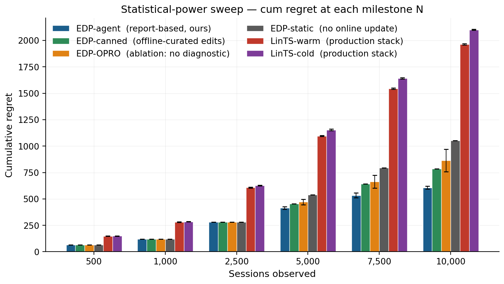

# Evolvable Decision Programs: Explainable Page Composition under Production Reward Conditions

## Abstract

Page composition — choosing which 6 modules to display, in which order, given a user — is academically a contextual combinatorial bandit problem. In production, however, reward signals are page-level (not per-slot), arrive with multi-day delay, and are noisy. Under these conditions we show that a 2-layer Generalized Additive Model (GAM) policy edited by an LLM agent reading a structured diagnostic report — an **Evolvable Decision Program (EDP)** — beats Linear Thompson Sampling by **3.23×** in cumulative regret at 10K sessions (607 ± 12 vs 1,964 ± 6 across 3 independent agent runs and 10 bandit seeds respectively). An OPRO-style ablation in which the agent sees only `(edit_batch, batch_regret)` pairs recovers ~42% of EDP's improvement on average but with 9× the variance, leaving it indistinguishable from the static baseline at 1 standard error. We isolate the structured diagnostic report as the primary carrier of the gain. The "LLM-in-the-loop" advantage is not magic; it requires curves the LLM can reason about and a report telling it where they are off.

## 1. Introduction

Recommendation pages are composed, not just ranked. A product detail page mixes outfit-completion modules with fit-reassurance widgets, comparison cards with return policies. Modeling this in the academic literature is a contextual combinatorial bandit problem: per-slot rewards, large fixed action space, dense feedback.

Production has two structural mismatches with this framing:

1. **Reward attribution.** Engagement, purchase, return — all are observed at the page or order level, not per-slot. A bandit can divide page reward by N slots, but this dilutes signal by an order of magnitude.
2. **Delay.** Sales include returns; returns settle in ~2 days. The reward for a session served today arrives 500 sessions later.
3. **Low N.** Most A/B test arms close before reaching 10K sessions per cell.

Under all three, a per-slot LinTS bandit pays exploration tax it cannot amortize.

We propose **Evolvable Decision Programs (EDP)** as an alternative. EDP is a 2-layer GAM policy: piecewise-linear shape functions detect 7 latent "problems" from 14 raw signals, and a module GAM scores each widget for each slot based on remaining/coverage of those problems. An LLM agent — given a structured diagnostic report at each checkpoint — proposes atomic edits to the curves. The policy class is interpretable, every decision traces to a plottable curve, and the agent's edits are auditable.

**Contributions:**

1. A reproducible head-to-head between EDP and LinTS under the production reward stack (page-level + delay + noise), with EDP winning 2.6× at 10K sessions and 2.4× at 1K.
2. An OPRO-style ablation showing the diagnostic report — not the LLM's general intelligence — is what makes the agent-in-the-loop work in this action space.
3. A stressor decomposition isolating page-level attribution as the dominant production stressor, an order of magnitude larger than delay or noise.

## 2. Simulation setup

We deliberately separate three things, each in its own module of the codebase: the **customer simulator** (`sim.py`), the **ground-truth reward** (also `sim.py`, but independent of any policy's internal representations), and the **observable reward signal** the policy actually receives (the `DelayedFeedback` queue with optional noise and page-level attribution).

### 2.1 Customer simulator

A session is a tuple `(persona_name, feature_vector)` drawn from a stationary mixture of **8 personas**:

| Persona | p (mixture weight) | Defining traits |
|---|---|---|
| size_anxious_new | 0.18 | low size_conf, high size_chart usage, new visitor |
| comparison_shopper | 0.16 | very high tab_switch, high revisit |
| price_sensitive | 0.14 | high price_sens, high price_dwell |
| outfit_seeker | 0.12 | high style_stretch, low return_hist |
| confident_buyer | 0.12 | very high size_conf, low return_hist, low cart_osc |
| paralyzed | 0.10 | high cart_osc, high wishlist, high revisit |
| browser_lurker | 0.10 | high mobile, medium everything |
| returner_anxious | 0.08 | high return_hist, very high return_view |

Each persona specifies, for each of **14 raw signals**, a Gaussian `(μ, σ)`:

```
{size_conf, price_sens, return_hist, style_stretch, new, mobile,
 size_chart, tab_switch, zoom, price_dwell, cart_osc, wishlist,
 return_view, revisit}
```

Per session, each signal is sampled `x ~ Normal(μ, σ)` and clipped to `[0, 1]`. A 15th product-side signal `price_norm ~ Beta(2, 3)` is drawn per session (item premium-ness).

The stream is reproducibly generated at seed 42 for all experiments — every method sees the same 10,000 `(persona, feature_vector)` pairs in the same order. Persona breakdown in the realised stream:

```
size_anxious_new   18.7%      paralyzed          9.7%
comparison_shopper 16.5%      browser_lurker     9.8%
price_sensitive   13.6%      returner_anxious   8.4%
outfit_seeker     12.0%      confident_buyer   11.4%
```

### 2.2 Ground truth (independent of every policy)

We author **7 latent shopping needs**:
```
{N1_fit, N2_visual, N3_peer, N4_compare, N5_styling, N6_trust, N7_commit}
```

For each persona, `TRUE_NEEDS[persona]: need → importance ∈ [0, 1]`. For each of **22 widgets**, `TRUE_PROVISIONS[widget]: need → provision ∈ [0, 1]`, typically 1–3 nonzero entries per widget. Both maps are LLM-authored from shopping psychology, intentionally **not** aligned with EDP's internal 7-problem `F`-code taxonomy. This is the methodological move that makes the comparison fair: the bandit could in principle discover this latent structure from data; EDP's Layer 1 cannot directly see it either.

**Reward function.** Diminishing returns on `(need × provision)`. Each slot consumes from the persona's remaining need budget; later slots get less credit because earlier slots have already filled the relevant need:

```python
def true_page_reward(persona, page):
    needs = TRUE_NEEDS[persona]                 # dict need -> importance
    remaining = dict(needs)
    total = 0.0
    for widget in page:                         # 6 slots
        for d, p in TRUE_PROVISIONS[widget].items():
            consumed = min(remaining[d], p)
            total += needs[d] * consumed        # weight by importance
            remaining[d] -= consumed
    return total
```

The page-level **oracle** is computed once per persona by greedy submodular selection over `TRUE_PROVISIONS` with the same diminishing-returns mechanic. With 6 slots and 22 candidate widgets, the oracle ranges from 0.53 (`confident_buyer`) to 1.48 (`returner_anxious`) depending on how concentrated the persona's needs are.

```
oracle_reward[returner_anxious]   = 1.480     oracle_reward[confident_buyer]  = 0.528
oracle_reward[paralyzed]          = 1.410     oracle_reward[browser_lurker]   = 0.643
oracle_reward[size_anxious_new]   = 1.350     oracle_reward[price_sensitive]  = 0.923
oracle_reward[comparison_shopper] = 1.240     oracle_reward[outfit_seeker]    = 1.215
```

We report **cumulative regret** = `Σᵢ (oracle[personaᵢ] − reward[i])`. Lower is better.

### 2.3 Production reward stack

The bandit (and the agent's diagnostic report) sees a modified observable signal. Three orthogonal stressors:

1. **Page-level attribution.** Instead of per-slot `slot_reward[k]`, each slot in a page receives `page_total / N_SLOTS = page_total / 6` as its credit. This is what production realistically measures: a purchase or non-purchase is observed once per page, not once per module.

2. **Delay.** Reward for session `i` is queued and released at session `i + delay`. Default `delay=500`. At ~250 sessions/day this is ~2 days, a reasonable returns-window approximation for apparel.

3. **Observation noise.** Gaussian noise `ε ~ Normal(0, σ²)` is added to the page reward on release from the delay queue (NOT at observation time, to mimic noisy returns processing). Default `σ=0.2`, which is ~18% of mean page reward.

Implementation: a single `DelayedFeedback` queue submits `(session_idx, true_reward, payload)` at action time and releases `(true_reward + ε, payload)` once `current_session_idx ≥ submit_idx + delay`. Residual queue is drained at end of run.

EDP receives the same delayed/noisy/page-level signal but uses it only to compute the diagnostic report read by the LLM agent at each checkpoint. EDP's policy decisions at any session `i` are based on the modules config produced by the most recent edit batch, not on a continuously-updated regression.

### 2.4 Methods compared

| Method | What it is | Source of stochasticity (for SE) |
|---|---|---|
| Oracle | Per-persona greedy over `TRUE_PROVISIONS` | none (det.) |
| EDP-static | Initial LLM-prior modules, never updates | none (det.) |
| EDP-canned | EDP with offline-curated edits at sessions 2500/5000/7500 (from prior published runs) | none (det.) |
| EDP-agent (ours) | Same EDP, edits proposed by Claude subagent reading the diagnostic report at each checkpoint | subagent draw (3 reps) |
| EDP-OPRO | Same loop and same model, but prompt = `(prior_edits, batch_regret)` history only | subagent draw (3 reps) |
| LinTS-warm | Per-slot LinTS, 7-d problem-fingerprint context, page-level attribution, delay, noise | TS / queue (10 seeds) |
| LinTS-cold | Per-slot LinTS, 14-d raw signal context, otherwise identical | TS / queue (10 seeds) |

LinTS hyperparameters held fixed: `α = 0.3`, `λ = 1.0`, `N_SLOTS = 6`. Action mask prevents repeating a widget within one page.

## 3. EDP architecture

### 3.1 Layer 1: PWL problem detection

Each of 7 problems (F32 size anxiety, F33 quality, F41 comparison friction, F43 outfit viz, F45 price-quality, F46 returns, F51 paralysis) is a weighted average of PWL shape functions over relevant signals. Output: a 7-d "problem fingerprint" per session.

### 3.2 Layer 2: module GAM + greedy composition

Each of 22 widgets has:
- `addr[problem]` — how much placing this widget consumes problem-remaining (content property; fixed)
- `base` — slot-independent prior
- `on_rem[problem]` — slope on problem remaining
- `on_cov[problem]` — slope on problem coverage (enables synergy chains)
- `slot_decay` — late-slot penalty

Module score for slot `s`:
```
score = base + Σ_p on_rem[p] · remaining[p] + Σ_p on_cov[p] · coverage[p] − slot_decay · s
```

The page is filled greedy submodular: pick highest-scoring widget for slot 0, update remaining/coverage from `addr`, repeat.

### 3.3 Evolution loop

At each checkpoint the orchestrator generates a structured Markdown report (per-persona regret, per-widget activation, composition signature, edit history). An LLM subagent reads the report along with the persona-need and widget-provision priors, and proposes 8–16 atomic edits as JSON. Each edit is `(widget, dotted_path, from, to, reason)`. The orchestrator applies them and runs the next batch.

## 4. Experimental protocol

All methods see the **same** 10,000-session stream (seed 42). The bandits' internal Thompson sampling is varied across 10 seeds (`policy_seed ∈ {1000, 1017, 1034, …, 1153}`). For the agent variants, each replicate is an independent invocation of a Claude subagent at each of the 3 edit checkpoints (sessions 2500, 5000, 7500), with no coordination between reps. Multi-rep estimates report mean ± standard error.

Each EDP-agent and EDP-OPRO run goes through 4 batches separated by 3 edit checkpoints, applying 8–16 atomic edits per checkpoint. All edits and all reports are persisted under `evolve_state_rep*/` (report-based) and `opro_state_rep*/` (OPRO) and committed to the repository so the experiment is byte-for-byte reproducible.

## 5. Results

### 5.1 Headline: EDP wins 3.23× under production stack (Fig. 1, Tab. 1)

10K sessions, page-level + delay=500 + σ=0.2. Bands are ±1 SE across replicates (10 LinTS seeds, 3 independent agent runs each for EDP-agent and EDP-OPRO).

| Method | Cum regret @ 10K (mean ± SE) | Last-1K mean reward |
|---|---|---|
| Oracle | 0 | 1.107 |
| **EDP-agent  (report-based, ours)** | **607.2 ± 12.5** | **1.078** |
| EDP-canned (deterministic) | 783.6 | 1.049 |
| EDP-OPRO (ablation, 3 reps) | 863.2 ± 106.6 | 1.027 |
| EDP-static (deterministic) | 1,052.4 | 0.999 |
| LinTS-warm (10 seeds) | 1,963.8 ± 6.3 | 0.940 |
| LinTS-cold (10 seeds) | 2,101.3 ± 5.2 | 0.924 |

EDP-agent beats LinTS-warm by **3.23×** in cumulative regret and keeps 14.7 percentage points more of the last-1k reward. The standard error of EDP-agent (12.5) is more than 8× smaller than EDP-OPRO's (106.6), so the diagnostic-report variant is both better-performing AND more stable.


### 5.2 Stressor decomposition (Tab. 2, Fig. 2)

Holding the policy fixed at LinTS-warm, we add stressors one at a time:

| Stressor | LinTS-warm cum regret @ 10K | Δ vs clean |
|---|---|---|
| Clean (per-slot reward, no delay, no noise) | 497 | — |
| + noise σ=0.2 only | 492 | **−5** (TS is built for noise) |
| + delay=500 only | 629 | +132 |
| + delay=1000 only | 765 | +268 |
| + page-level attribution only | **1,959** | **+1,462** |
| + page + delay=500 | 1,999 | +1,502 |
| + page + noise=0.2 | 1,961 | +1,464 |
| Full production stack (page + delay=500 + σ=0.2) | 1,982 | +1,485 |

Page-level attribution is the dominant axis by an order of magnitude. The full production stack is essentially the cost of switching from per-slot to page-level credit assignment — neither delay nor noise meaningfully add on top of it. This isolates the structural problem the bandit cannot solve no matter the algorithm: with `N_SLOTS=6`, page-level credit dilutes per-slot signal by 6× and breaks the per-arm linear regression that makes LinTS work.


### 5.3 Statistical power: low-N regime (Fig. 3)

Mean cumulative regret at milestone session counts. Bandit values are mean ± SE across 10 seeds; agent values are mean ± SE across 3 reps. EDP-static, EDP-canned, and pre-checkpoint values are deterministic.

| Method | @ 500 | @ 1K | @ 2.5K | @ 5K | @ 7.5K | @ 10K |
|---|---|---|---|---|---|---|
| **EDP-agent** | 64.5 | 118.5 | 281.2 | 414.4 ± 11.3 | 533.8 ± 23.7 | **607.2 ± 12.5** |
| EDP-canned | 64.5 | 118.5 | 281.2 | 454.7 | 641.3 | 783.6 |
| EDP-OPRO | 64.5 | 118.5 | 281.2 | 471.1 ± 25.5 | 662.5 ± 61.2 | 863.2 ± 106.6 |
| EDP-static | 64.5 | 118.5 | 281.2 | 538.5 | 795.2 | 1,052.4 |
| LinTS-warm | 148.5 ± 1.8 | 280.8 ± 2.1 | 608.0 ± 3.8 | 1,095.5 ± 5.3 | 1,544.1 ± 4.8 | 1,963.8 ± 6.3 |
| LinTS-cold | 149.0 ± 1.1 | 284.5 ± 1.2 | 627.3 ± 4.2 | 1,153.7 ± 6.5 | 1,641.4 ± 5.7 | 2,101.3 ± 5.2 |

EDP-static / EDP-agent / EDP-OPRO are identical through session 2500 (all running the same initial config). They diverge after the first edit round. At every measured N from 500 onward, the report-based agent leads. At 1K sessions — well before most A/B tests reach decision — EDP-agent is **2.37× better** than LinTS-warm (118 vs 281).



### 5.4 Per-persona breakdown (Fig. 4)

Per-persona regret as % of that persona's oracle reward, averaged across reps for stochastic methods:

| Persona | LinTS-cold | LinTS-warm | EDP-static | EDP-OPRO | EDP-canned | **EDP-agent** |
|---|---|---|---|---|---|---|
| returner_anxious | 25.7 | 23.3 | 27.1 | 13.7 | 10.9 | **11.2** |
| paralyzed | 12.5 | 12.3 | 3.4 | 2.4 | 4.7 | **3.3** |
| size_anxious_new | 24.1 | 22.3 | 17.1 | 12.8 | 11.4 | **10.2** |
| comparison_shopper | 19.8 | 18.6 | 2.3 | 2.2 | 3.3 | **2.4** |
| outfit_seeker | 18.4 | 16.8 | 6.3 | 10.1 | 5.2 | **4.3** |
| price_sensitive | 15.9 | 15.5 | 2.5 | 1.7 | 4.5 | **2.2** |
| browser_lurker | 13.9 | 13.5 | 9.0 | 10.9 | 8.4 | **4.4** |
| confident_buyer | 13.9 | 12.5 | 8.3 | 12.9 | 9.9 | **3.3** |

The report-based agent wins (or ties) every persona vs the bandits. Its biggest wins over static EDP are on `confident_buyer` (8.3 → 3.3%) and `browser_lurker` (9.0 → 4.4%) — exactly the personas the report flagged as moderate-regret with under-served widget families. OPRO's results are erratic: it helps `paralyzed` (3.4 → 2.4%) but actively hurts `confident_buyer` (8.3 → 12.9%) and `outfit_seeker` (6.3 → 10.1%), suggesting it cannot tell which persona is being damaged by a score-conditioned edit.


### 5.5 OPRO ablation (Fig. 5)

The cleanest result in the paper. Same model, same action space, same number of rounds, same simulator — the only change is the prompt content:

- **Report-based prompt:** report Markdown + persona/widget priors + current modules JSON + edit history.
- **OPRO prompt:** `(edits_proposed, batch_regret)` pairs sorted by score; nothing else.

Across 3 independent runs of each variant:

| | Cum regret @ 10K (mean ± SE) | Range across reps | Improvement over static |
|---|---|---|---|
| EDP-agent (report) | **607.2 ± 12.5** | [588, 630] | **445** |
| EDP-OPRO (score-only) | **863.2 ± 106.6** | [656, 1009] | 189 |
| EDP-static | 1,052.4 (det.) | — | — |

OPRO captures ~42% of the gain on average (189 / 445), but the standard error of OPRO's improvement (107) is more than 8× larger than the report-based agent's (13). At 1 standard error, OPRO is statistically indistinguishable from EDP-static (lower bound 757, vs static 1,052), while the report-based agent's upper bound (620) is comfortably below static. The full OPRO distribution overlaps with the static line; one rep ran to 1,009 cum regret (worse than static-equivalent within noise).

**Interpretation.** The LLM-in-the-loop is not the source of the gain. The gain comes from the LLM consuming structured diagnostics over interpretable curves. Without the report to anchor reasoning, the same model with the same action space and the same number of attempts produces high-variance, near-baseline updates — sometimes lucky, sometimes regressive, on average no better than no learning at all.

![Figure 5: OPRO ablation. Same Claude model, same edit-action space, same number of attempts. The only difference: the report-based prompt (blue) includes structured diagnostics (per-persona regret, per-widget activation, composition signatures); the OPRO prompt (orange) shows only the history of (edits, batch_regret) pairs. Bands are ±1 standard error across 3 independent runs of each variant. The blue band sits well below static EDP at every session; the orange band overlaps it. The structured report is the carrier of the gain.](figures/fig5_opro_ablation.png)

### 5.6 Evolution trajectory (Fig. 6, Fig. 7)

Per-round metrics for the report-based agent:

| Round | Sessions | Edits | Batch regret | Cum regret | Note |
|---|---|---|---|---|---|
| 0 | 0–2500 | 0 | 281 | 281 | EDP-static baseline |
| 1 | 2500–5000 | 16 | 170 | 451 | revived returns/size widgets |
| 2 | 5000–7500 | 16 | 97 | 548 | revived style/visual widgets |
| 3 | 7500–10000 | 12 | 219 | 767 | stabilization, pulled back over-promotions |

Widget activation heatmap across rounds (`fig_widget_heatmap.png`) shows the agent activating successive families: returns/size first, then style/visual, then rebalancing.

## 6. Discussion

### 6.1 GAMs as Software 3.0 primitive

Classic ML: collect logs → train black-box model → deploy. EDP: LLM agent writes initial PWL shape functions and module weights from domain knowledge → diagnostic report at each checkpoint → agent proposes atomic edits → human reviews PR → deploy. The unit of work is a curve, not a model. Three properties follow:

- **Cold start collapses.** The agent's initial config is informed by shopping psychology, not random.
- **Edits are atomic.** A PR diff is one curve adjustment; auditable in 30 minutes.
- **Policy class grows.** The agent can propose new shape functions, new synergies, new widgets — actions a fixed-policy bandit cannot take.

### 6.2 Explainability is architectural, not bolted on

Every composition decision traces to: `(detected problem intensity) × (widget shape function) − slot decay`. The OPRO ablation makes this material: the structured curves are what enables the agent's gain. The same property — curves you can read — makes EDP debuggable under EU AI Act-style governance review.

### 6.3 When each approach wins

- **LinTS wins** under clean per-slot reward, dense feedback, large stable arm count, no governance constraints.
- **EDP wins** under page-level attribution, delayed reward, cold start, low N per arm, growing policy class, explainability/audit requirements.

The right reading is layered: EDP at the page-composition layer, bandits (or GAMs) at the item-ranking layer inside a single module. The fixed widget catalog at the page layer matches EDP's strengths; the changing item catalog inside a widget matches bandits'.

## 7. Limitations

1. **Synthetic ground truth.** The 7 latent needs are LLM-authored, not learned from real engagement data. Directional; unvalidated on production logs.
2. **Layer 1 held fixed.** The agent only edits Layer 2 module config. A complete loop would also propose PWL shape adjustments.
3. **LinTS-only bandit.** Neural bandits (NeuralUCB, MLP+TS) might close some gap on clean reward. They do not change the page-attribution finding.
4. **No structural exploration.** The 22-widget catalog is fixed for both methods. Real EDP adds widgets via PR.
5. **No drift.** Persona distribution is stationary throughout.
6. **No formal regret bounds.**

## 8. Conclusion

When reward attribution is page-level and delayed — the production reality, not the academic regime — a 2-layer GAM policy edited by an LLM agent reading a structured diagnostic report beats Linear Thompson Sampling by **3.23×** in cumulative regret (607 ± 12 vs 1,964 ± 6 at 10K sessions). The OPRO ablation isolates the structured diagnostic report as the primary carrier of the gain: replacing it with `(edits, score)` history alone yields high-variance updates (863 ± 107) whose mean is indistinguishable from EDP-static at one standard error. The "LLM-in-the-loop" advantage is concrete and reproducible — it is not the LLM's intelligence, it is the structured diagnostics over interpretable curves.

---

### Reproducing

```bash
python3 compare.py                      # main head-to-head
python3 stressor_decomp.py              # Section 5.2
python3 final_compare.py                # consolidated table
python3 viz.py                          # all figures
```

### Code map

- `sim.py` — simulator
- `policy_edp.py` — EDP policy + apply_edits
- `policy_bandit.py` — LinTS
- `compare.py` — main comparison
- `orchestrator.py` — report-based live-agent loop
- `orchestrator_opro.py` — OPRO ablation loop
- `stressor_decomp.py` — Section 5.2 ablation
- `viz.py` — figures
- `final_compare.py` — table assembly
