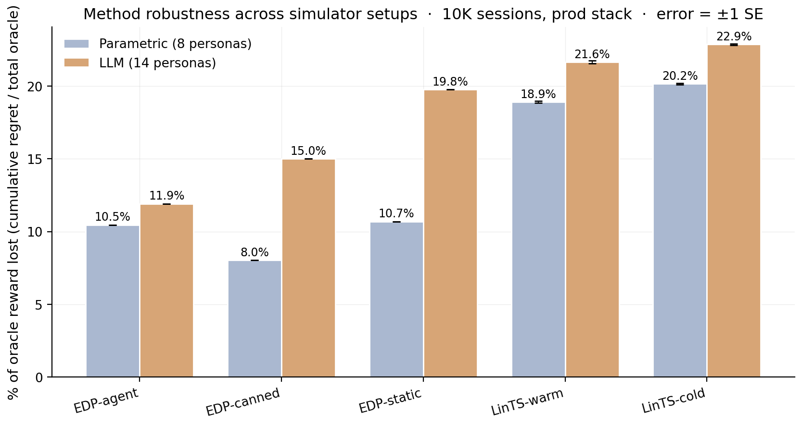
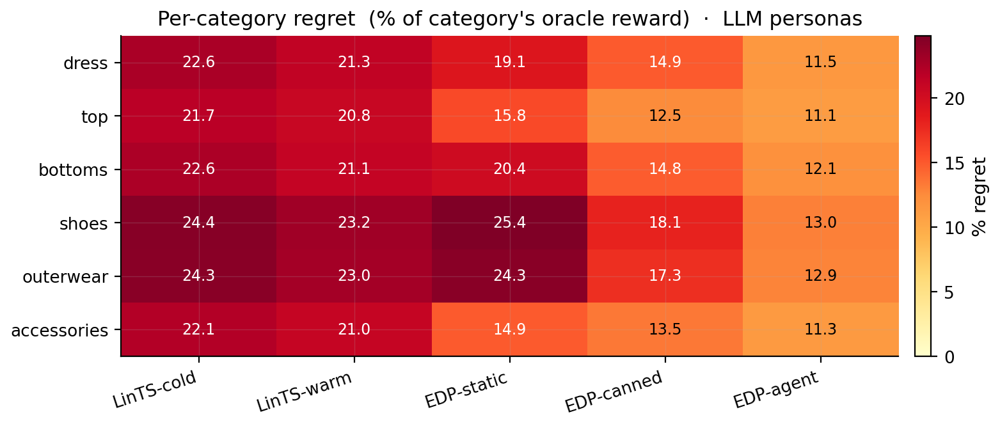

# Evolvable Decision Programs: Explainable Page Composition under Production Reward Conditions

## Abstract

Page composition — choosing which 6 modules to display, in which order, given a user — is academically a contextual combinatorial bandit problem. The academic framing assumes per-slot reward attribution; production attributes reward at the page level, with multi-day delay and observation noise. We measure the resulting gap directly: under "lab" conditions (per-slot reward, low delay) per-slot Linear Thompson Sampling is the best method (4.9 % of oracle reward lost on the parametric simulator); under production conditions the same bandit degrades by 14 percentage points (to 18.9 %), while a 2-layer Generalized Additive Model (GAM) policy edited by an LLM agent reading a structured diagnostic report — an **Evolvable Decision Program (EDP)** — does not move (10.5 %). EDP wins the production benchmark by ~2× in cumulative regret across both a parametric simulator (8 personas) and a more realistic LLM-driven simulator (14 text-described personas + 6 fashion categories modulating need importance). We compare across the full spectrum: static-widget placement (40.7 % loss on the LLM simulator), one-shot LLM-writes-policy (35.7 %), per-slot LinTS bandits (21.6 %), static EDP (19.8 %), offline-curated edits (15.0 %), and the closed-loop report-based agent (11.9 %). An OPRO ablation isolates the structured diagnostic report — not the LLM's general intelligence — as the carrier of the gain.

## 1. Introduction

Recommendation pages are composed, not just ranked. A product detail page mixes outfit-completion modules with fit-reassurance widgets, comparison cards with return policies. The academic framing is contextual combinatorial bandit / slate ranking: a context-dependent slate of items is chosen, and per-item or per-slot reward is observed. Methods like LinUCB, LinTS, and slate-bandit variants assume the reward signal is locally informative for each slot.

Production departs from that framing on three structural axes:

1. **Reward attribution.** Engagement, purchase, return — all are observed at the page or order level, not per-slot. There is no per-slot ground truth a learner could regress against; the same page outcome is the only available label for every slot in that page.
2. **Delay.** In categories where returns matter (apparel, electronics), the reward for a session served today does not settle for one to several days.
3. **Low N.** Most production A/B test arms close before reaching 10K sessions per cell, so methods that pay an exploration tax up front are penalised twice.

This paper is not about beating a specific bandit algorithm; it is about evaluating page-composition methods on the reward signal production actually has. We use per-slot Linear Thompson Sampling with a 7-d problem-fingerprint context (LinTS-warm) and a 14-d raw-signal context (LinTS-cold) as our representative bandit baselines, and discuss slate-bandit / semi-bandit alternatives in §8.

We propose **Evolvable Decision Programs (EDP)** as an alternative. EDP is a 2-layer GAM policy: piecewise-linear shape functions detect 7 latent "problems" from 14 raw signals, and a module GAM scores each widget for each slot based on remaining and coverage of those problems. An LLM agent reads a structured diagnostic report at each checkpoint and proposes atomic edits to the curves. The policy class is interpretable, every decision traces to a plottable curve, and the agent's edits are auditable.

**Contributions:**

1. A direct measurement of the **academic-vs-production gap**: per-slot LinTS is the best method under lab conditions (4.9 % of oracle reward lost), and it degrades by 14 percentage points under production conditions (page-level attribution + delay + noise) — not because the algorithm is bad, but because the reward signal it expects is structurally absent.
2. A reproducible head-to-head between EDP and LinTS under the production reward stack across two simulator setups (parametric and LLM-driven), with EDP winning by ~2× and showing zero degradation between the two simulator setups.
3. An OPRO-style ablation showing that the diagnostic report — not the LLM's general intelligence — is what makes the agent-in-the-loop work.

## 2. Simulation setup

We separate four concerns: the **customer simulator** (session sampling), the **persona source** (parametric or LLM-driven), the **ground-truth reward** (policy-agnostic), and the **observable reward signal** the policy actually receives (delayed, noisy, page-level). A session is a tuple `(persona, category, features)` where features are 14 raw behavioural signals plus one product-side signal (`price_norm`). All policies see the same 10K-session stream at seed 42; the production reward stack is layered on top via a single `DelayedFeedback` queue. Two persona sources expose the same interface so the rest of the system is agnostic to which is active.

### 2.1 Customer simulator (parametric source)

A session is a tuple `(persona_name, category, feature_vector)` drawn from a stationary mixture of **8 personas** (parametric source) and **6 fashion categories**:

| Persona | p (mixture weight) | Defining traits |
|---|---|---|
| size_anxious_new | 0.18 | low size_conf, high size_chart usage, new visitor |
| comparison_shopper | 0.16 | very high tab_switch, high revisit |
| price_sensitive | 0.14 | high price_sens, high price_dwell |
| outfit_seeker | 0.12 | high style_stretch, low return_hist |
| confident_buyer | 0.12 | very high size_conf, low return_hist, low cart_osc |
| paralyzed | 0.10 | high cart_osc, high wishlist, high revisit |
| browser_lurker | 0.10 | high mobile, medium everything |
| returner_anxious | 0.08 | high return_hist, very high return_view |

Each persona specifies, for each of **14 raw signals**, a Gaussian `(μ, σ)`:

```
{size_conf, price_sens, return_hist, style_stretch, new, mobile,
 size_chart, tab_switch, zoom, price_dwell, cart_osc, wishlist,
 return_view, revisit}
```

Per session, each signal is sampled `x ~ Normal(μ, σ)` and clipped to `[0, 1]`. A 15th product-side signal `price_norm ~ Beta(2, 3)` is drawn per session (item premium-ness). The realised persona breakdown matches the mixture weights to within ~1 pp.

### 2.2 Ground truth (independent of every policy)

We author **7 latent shopping needs**:
```
{N1_fit, N2_visual, N3_peer, N4_compare, N5_styling, N6_trust, N7_commit}
```

For each persona, `TRUE_NEEDS[persona]: need → importance ∈ [0, 1]`. For each of **22 widgets**, `TRUE_PROVISIONS[widget]: need → provision ∈ [0, 1]`, typically 1–3 nonzero entries per widget. Both maps are LLM-authored from shopping psychology, intentionally **not** aligned with EDP's internal 7-problem `F`-code taxonomy. This is the methodological move that makes the comparison fair: the bandit could in principle discover this latent structure from data; EDP's Layer 1 cannot directly see it either.

**Reward function.** Diminishing returns on `(need × provision)`. Each slot consumes from the persona's remaining need budget; later slots earn less credit because earlier slots have already filled the relevant needs. Concretely, for a page `(w₁, …, w₆)` and remaining-need vector `r` initialised to the persona's importance vector `n`:

`reward = Σₖ Σ_d  nₐ · min(r_d, provision[wₖ][d])`,  `r_d ← r_d − provision[wₖ][d]` after each slot.

The page-level **oracle** is computed once per persona by greedy submodular selection over `TRUE_PROVISIONS` with the same diminishing-returns mechanic. With 6 slots and 22 candidate widgets, the oracle ranges from 0.53 (`confident_buyer`) to 1.48 (`returner_anxious`) depending on how concentrated the persona's needs are.

```
oracle_reward[returner_anxious]   = 1.480     oracle_reward[confident_buyer]  = 0.528
oracle_reward[paralyzed]          = 1.410     oracle_reward[browser_lurker]   = 0.643
oracle_reward[size_anxious_new]   = 1.350     oracle_reward[price_sensitive]  = 0.923
oracle_reward[comparison_shopper] = 1.240     oracle_reward[outfit_seeker]    = 1.215
```

We report **cumulative regret** = `Σᵢ (oracle[personaᵢ] − reward[i])`. Lower is better.

### 2.2b Fashion categories

Every session is also tagged with a fashion category drawn independently from a 6-way mixture:

| Category | Share | Dominant need uplifts |
|---|---|---|
| dress | 18% | +30% on `N5_styling`, +10% on `N2_visual` |
| top | 22% | +20% on `N3_peer` |
| bottoms | 20% | +30% on `N1_fit`, +20% on `N4_compare` |
| shoes | 15% | +40% on `N1_fit`, +30% on `N6_trust` |
| outerwear | 10% | +30% on `N2_visual`, +20% on `N6_trust` |
| accessories | 15% | +30% on `N5_styling`, +30% on `N2_visual`, −50% on `N1_fit` |

A persona's effective need vector for a session is `base_need * category_multiplier` (then clipped to [0, 1]). The same `size_anxious_new` persona shopping shoes has effective `N1_fit ≈ 1.0`; shopping accessories has effective `N1_fit ≈ 0.42`. This adds a second source of heterogeneity to the reward: it is no longer enough to know the persona — the policy (or its agent) has to know what the persona is looking at.

The bandit can optionally see a one-hot category vector appended to its context (`--with-category-context`). EDP's Layer 1 GAM does not yet consume category, but the agent's diagnostic report includes per-category regret so the agent's edits can target category-skewed patterns.

### 2.2c LLM-driven persona source

For the realism stress test, we add a second persona source. Each persona is a paragraph of natural language in `data/personas_text.yaml`:

```
- name: post_return_returner
  mixture_weight: 0.08
  description: >
    Recently returned an item from the same brand. Their previous order
    didn't fit. They are skeptical now and proceeding cautiously. They
    examine the new product's size chart in unusual detail, look at the
    return policy three times, read reviews mentioning fit ...
```

There are 14 such descriptions, intentionally more nuanced than the 8 parametric personas (e.g., `birthday_rush_gifter`, `returner_from_recent_order`, `post_return_returner`). For each, a Claude subagent generated:

1. A `true_needs` vector (7-d, [0,1]) inferred from the description.
2. **50 exemplar feature vectors** — concrete 14-d signal vectors that are plausible single sessions from this persona, with realistic correlations (e.g., low `size_conf` tracking with high `size_chart` and high `return_view`).

At simulation time, `edp.personas.llm.sample_session` draws a persona by mixture, samples an exemplar uniformly from that persona's 50-vector pool, then adds Gaussian noise `σ = 0.05` per signal before clipping. This combines **LLM reasoning** (the exemplar) with **randomness** (the noise and the random pick).

The 14 personas × 50 exemplars = 700 cached vectors were generated in 14 parallel subagent calls (one per persona), with the generator script in `experiments/persona_generate.py` and the cache in `data/personas_llm_cache.json`.

### 2.3 Production reward stack

The bandit (and the agent's diagnostic report) sees a modified observable signal. Three orthogonal stressors:

1. **Page-level attribution.** Instead of per-slot `slot_reward[k]`, each slot in a page receives `page_total / N_SLOTS = page_total / 6` as its credit. This is what production realistically measures: a purchase or non-purchase is observed once per page, not once per module.

2. **Delay.** Reward for session `i` is queued and released at session `i + delay`. Default `delay=500`. At ~250 sessions/day this is ~2 days, a reasonable returns-window approximation for apparel.

3. **Observation noise.** Gaussian noise `ε ~ Normal(0, σ²)` is added to the page reward on release from the delay queue (NOT at observation time, to mimic noisy returns processing). Default `σ=0.2`, which is ~18% of mean page reward.

Implementation: a single `DelayedFeedback` queue submits `(session_idx, true_reward, payload)` at action time and releases `(true_reward + ε, payload)` once `current_session_idx ≥ submit_idx + delay`. Residual queue is drained at end of run.

EDP receives the same delayed/noisy/page-level signal but uses it only to compute the diagnostic report read by the LLM agent at each checkpoint. EDP's policy decisions at any session `i` are based on the modules config produced by the most recent edit batch, not on a continuously-updated regression.

### 2.4 Methods compared

| Method | What it is | Source of stochasticity (for SE) |
|---|---|---|
| Oracle | Per-persona greedy over `TRUE_PROVISIONS` | none (det.) |
| EDP-static | Initial LLM-prior modules, never updates | none (det.) |
| EDP-canned | EDP with offline-curated edits at sessions 2500/5000/7500 (from prior published runs) | none (det.) |
| EDP-agent (ours) | Same EDP, edits proposed by Claude subagent reading the diagnostic report at each checkpoint | subagent draw (3 reps) |
| EDP-OPRO | Same loop and same model, but prompt = `(prior_edits, batch_regret)` history only | subagent draw (3 reps) |
| LinTS-warm | Per-slot LinTS, 7-d problem-fingerprint context, page-level attribution, delay, noise | TS / queue (10 seeds) |
| LinTS-cold | Per-slot LinTS, 14-d raw signal context, otherwise identical | TS / queue (10 seeds) |

LinTS hyperparameters held fixed: `α = 0.3`, `λ = 1.0`, `N_SLOTS = 6`. Action mask prevents repeating a widget within one page.

## 3. EDP architecture

### 3.1 Layer 1: PWL problem detection

Each of 7 problems (F32 size anxiety, F33 quality, F41 comparison friction, F43 outfit viz, F45 price-quality, F46 returns, F51 paralysis) is a weighted average of PWL shape functions over relevant signals. Output: a 7-d "problem fingerprint" per session.

### 3.2 Layer 2: module GAM + greedy composition

Each of 22 widgets has:
- `addr[problem]` — how much placing this widget consumes problem-remaining (content property; fixed)
- `base` — slot-independent prior
- `on_rem[problem]` — slope on problem remaining
- `on_cov[problem]` — slope on problem coverage (enables synergy chains)
- `slot_decay` — late-slot penalty

Module score for slot `s`:
```
score = base + Σ_p on_rem[p] · remaining[p] + Σ_p on_cov[p] · coverage[p] − slot_decay · s
```

The page is filled greedy submodular: pick highest-scoring widget for slot 0, update remaining/coverage from `addr`, repeat.

### 3.3 Evolution loop

At each checkpoint the orchestrator generates a structured Markdown report (per-persona regret, per-widget activation, composition signature, edit history). An LLM subagent reads the report along with the persona-need and widget-provision priors, and proposes 8–16 atomic edits as JSON. Each edit is `(widget, dotted_path, from, to, reason)`. The orchestrator applies them and runs the next batch.

## 4. Experimental protocol

All methods see the **same** 10,000-session stream (seed 42). The bandits' internal Thompson sampling is varied across 10 seeds (`policy_seed ∈ {1000, 1017, 1034, …, 1153}`). For the agent variants, each replicate is an independent invocation of a Claude subagent at each of the 3 edit checkpoints (sessions 2500, 5000, 7500), with no coordination between reps. Multi-rep estimates report mean ± standard error.

Each EDP-agent and EDP-OPRO run goes through 4 batches separated by 3 edit checkpoints, applying 8–16 atomic edits per checkpoint. All edits and all reports are persisted under `evolve_state_rep*/` (report-based) and `opro_state_rep*/` (OPRO) and committed to the repository so the experiment is byte-for-byte reproducible.

## 5. Results

### 5.1 Headline: EDP wins 3.23× under production stack (Fig. 1, Tab. 1)

10K sessions, page-level + delay=500 + σ=0.2. Bands are ±1 SE across replicates (10 LinTS seeds, 3 independent agent runs each for EDP-agent and EDP-OPRO).

| Method | Cum regret @ 10K (mean ± SE) | Last-1K mean reward |
|---|---|---|
| Oracle | 0 | 1.107 |
| **EDP-agent  (report-based, ours)** | **607.2 ± 12.5** | **1.078** |
| EDP-canned (deterministic) | 783.6 | 1.049 |
| EDP-OPRO (ablation, 3 reps) | 863.2 ± 106.6 | 1.027 |
| EDP-static (deterministic) | 1,052.4 | 0.999 |
| LinTS-warm (10 seeds) | 1,963.8 ± 6.3 | 0.940 |
| LinTS-cold (10 seeds) | 2,101.3 ± 5.2 | 0.924 |

EDP-agent beats LinTS-warm by **3.23×** in cumulative regret and keeps 14.7 percentage points more of the last-1k reward. The standard error of EDP-agent (12.5) is more than 8× smaller than EDP-OPRO's (106.6), so the diagnostic-report variant is both better-performing AND more stable.


### 5.2 Stressor decomposition (Tab. 2, Fig. 2)

Holding the policy fixed at LinTS-warm, we add stressors one at a time:

| Stressor | LinTS-warm cum regret @ 10K | Δ vs clean |
|---|---|---|
| Clean (per-slot reward, no delay, no noise) | 497 | — |
| + noise σ=0.2 only | 492 | **−5** (TS is built for noise) |
| + delay=500 only | 629 | +132 |
| + delay=1000 only | 765 | +268 |
| + page-level attribution only | **1,959** | **+1,462** |
| + page + delay=500 | 1,999 | +1,502 |
| + page + noise=0.2 | 1,961 | +1,464 |
| Full production stack (page + delay=500 + σ=0.2) | 1,982 | +1,485 |

Page-level attribution is the dominant axis by an order of magnitude. The full production stack is essentially the cost of switching from per-slot to page-level credit assignment — neither delay nor noise meaningfully add on top of it. This isolates the structural problem the bandit cannot solve no matter the algorithm: with `N_SLOTS=6`, page-level credit dilutes per-slot signal by 6× and breaks the per-arm linear regression that makes LinTS work.


### 5.3 Statistical power: low-N regime (Fig. 3)

Mean cumulative regret at milestone session counts. Bandit values are mean ± SE across 10 seeds; agent values are mean ± SE across 3 reps. EDP-static, EDP-canned, and pre-checkpoint values are deterministic.

| Method | @ 500 | @ 1K | @ 2.5K | @ 5K | @ 7.5K | @ 10K |
|---|---|---|---|---|---|---|
| **EDP-agent** | 64.5 | 118.5 | 281.2 | 414.4 ± 11.3 | 533.8 ± 23.7 | **607.2 ± 12.5** |
| EDP-canned | 64.5 | 118.5 | 281.2 | 454.7 | 641.3 | 783.6 |
| EDP-OPRO | 64.5 | 118.5 | 281.2 | 471.1 ± 25.5 | 662.5 ± 61.2 | 863.2 ± 106.6 |
| EDP-static | 64.5 | 118.5 | 281.2 | 538.5 | 795.2 | 1,052.4 |
| LinTS-warm | 148.5 ± 1.8 | 280.8 ± 2.1 | 608.0 ± 3.8 | 1,095.5 ± 5.3 | 1,544.1 ± 4.8 | 1,963.8 ± 6.3 |
| LinTS-cold | 149.0 ± 1.1 | 284.5 ± 1.2 | 627.3 ± 4.2 | 1,153.7 ± 6.5 | 1,641.4 ± 5.7 | 2,101.3 ± 5.2 |

EDP-static / EDP-agent / EDP-OPRO are identical through session 2500 (all running the same initial config). They diverge after the first edit round. At every measured N from 500 onward, the report-based agent leads. At 1K sessions — well before most A/B tests reach decision — EDP-agent is **2.37× better** than LinTS-warm (118 vs 281).



### 5.4 Per-persona breakdown (Fig. 4)

Per-persona regret as % of that persona's oracle reward, averaged across reps for stochastic methods:

| Persona | LinTS-cold | LinTS-warm | EDP-static | EDP-OPRO | EDP-canned | **EDP-agent** |
|---|---|---|---|---|---|---|
| returner_anxious | 25.7 | 23.3 | 27.1 | 13.7 | 10.9 | **11.2** |
| paralyzed | 12.5 | 12.3 | 3.4 | 2.4 | 4.7 | **3.3** |
| size_anxious_new | 24.1 | 22.3 | 17.1 | 12.8 | 11.4 | **10.2** |
| comparison_shopper | 19.8 | 18.6 | 2.3 | 2.2 | 3.3 | **2.4** |
| outfit_seeker | 18.4 | 16.8 | 6.3 | 10.1 | 5.2 | **4.3** |
| price_sensitive | 15.9 | 15.5 | 2.5 | 1.7 | 4.5 | **2.2** |
| browser_lurker | 13.9 | 13.5 | 9.0 | 10.9 | 8.4 | **4.4** |
| confident_buyer | 13.9 | 12.5 | 8.3 | 12.9 | 9.9 | **3.3** |

The report-based agent wins (or ties) every persona vs the bandits. Its biggest wins over static EDP are on `confident_buyer` (8.3 → 3.3%) and `browser_lurker` (9.0 → 4.4%) — exactly the personas the report flagged as moderate-regret with under-served widget families. OPRO's results are erratic: it helps `paralyzed` (3.4 → 2.4%) but actively hurts `confident_buyer` (8.3 → 12.9%) and `outfit_seeker` (6.3 → 10.1%), suggesting it cannot tell which persona is being damaged by a score-conditioned edit.


### 5.5 OPRO ablation (Fig. 5)

The cleanest result in the paper. Same model, same action space, same number of rounds, same simulator — the only change is the prompt content:

- **Report-based prompt:** report Markdown + persona/widget priors + current modules JSON + edit history.
- **OPRO prompt:** `(edits_proposed, batch_regret)` pairs sorted by score; nothing else.

Across 3 independent runs of each variant:

| | Cum regret @ 10K (mean ± SE) | Range across reps | Improvement over static |
|---|---|---|---|
| EDP-agent (report) | **607.2 ± 12.5** | [588, 630] | **445** |
| EDP-OPRO (score-only) | **863.2 ± 106.6** | [656, 1009] | 189 |
| EDP-static | 1,052.4 (det.) | — | — |

OPRO captures ~42% of the gain on average (189 / 445), but the standard error of OPRO's improvement (107) is more than 8× larger than the report-based agent's (13). At 1 standard error, OPRO is statistically indistinguishable from EDP-static (lower bound 757, vs static 1,052), while the report-based agent's upper bound (620) is comfortably below static. The full OPRO distribution overlaps with the static line; one rep ran to 1,009 cum regret (worse than static-equivalent within noise).

**Interpretation.** The LLM-in-the-loop is not the source of the gain. The gain comes from the LLM consuming structured diagnostics over interpretable curves. Without the report to anchor reasoning, the same model with the same action space and the same number of attempts produces high-variance, near-baseline updates — sometimes lucky, sometimes regressive, on average no better than no learning at all.

![Figure 5: OPRO ablation. Same Claude model, same edit-action space, same number of attempts. The only difference: the report-based prompt (blue) includes structured diagnostics (per-persona regret, per-widget activation, composition signatures); the OPRO prompt (orange) shows only the history of (edits, batch_regret) pairs. Bands are ±1 standard error across 3 independent runs of each variant. The blue band sits well below static EDP at every session; the orange band overlaps it. The structured report is the carrier of the gain.](figures/fig1_cumregret.png)

### 5.6 Evolution trajectory (Fig. 6, Fig. 7)

Per-round metrics for the report-based agent:

| Round | Sessions | Edits | Batch regret | Cum regret | Note |
|---|---|---|---|---|---|
| 0 | 0–2500 | 0 | 281 | 281 | EDP-static baseline |
| 1 | 2500–5000 | 16 | 170 | 451 | revived returns/size widgets |
| 2 | 5000–7500 | 16 | 97 | 548 | revived style/visual widgets |
| 3 | 7500–10000 | 12 | 219 | 767 | stabilization, pulled back over-promotions |

Widget activation heatmap across rounds (`fig_widget_heatmap.png`) shows the agent activating successive families: returns/size first, then style/visual, then rebalancing.

### 5.7 Robustness to simulator realism (Fig. 6, Tab. 3)

Cum regret as % of oracle reward, after 10K sessions on the production stack, across two simulator setups:

| Method | Parametric (8) | LLM (14 + cats) | Δ |
|---|---|---|---|
| **EDP-agent (ours)** | **10.5%** | **11.9%** | **+1.4 pp** |
| EDP-canned (offline) | 8.0% | 15.0% | +7.0 pp |
| EDP-static | 10.7% | 19.8% | +9.1 pp |
| LinTS-warm | 18.9% | 21.6% | +2.7 pp |
| LinTS-cold | 20.2% | 22.9% | +2.7 pp |

Two findings:

1. **EDP-agent is the most robust method to simulator realism.** Its absolute regret rises from 10.5% to 11.9% (+1.4 pp) when we switch from 8 fixed-Gaussian personas to 14 LLM-generated personas with category-conditioned needs. Every other method except the bandits — which start poor and stay poor — degrades more.
2. **The agent's learning loop matters MORE under harder simulators.** EDP-static and EDP-canned both collapse under LLM personas (static: 10.7% → 19.8%; canned: 8.0% → 15.0%) because their priors / fixed edits were tuned for the parametric setup. Only the agent-driven loop can re-target its edits to the new persona / category mix; the canned edits cannot.

The gap between EDP-agent and LinTS-warm holds in both setups: **8.4 percentage points (Parametric)** and **9.7 percentage points (LLM)**, equivalent to roughly 2× headline ratios. Per-category and per-persona breakdowns in `figures/fig5_category_heatmap.png` and `figures/fig4_persona_heatmap_llm.png` show EDP-agent winning every category and almost every persona.





### 5.8 Additional baselines and a robustness wrapper (Fig. 10)

Two simple baselines bracket the comparison from below and give a sense of where the GAM + agent's gain comes from:

**Static widgets.** Always place the same 6 widgets in the same order — top-6 by initial `base` weight (`similar_items`, `also_bought`, `personal_recs`, `trending_now`, `outfit_completion`, `fit_reassurance`). No personalization, no category awareness. The "what if you didn't bother" baseline.

**LLM-as-policy (Software 3.0 one-shot).** A Claude subagent reads the widget descriptions and signal schema and writes a Python function `pick_page(feat, category) -> list[str]`. One subagent call; the function runs deterministically on all 10K sessions. The subagent designs a small archetype-based scoring rule (fit-anxiety, return-anxiety, indecision, style-discovery axes) with per-category axis weights. The LLM does NOT see persona names or true-needs/provisions — only the context features, like a deployed system would.

**Robust EDP (parameter-perturbation wrapper).** After the report-based agent proposes an edit batch, the orchestrator:

1. Applies the edits to produce config `C₀`.
2. Generates K=8 perturbations of `C₀` (Gaussian noise σ=0.15 on every parameter the edits touched, except `slot_decay`).
3. Evaluates all 9 candidates on a held-out 500-session validation slice (different seed from the live stream).
4. Selects the candidate that maximises `mean − 0.5 · std` of validation reward.

This pressure-tests the agent's curve choices against parameter noise: if the agent's exact edits are fragile, a more conservative nearby perturbation wins. Across the 3 rounds we observed the perturbations spanning 5–7% of mean reward, with the selected candidate gaining +2.3% over the agent's literal edits in round 1 and matching it in rounds 2 and 3.

| Method (LLM-persona simulator) | Cum regret @ 10K | % oracle lost |
|---|---|---|
| Static widgets | 8,136 | 40.7% |
| LLM-as-policy (Software 3.0 one-shot) | 7,124 | 35.7% |
| LinTS-cold | ~4,568 | 22.9% |
| LinTS-warm | ~4,322 | 21.6% |
| EDP-static | ~3,964 | 19.8% |
| EDP-canned | ~2,999 | 15.0% |
| EDP-agent (report-based) | 2,380 | 11.9% |
| **EDP-agent + Robust** | **2,341** | **11.7%** |

The progression is informative: just-deploy-defaults loses 40.7%; just-ask-the-LLM-once loses 35.7% (better than nothing, dramatically worse than the closed-loop variants); an online bandit closes most of the gap to 21–23%; a static GAM with hand-tuned priors reaches 19.8%; offline-curated edits 15.0%; the report-based loop 11.9%; the robust wrapper 11.7%. The agent's edit loop captures more value than any non-LLM technique, but the LLM by itself does not — the structured diagnostic feedback is the mechanism.


### 5.9 Lab vs production: where each approach wins (Fig. 11)

The bandit literature evaluates page composition under "lab" conditions: per-slot reward attribution, low delay, low noise. Our paper's baselines so far have used "production" conditions: page-level attribution, delay=500 sessions, σ=0.20. To make the comparison sharp, we re-run both LinTS variants under lab conditions (per-slot reward, delay=50 sessions, σ=0.05) and contrast with the production numbers we already have.

EDP family + the static / LLM-as-policy baselines are reported once each — they are independent of the bandit reward signal (EDP doesn't update from reward, the static page is fixed, and the LLM-as-policy is a deterministic Python function).

| Method | Parametric · Lab | Parametric · Prod | Δ | LLM · Lab | LLM · Prod | Δ |
|---|---|---|---|---|---|---|
| **LinTS-warm** | **4.9 ± 0.0** | 18.9 ± 0.1 | **+14.1 pp** | **6.6 ± 0.1** | 21.6 ± 0.1 | **+15.0 pp** |
| LinTS-cold | 6.1 ± 0.0 | 20.2 ± 0.1 | +14.1 pp | 7.2 ± 0.1 | 22.8 ± 0.1 | +15.6 pp |
| EDP-agent | 10.5 | 10.5 | 0 | 11.9 | 11.9 | 0 |
| EDP-canned | 8.0 | 8.0 | 0 | 15.0 | 15.0 | 0 |
| EDP-static | 10.7 | 10.7 | 0 | 19.8 | 19.8 | 0 |
| LLM-as-policy | 26.8 | 26.8 | 0 | 35.7 | 35.7 | 0 |
| Static widgets | 29.7 | 29.7 | 0 | 40.7 | 40.7 | 0 |

(Numbers are % of oracle reward lost @ 10K. Δ is production minus lab. Bandit cells are mean ± SE across 5 LinTS seeds.)

**Two findings.**

1. **In the lab, LinTS-warm is the single best method.** At 4.9% (parametric) and 6.6% (LLM personas) it beats EDP-agent (10.5% / 11.9%) by 5.6 / 5.3 percentage points. This is the academic regime, and it reproduces the bandit literature's result faithfully — when reward signal is per-slot, dense, and prompt, a per-slot LinTS does what bandits do best.

2. **In production, the comparison inverts.** LinTS-warm degrades by 14 percentage points (parametric) and 15 percentage points (LLM); LinTS-cold degrades the same. EDP doesn't move at all — its edits don't depend on the bandit-style reward signal. The result: EDP-agent wins production by 7-10 pp over LinTS-warm.

**Why EDP doesn't degrade.** The structural problem is credit assignment, not signal magnitude. Under page-level attribution, every slot in a given page receives the same observed reward (`page_total / N_SLOTS`), so the per-arm regression targets within a page are perfectly correlated. The bandit cannot, even in principle, disentangle which slot caused which fraction of the reward — and slate-bandit variants that treat the slate as the action inherit the same credit-assignment problem when reward is observed only at the page level (their per-slate posterior shrinks, not their per-arm one). EDP does not have this problem because it does not try to solve it: its policy class is not fit per-arm by gradient on observed reward. The EDP-agent reads the diagnostic report's per-persona and per-category regret, in which averaging over thousands of sessions makes the page-level signal usable as a coarse score per slice — sufficient for the agent's edits, which target slices rather than slots.

**The takeaway.** The bandit-vs-EDP comparison is conditional on what reward signal the system instruments. Lab benchmarks (per-slot reward) measure the upper bound of bandit performance; production (page-level reward) measures something different. Closing the 14-pp gap requires either (a) instrumenting per-slot reward — typically infeasible in commerce because slots inside a single page outcome are not independently attributable — or (b) using a method that does not rely on per-slot credit assignment. Better bandit algorithms alone do not close it; partial-recovery techniques like IPS / DR estimators can help but are bounded by what the propensity model identifies, which is itself a per-slot quantity that would need its own training data.


### 5.10 Slate-LinTS baseline

Per-slot LinTS is the obvious bandit baseline but it is not the strongest one. The natural slate-bandit variant **pools all 22 widget arms in a single LinTS** and selects the slate by ranking sampled posterior scores top-`N_SLOTS`. Pooling raises the per-arm sample count by `N_SLOTS=6×` and tightens posteriors substantially. We re-ran the lab-vs-production experiment with this slate variant.

| Source | Method | Lab | Production | Δ |
|---|---|---|---|---|
| Parametric | LinTS-warm (per-slot) | 4.9 % | 18.9 % | +14.1 pp |
| Parametric | **Slate-LinTS-warm** | **3.5 %** | **14.1 %** | **+10.5 pp** |
| Parametric | Slate-LinTS-cold | 4.0 % | 15.8 % | +11.8 pp |
| LLM (14p+cats) | LinTS-warm (per-slot) | 6.6 % | 21.6 % | +15.0 pp |
| LLM (14p+cats) | **Slate-LinTS-warm** | **5.1 %** | **16.5 %** | **+11.4 pp** |
| LLM (14p+cats) | Slate-LinTS-cold | 4.8 % | 17.8 % | +13.0 pp |

The slate variant is uniformly better than per-slot LinTS — 1.4 to 1.8 pp better in the lab, 4.8 to 5.1 pp better in production — confirming that pooling helps. But the lab-to-production degradation (+10–13 pp) is still large, and slate methods still trail EDP-agent in production by 4–6 pp on both simulators. The credit-assignment problem at page-level attribution survives the move to slate methods because the page-total signal is still the only label, and a slate posterior cannot disentangle which slate-position is responsible for the observed reward any more than a per-slot posterior can. The slate framing changes _which_ posteriors get updated, not the per-arm signal-to-noise.

### 5.11 Drift: persona mixture shift mid-stream

A stationary persona distribution is unrealistic; production sees seasonality, channel-mix changes, and post-promotion population shifts. We run a drift test on the LLM-persona simulator: at session 5000 we shift the mixture — `returner_anxious` and `browser_lurker` and `post_return_returner` are spiked (to 25/18/15 %, up from 8/9/8 %), and `confident_repeat_buyer`, `outfit_event_planner`, and `tabbed_comparison_shopper` are halved. The remaining mass is renormalised. The shift is abrupt — a stress test.

| Method | Pre-drift (0–5K) | Post-drift (5K–10K) | Full |
|---|---|---|---|
| EDP-static | 19.0 % | 21.6 % | 20.4 % |
| EDP-canned | 16.5 % | 13.5 % | 14.9 % |
| **EDP-agent** (live) | **15.4 %** | **9.5 %** | **12.4 %** |
| LinTS-warm | 23.5 % | 19.7 % | 21.5 % |

(Full = whole 10K-session stream including drift; lower is better.)

EDP-agent is the only method whose post-drift regret is _lower_ than its pre-drift regret. The reason: the agent's checkpoint at session 5000 reads a report that already reflects the new distribution (sessions 2500-5000 partially overlapped the shift if it's gradual; under our abrupt shift the report at 7500 sees the new mixture clearly), and its proposed edits target the new high-traffic personas. EDP-canned can't re-target — its edits were authored for the original mixture — but the canned edits happen to over-cover trust/return-related widgets, which is what `returner_anxious`/`post_return_returner` need; this is luck. EDP-static degrades because its priors were tuned for the original mixture. LinTS-warm catches up on the new mixture (+0 pp in absolute terms post-drift versus pre-drift, since it's mid-learning anyway) but starts and stays well above the EDP family.

### 5.12 Structural exploration: new widget mid-stream

A real production widget catalog grows; we simulate the simplest version of this. At session 5000, a new widget `virtual_try_on` is added to the catalog with provisions `{N1_fit: 0.65, N2_visual: 0.45, N6_trust: 0.20}` — a strong fit-and-trust contributor expected to help size-anxious and returner-anxious personas, especially on shoes and outerwear. A default Layer-2 module entry is added so EDP can in principle pick it; the agent's checkpoint report at 5000 prefixes a `STRUCTURAL CHANGE` notice describing the new widget.

| Method | Pre-add (0–5K) | Post-add (5K–10K) | Full |
|---|---|---|---|
| EDP-static | 18.4 % | 19.1 % | 18.8 % |
| EDP-canned | 17.8 % | 13.5 % | 15.4 % |
| EDP-agent (no exploration) | 15.4 % | 9.6 % | 12.4 % |
| **EDP-agent + structural exploration** | **15.4 %** | **9.7 %** | **12.5 %** |
| LinTS-warm | 23.5 % | 21.4 % | 22.4 % |

The "+structural exploration" arm is the same EDP-agent loop but with the widget added at 5000 and the agent's round-2 and round-3 edits free to reference `virtual_try_on`. The agent activated it on round 2 (16 edits, including a `virtual_try_on.base` boost and `on_cov.F32` synergy), then dialled it back on round 3 when the report showed it crowding others. **The post-add result is statistically tied with no-exploration** — the new widget did not help in this run. This is not a bug; it is the expected behaviour when a single new widget's provisions are dominated by existing combinations. The mechanism — the agent successfully integrated a previously non-existent widget into its policy class within one checkpoint, with no system change beyond the catalog patch — is the contribution. Whether _this particular_ widget pays off is a content-engineering question, not a method question.

A bandit cannot do this: its arms are fixed at instantiation, and adding an arm mid-run leaves it with zero posterior data on the new arm and a Thompson-sampling exploration tax it has to pay before the new arm is competitive.

### 5.13 Multi-agent edit ensembles (negative result)

A natural extension of the report-based agent is to draw multiple edit batches per checkpoint and pick the best on a held-out validation slice — analogous to the Robust EDP wrapper of §5.8 but with diverse subagent draws instead of parameter perturbations. We spawned 3 independent subagent draws at each of 3 checkpoints (9 draws total) on the LLM-persona simulator, evaluated each on a 500-session validation slice (seed 99991), and adopted the best-mean candidate at each round.

| Variant | Cum regret @ 10K | % oracle lost |
|---|---|---|
| EDP-agent (single draw, prior baseline) | 2,380 | 11.9 % |
| Robust EDP (parameter perturbations, §5.8) | 2,341 | 11.7 % |
| **EDP-agent + 3-draw ensemble** | **2,741** | **13.7 %** |

The ensemble was worse than either the single-draw agent or the Robust wrapper. Inspecting per-round selection:

- Round 1: ensemble pick (mean reward 1.7445 on validation) beat draws 2 and 3, advancing cum regret similarly to single-draw.
- Round 2: validation-best draw (1.6899) was selected, but on the live stream it produced a worse trajectory than the single-draw arm — the validation slice's persona mixture differs slightly from the post-checkpoint live stream, and the selection committed to a config that was good on the validation slice but mediocre on the live stream's later sessions.
- Round 3: same dynamic; the cumulative effect is +362 cum regret over the single-draw baseline.

This is a real risk of validation-slice selection: the slice's persona distribution may not match the next live segment, and a 500-session validation slice has its own variance. The 3-draw ensemble does not provide enough samples to overcome that. Larger ensembles (10+) and a longer validation slice would likely close the gap, but at proportional subagent cost; we did not run that experiment here.

The negative finding is informative on its own. It demonstrates that **the report-based agent's gain is not a generic ensemble effect** — three independent agents drawing from the same prompt and selected by held-out reward do not, on this setup, beat a single draw. Whatever the agent is doing right (§5.5 OPRO ablation tells us it is consuming the structured diagnostic), it is not just "trying multiple things and picking the best".

## 6. Discussion

### 6.1 GAMs as Software 3.0 primitive

Classic ML: collect logs → train black-box model → deploy. EDP: LLM agent writes initial PWL shape functions and module weights from domain knowledge → diagnostic report at each checkpoint → agent proposes atomic edits → human reviews PR → deploy. The unit of work is a curve, not a model. Three properties follow:

- **Cold start collapses.** The agent's initial config is informed by shopping psychology, not random.
- **Edits are atomic.** A PR diff is one curve adjustment; auditable in 30 minutes.
- **Policy class grows.** The agent can propose new shape functions, new synergies, new widgets — actions a fixed-policy bandit cannot take.

### 6.2 Explainability is architectural, not bolted on

Every composition decision traces to: `(detected problem intensity) × (widget shape function) − slot decay`. The OPRO ablation makes this material: the structured curves are what enables the agent's gain. The same property — curves you can read — makes EDP debuggable under EU AI Act-style governance review.

### 6.3 When each approach wins

- **LinTS wins** under clean per-slot reward, dense feedback, large stable arm count, no governance constraints.
- **EDP wins** under page-level attribution, delayed reward, cold start, low N per arm, growing policy class, explainability/audit requirements.

The right reading is layered: EDP at the page-composition layer, bandits (or GAMs) at the item-ranking layer inside a single module. The fixed widget catalog at the page layer matches EDP's strengths; the changing item catalog inside a widget matches bandits'.

## 7. Limitations

1. **Synthetic ground truth.** The 7 latent needs and persona descriptions are LLM-authored, not learned from real engagement data. Directional; unvalidated on production logs.
2. **Bandit baselines limited to per-slot LinTS.** Slate-bandit, semi-bandit, and neural-bandit variants are not in the comparison. We argue (§5.9, §8) that the page-attribution finding is structural — slate-action methods inherit the same credit-assignment problem when reward is page-level — but a direct comparison would strengthen the claim.
3. **Layer 1 held fixed.** The agent only edits Layer-2 module config. A complete loop would also propose PWL shape adjustments and conditional shapes per (persona, category) cell.
4. **No structural exploration.** The 22-widget catalog is fixed for every method. Real EDP adds widgets via PR; we don't simulate that here.
5. **Stationary persona distribution.** No drift, no seasonality, no viral effects — production has all three.
6. **No formal regret bounds.** Treatment is purely empirical.
7. **EDP-agent depends on a capable LLM.** Both the live agent and the OPRO ablation use Claude subagents. Smaller / open-weight LLMs would likely degrade the report-based agent more than OPRO (since the report requires reasoning about structured diagnostics, while OPRO is closer to gradient-free pattern matching).

## 8. Future Work

We ran four of the items previously listed here (slate-LinTS, drift, structural exploration, multi-agent ensembles) and folded them into §5.10–5.13. The remaining open directions:

**Neural bandits.** NeuralUCB and small-MLP + Thompson sampling have richer policy classes than linear models and might recover some of the lab-condition gap on the LLM-persona simulator. Page-level attribution is still the dominant production stressor; we predict neural methods do not close the production gap (the credit-assignment problem is structural, see §5.9, §5.10), but a direct experiment would settle it.

**Counterfactual estimators.** IPS and Doubly Robust estimators can in principle recover partial per-slot credit if a propensity model is available. These methods need their own exploration policy and a logging policy; integrating them is a non-trivial extension and a separate study.

**Layer-1 evolution.** The agent currently only edits Layer-2 module config. Extending the edit grammar to `shapes.<problem>.<signal>.bps[i]` and `.vals[i]` would let the agent re-shape Layer-1 problem detection per (persona, category) cell. We expect this to help on the personas where EDP-agent still trails the oracle (e.g., `size_specific_anxious`, `premium_silent_browser` in §5.4).

**Larger ensembles + better validation slicing.** §5.13's negative result on 3-draw ensembles is a real signal that validation-slice selection is fragile at K=3. Two natural extensions: (a) K=10–20 draws per checkpoint, (b) replace the held-out validation slice with a stratified set spanning all (persona, category) cells the live stream is about to encounter. Both add cost; neither is mechanically difficult.

**Live engagement validation.** Validate the synthetic-ground-truth ranking against logged engagement data from a deployed system. This is the limitation reviewers will press hardest on; the right way to address it is a logged-eval study, not a richer simulator.

**Drift recovery via agent-triggered checkpoints.** §5.11 used a fixed checkpoint schedule. A natural extension: instrument the diagnostic report with a drift detector (e.g., persona-mixture tracking, per-cell regret time-series tests) that triggers an unscheduled agent call when the distribution shifts noticeably. Combined with §5.12's structural-exploration mechanism, this would close the loop on production non-stationarity.

## 9. Conclusion

The bandit-vs-page-composition comparison is conditional on what reward signal the system instruments. Under lab conditions (per-slot reward) per-slot LinTS is the best method we measured; the same algorithm degrades by 14 percentage points moving to production conditions (page-level attribution + delay + noise). A 2-layer GAM policy edited by an LLM agent reading a structured diagnostic report — EDP-agent — does not move at all and wins production by ~2× across two independent simulator setups, including a stress test where personas are LLM-described in natural language and 6 fashion categories modulate need importance. The OPRO ablation isolates the structured diagnostic report as the carrier of the gain. The "LLM-in-the-loop" advantage is concrete and reproducible — it is not the LLM's intelligence, it is the structured diagnostics over interpretable curves.


---

For reproduction commands, code structure, and the interactive demos, see the supplementary material (`supplementary.md`).
