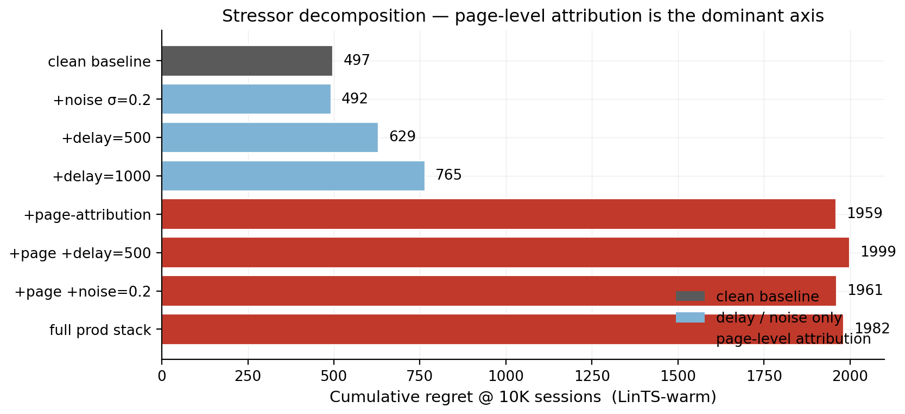

# WPO-Gym: A Simulation Benchmark for Whole-Page Optimization, with Evolvable Decision Programs as a Reference Policy

## Abstract

**Whole-page optimization (WPO)** — choosing *which* modules to show and *in what order* on a page, jointly, for a given user — cannot be studied the way the field usually studies decision policies. The action space is ordered slates over tens of modules (here 22 widgets into 6 slots, ≈10⁸ ordered pages); a live A/B test can compare a handful of hand-built designs, never the space; and logged production data is confounded by whatever policy produced it and never covers the combinatorial action set. The honest methodology is the one reinforcement learning adopted for control: a calibrated **simulator** with a transparent, swappable reward, against which any policy can be run reproducibly. This paper contributes that environment.

**WPO-Gym** is a simulation benchmark for whole-page composition under the reward signal production actually has — page-level attribution, multi-day delay, and observation noise — not the per-slot signal academic slate-bandit work assumes. It ships: a customer simulator with two interchangeable persona sources (parametric 8-persona; LLM-driven 14-persona × 6-category); a policy-agnostic ground-truth reward and oracle; a Gym-style `reset()/step()/drain()` API whose delayed-feedback contract exposes exactly the reward a production learner may see; and an inaugural leaderboard of ten policies. The ground truth is a transparent, swappable component of the benchmark, not a hidden assumption; we report the policy ranking's invariance to i.i.d. and structured perturbations of it.

As the benchmark's reference policy we study **Evolvable Decision Programs (EDP)**: a 200–300-parameter named GAM with piecewise-linear shape functions, which is simultaneously:

- **LLM-writable.** An LLM can author a competent initial policy directly from domain knowledge (245 named parameters, ~9 KB of JSON, no training data).
- **LLM-editable.** Every parameter has an addressable dotted path (`size_guide.on_cov.F32`), so an agent emits well-typed scalar edits with attached reasons (15 ± 1 edits per round in our runs, ~3 KB per round).
- **Human-auditable.** The whole policy fits on one page of plots (Fig. 8); every decision factors as a sum of named contributions (Fig. 9); every edit carries an LLM-written justification in version control (Fig. 10).
- **Microsecond-servable.** Evaluating 245 numbers through PWL interpolation and a 6-step greedy loop is roughly 1 ms; the LLM never runs in the serving path.

Together these four properties give **closure under both human and LLM editing**. The LLM reads, the human reviews, the LLM re-edits, with no translation layer. Neural nets are not closed under LLM edits, since there is no `weights[847][22]` an LLM can sensibly reason about. Large codebases are not closed under *single-checkpoint* LLM edits, since the agent cannot hold the full surface in working memory each round. A 245-parameter GAM sits between the two: small enough that the entire policy is in-context, large enough to express a competitive policy, structured enough that edits are well-typed and the post-edit artifact is still human-reviewable. We call a GAM equipped with this evolution loop an **Evolvable Decision Program** (EDP).

**What the inaugural leaderboard shows.** Run through one harness (§5.0), the ten policies separate by class. At default exploration, per-slot and combinatorial bandits lose heavily under page-level attribution, because the per-arm credit they rely on is structurally absent (§5.2): LinTS-warm loses 21.6 %, the best combinatorial bandit 16.6 %, while the adaptive-submodular GAM class leads (GreedyLinTS, no LLM, 13.5 %; Bayesian-EDP 10.8 %; EDP-agent 13.3 % on the primary LLM-persona simulator, and EDP-agent 6.5 % on parametric). But the benchmark also corrects its own naive reading: a per-condition exploration sweep (§5.3) drops a *tuned* LinTS-warm to 10.5 % on LLM — tied with the best GAM — showing that much of the apparent bandit "collapse" is over-exploration under an uninformative signal, not an inability to compete. The durable finding is therefore about *policy classes and what the regime rewards*, not "LLM beats bandits": the GAM class wins at default settings and ties a tuned, feature-matched bandit at best settings. When regret ties, the tie-breaker is what the class buys beyond it (§6.0) — following the customer across funnel surfaces by construction, compile-time LLM reasoning with no LLM in the serving path, robustness to the noise that actually appears, and expandability by both coding agents and humans adding problems, widgets, and curves — none of which a bandit's per-arm posteriors provide. Code, the Gym API, the committed policy/edit artifacts, and the leaderboard harness are released so the benchmark is runnable and extensible.

## 1. Introduction

### 1.1 Why whole-page optimization needs a simulator

A product page is *composed*, not just ranked: a recommender chooses which modules to place — fit reassurance, a comparison card, outfit completion, a returns explainer — and in what order, jointly, for the user in front of it. This is **whole-page optimization (WPO)**, and it has a property that makes it hard to study with the field's usual instruments. The action is an *ordered slate* over the module registry; with 22 widgets into 6 slots the space is ≈10⁸ ordered pages, and the reward is a property of the *whole page*, not of any module in isolation.

That combination defeats the three standard evaluation routes:

- **Live A/B testing** can compare a handful of hand-built page designs. It cannot search a 10⁸-action space, and every arm costs weeks of traffic and a real customer experience. You learn whether design A beats design B, never which region of the space is good.
- **Logged/offline data** is generated by *some* production policy, so it covers only the slates that policy chose; the combinatorial remainder is unobserved, and counterfactual estimators (IPS, DR) need a known logging propensity over an action space this large, which production rarely has.
- **Per-slot bandit benchmarks** assume the reward is attributed to each slot. Production attributes reward at the page or order level, after a multi-day return window, with noise — precisely the signal per-slot methods cannot consume (§5.2).

Reinforcement learning faced the same wall for control and answered it with simulators: MuJoCo, the Arcade Learning Environment, Gym, D4RL. You cannot cheaply learn locomotion on real robots, so a calibrated simulator with a transparent reward became the field's substrate, and progress was measured on it. WPO is in the same position. The contribution of this paper is the corresponding environment.

### 1.2 WPO-Gym

**WPO-Gym** is a simulation benchmark for whole-page composition under the reward signal production actually has — page-level attribution, multi-day delay, and observation noise. It has four components (§2):

1. A **customer simulator** with two interchangeable persona sources — a parametric 8-persona mixture and an LLM-authored 14-persona × 6-category source — exposing one interface so policies are agnostic to which is active.
2. A **policy-agnostic ground truth**: latent per-persona needs and per-widget provisions define a diminishing-returns page reward and a per-persona oracle. The ground truth is an explicit, swappable component of the benchmark, not a hidden modelling assumption; §5.4e and Appendix C report how the policy ranking moves under perturbations of it.
3. A **Gym-style API** (`reset()`, `step(page, payload)`, `drain()`) whose delayed-feedback contract surfaces exactly the (noisy, page-level, delayed) reward a production learner is allowed to see, while withholding the latent persona. One harness drives per-slot bandits, slate bandits, and GAM policies alike (`edp/env.py`, `edp/agents.py`).
4. An **inaugural leaderboard** of ten policies (§5.0), run through that single harness with one seed protocol, released for extension.

The benchmark's headline finding is a **policy-class ranking with a caveat the benchmark itself surfaces**: at default exploration, per-slot and combinatorial bandits lose heavily under page-level attribution (§5.1–5.2), while an adaptive-submodular GAM policy class leads; but a per-condition exploration sweep (§5.3) shows a tuned, feature-matched per-slot bandit *ties* the best GAM on regret. We make the *why* explicit rather than crowning a method: page-level attribution removes the per-arm credit bandits rely on, over-exploration compounds the loss when that signal is uninformative, and a model class that scores pages compositionally sidesteps both (§5.4c). What separates the GAM class in deployment is not regret but cold-start and the closure properties below.

### 1.3 Evolvable Decision Programs: the reference policy

The strongest entries are instances of a policy class we call an **Evolvable Decision Program (EDP)**: a 200–300-parameter named generalised additive model (GAM) with piecewise-linear shape functions, authored and edited by an LLM offline and served as pure code. We study it as the benchmark's reference policy because it has four properties no weight-based learner combines:

The four properties are: **LLM-writable** (the LLM authors a competent initial policy directly from domain knowledge); **LLM-editable** (every parameter has an addressable dotted path, so the agent emits well-typed scalar edits with attached reasons); **Human-auditable** (every decision factors as a sum of named contributions and every edit is a PR diff); and **Microsecond-servable** (evaluating ~245 numbers and a 6-step greedy composition is roughly 1 ms in pure Python, with the LLM strictly offline). §3.4 quantifies each. Together they give **closure under both human and LLM editing**: the LLM reads, the human reviews, the LLM re-edits, with no translation layer. This is the *Software 3.0* idea (Karpathy) made serviceable for an online decision system — the LLM authors a readable artifact rather than sitting in the serving path. A neural net is not closed under LLM edits (there is no `weights[847][22]` an LLM can reason about); a 10K-line codebase is not closed under single-checkpoint edits (too much surface). A 245-parameter named GAM sits in between.

On the leaderboard, EDP-agent reaches 6.5 ± 0.2 % oracle-regret on the parametric simulator and Bayesian-EDP reaches 11.0 ± 0.2 % on the primary LLM-persona simulator — best among the ten entries at their default settings. We are explicit about two qualifications. First, the architecture, not the LLM, carries most of this: GreedyLinTS — the same GAM with no LLM — already reaches 12.8 % / 13.3 % (§5.4c). Second, a *tuned* per-slot bandit handed the EDP problem-features matches Bayesian-EDP on regret (§5.3). EDP's distinctive value is therefore not a regret margin but the deployment properties its closure buys — cold-start with zero data (§5.7), zero serving dependencies, inline audit — that no bandit entry has.

The "evolvable" qualifier carries a disclaimer. What the experiments cleanly support is *coefficient updates within a fixed policy class*. Structural growth (new shape functions, widgets, synergies mid-stream) is supported by the edit grammar (§5.4d, §5.9) but not yet shown to pay off at multi-seed; treat it as a capability claim until §5.4d/§5.9 are replicated at K ≥ 5.

**Contributions:**

1. **WPO-Gym (§2, §5.0).** A simulation benchmark for whole-page optimization under production reward conditions, with two interchangeable persona sources, a transparent swappable ground truth, a Gym-style delayed-feedback API, and an inaugural ten-policy leaderboard — all released and reproducible from one harness. The methodological claim is that simulation is the appropriate, not merely convenient, way to study WPO.
2. **A policy-class finding, with an honest caveat (§5.1–5.4c).** At default exploration, per-slot and combinatorial bandits lose heavily under page-level attribution and the adaptive-submodular GAM class leads. A per-condition exploration sweep (§5.3) shows much of the bandit loss is over-exploration: a tuned, feature-matched per-slot bandit ties the best GAM on regret. The structural point — page-level reward removes per-arm credit (§5.2) — stands for the from-scratch (cold) bandit and at default settings; the durable class difference is in cold-start and deployment properties, not a regret margin.
3. **Evolvable Decision Programs as a reference policy (§3, §3.4).** A 200–300-parameter named GAM with closure under both human and LLM editing — LLM-writable, -editable, human-auditable, microsecond-servable — and the GAM-as-prior Bayesian fusion (§5.4b) that is the best leaderboard entry on the primary simulator.
4. **An OPRO-style ablation (§5.4)** isolating structured context, not the LLM's raw intelligence, as the carrier of the LLM-side gain.

### 1.4 Related work and positioning

WPO-Gym relates to simulation benchmarks; EDP relates to four method lines. We position against each.

**Simulation benchmarks for decision-making.** RL standardised on simulators when real interaction was too costly to search: MuJoCo, the Arcade Learning Environment, OpenAI Gym, and offline-RL suites like D4RL. WPO-Gym is the analogue for whole-page composition — a calibrated environment with a transparent, swappable reward and a Gym-style API — motivated by the same impossibility argument (§1.1). Recommender simulators exist (RecoGym, RecSim) but target single-slot or sequential-item recommendation with per-item feedback; WPO-Gym's distinguishing features are the *ordered-slate* action, the *page-level* delayed reward, and a ground truth designed to be perturbed and swapped as part of the evaluation.

**LLMs as optimizers and program authors.** OPRO (Yang et al., 2023) uses an LLM to propose solutions from a trajectory of (solution, score) pairs — exactly our OPRO ablation (§5.4), which we use as a baseline, not a contribution. FunSearch (Romera-Paredes et al., 2024) and ADAS / meta-agent search (Hu et al., 2024) evolve *programs* with an LLM under a fitness signal; Eureka (Ma et al., 2023) has an LLM author *reward functions* for RL. These share EDP's core move — the LLM edits a symbolic artifact that a machine then executes — and already exploit the property that programs are LLM-editable in a way weights are not. EDP differs in three respects: (i) the artifact is a *fixed-class GAM* (≈245 named scalars), not free-form code, so the whole policy fits in one context window and every edit is a typed scalar with a plottable effect; (ii) the same artifact must be *microsecond-servable and human-auditable*, not merely executable, which rules out the larger programs FunSearch/ADAS evolve; (iii) we pair the discrete LLM edits with a regularised-SGD channel on the same parameters (Bayesian-EDP, §5.4b). The contribution is this *fit* — a representation simultaneously closed under LLM edits, human review, and sub-ms serving — not LLM-guided search per se.

**Interpretable additive models.** The substrate is a generalized additive model (Hastie & Tibshirani, 1986) with piecewise-linear shape functions; explainable boosting machines / GA²M (Lou et al., 2013; Caruana et al., 2015) are the canonical modern instance and the line our Layer-1/Layer-2 GAM builds on. Prior GAM work optimizes interpretability *for a fixed dataset*; EDP's novelty over it is the LLM authoring/editing loop and the deployment under delayed page-level reward, not the additive form.

**Symbolic and interpretable policies.** Symbolic regression (e.g. PySR; Cranmer, 2023) and interpretable/programmatic RL (e.g. PIRL, Verma et al., 2018) also seek small, readable decision artifacts. EDP's distinction is that the readable artifact is *grown by an LLM editor under human review*, and is evaluated as an online policy under a production reward stack rather than fit offline.

**Contextual, combinatorial, and slate bandits.** LinUCB (Li et al., 2010), Linear Thompson Sampling (Agrawal & Goyal, 2013), and combinatorial / slate / cascading bandits are the comparison class (§5.1, §5.3). Our point is not a new bandit algorithm; it is that the per-arm credit-assignment these methods rely on is structurally absent under page-level reward (§5.2), and that an adaptive-submodular GAM (GreedyLinTS, §5.4c) sidesteps the problem by changing the model class. We do not test neural bandits (NeuralUCB) or offline/counterfactual estimators (IPS, DR); these are acknowledged gaps (§7).

## 2. The WPO-Gym environment

WPO-Gym separates four concerns: the **customer simulator** (session sampling), the **persona source** (parametric or LLM-driven), the **ground-truth reward** (policy-agnostic), and the **observable reward signal** the policy actually receives (delayed, noisy, page-level). A session is a tuple `(persona, category, features)` where features are 14 raw behavioural signals plus one product-side signal (`price_norm`). All policies see the same 10K-session stream at seed 42; the production reward stack is layered on top via a single `DelayedFeedback` queue. Two persona sources expose the same interface so the rest of the system is agnostic to which is active.

The environment is exposed through a Gym-style contract (`edp/env.py`): `reset()` returns an `Observation(index, category, feat)` — note the persona is *withheld*, since it is the latent the reward depends on; `step(page, payload)` advances one session and returns a `StepResult` whose `matured` field carries only the delayed, page-level, noisy feedback that has become visible at the current tick (the queue holds each reward for `delay` sessions and adds Gaussian noise on release); `drain()` flushes the queue at episode end. A policy that reads `true_reward` or the persona instead of the matured feedback is cheating, and the API makes that boundary explicit. Crucially, reward *attribution* lives in the policy's `payload`, not the environment — so a per-slot bandit (which packs per-slot contexts into the payload and splits the page reward across them) and a page-level GAM (which consumes the scalar directly) run against the *same* environment with no special-casing. The agent adapters that wrap each policy family behind one `act/learn/maybe_checkpoint` protocol are in `edp/agents.py`, and one runner (`run_episode`) drives all of them; this is the harness behind the §5.0 leaderboard.

The ground truth (§2.2) is an explicit, swappable component, not a hidden modelling choice: it is a pair of LLM-authored maps that any user of the benchmark can replace or perturb, and §5.4e / Appendix C report how the policy ranking responds when we do.

### 2.1 Customer simulator (parametric source)

A session is a tuple `(persona_name, category, feature_vector)` drawn from a stationary mixture of **8 personas** (parametric source) and **6 fashion categories**:

| Persona | p (mixture weight) | Defining traits |
|---|---|---|
| size_anxious_new | 0.18 | low size_conf, high size_chart usage, new visitor |
| comparison_shopper | 0.16 | very high tab_switch, high revisit |
| price_sensitive | 0.14 | high price_sens, high price_dwell |
| outfit_seeker | 0.12 | high style_stretch, low return_hist |
| confident_buyer | 0.12 | very high size_conf, low return_hist, low cart_osc |
| paralyzed | 0.10 | high cart_osc, high wishlist, high revisit |
| browser_lurker | 0.10 | high mobile, medium everything |
| returner_anxious | 0.08 | high return_hist, very high return_view |

Each persona specifies, for each of **14 raw signals**, a Gaussian `(μ, σ)`:

```
{size_conf, price_sens, return_hist, style_stretch, new, mobile,
 size_chart, tab_switch, zoom, price_dwell, cart_osc, wishlist,
 return_view, revisit}
```

Per session, each signal is sampled `x ~ Normal(μ, σ)` and clipped to `[0, 1]`. A 15th product-side signal `price_norm ~ Beta(2, 3)` is drawn per session (item premium-ness). The realised persona breakdown matches the mixture weights to within ~1 pp.

### 2.2 Ground truth (independent of every policy)

We author **7 latent shopping needs**:
```
{N1_fit, N2_visual, N3_peer, N4_compare, N5_styling, N6_trust, N7_commit}
```

For each persona, `TRUE_NEEDS[persona]: need → importance ∈ [0, 1]`. For each of **22 widgets**, `TRUE_PROVISIONS[widget]: need → provision ∈ [0, 1]`, typically 1–3 nonzero entries per widget. Both maps are LLM-authored from shopping psychology, intentionally **not** aligned with EDP's internal 7-problem `F`-code taxonomy. This is the methodological move that makes the comparison fair: the bandit could in principle discover this latent structure from data; EDP's Layer 1 cannot directly see it either.

**Reward function.** Diminishing returns on `(need × provision)`. Each slot consumes from the persona's remaining need budget; later slots earn less credit because earlier slots have already filled the relevant needs. Concretely, for a page `(w₁, …, w₆)` and remaining-need vector `r` initialised to the persona's importance vector `n`:

`reward = Σₖ Σ_d  nₐ · min(r_d, provision[wₖ][d])`,  `r_d ← r_d − provision[wₖ][d]` after each slot.

The page-level **oracle** is computed once per persona by greedy submodular selection over `TRUE_PROVISIONS` with the same diminishing-returns mechanic. With 6 slots and 22 candidate widgets, the oracle ranges from 0.53 (`confident_buyer`) to 1.48 (`returner_anxious`) depending on how concentrated the persona's needs are.

```
oracle_reward[returner_anxious]   = 1.480     oracle_reward[confident_buyer]  = 0.528
oracle_reward[paralyzed]          = 1.410     oracle_reward[browser_lurker]   = 0.643
oracle_reward[size_anxious_new]   = 1.350     oracle_reward[price_sensitive]  = 0.923
oracle_reward[comparison_shopper] = 1.240     oracle_reward[outfit_seeker]    = 1.215
```

We report **cumulative regret** = `Σᵢ (oracle[personaᵢ] − reward[i])`. Lower is better.

### 2.2b Fashion categories

Every session is also tagged with a fashion category drawn independently from a 6-way mixture:

| Category | Share | Dominant need uplifts |
|---|---|---|
| dress | 18% | +30% on `N5_styling`, +10% on `N2_visual` |
| top | 22% | +20% on `N3_peer` |
| bottoms | 20% | +30% on `N1_fit`, +20% on `N4_compare` |
| shoes | 15% | +40% on `N1_fit`, +30% on `N6_trust` |
| outerwear | 10% | +30% on `N2_visual`, +20% on `N6_trust` |
| accessories | 15% | +30% on `N5_styling`, +30% on `N2_visual`, −50% on `N1_fit` |

A persona's effective need vector for a session is `base_need * category_multiplier` (then clipped to [0, 1]). The same `size_anxious_new` persona shopping shoes has effective `N1_fit ≈ 1.0`; shopping accessories has effective `N1_fit ≈ 0.42`. This adds a second source of heterogeneity to the reward: knowing the persona is no longer enough; the policy (or its agent) has to know what the persona is looking at.

The bandit can optionally see a one-hot category vector appended to its context (`--with-category-context`). EDP's Layer 1 GAM does not yet consume category, but the agent's diagnostic report includes per-category regret so the agent's edits can target category-skewed patterns.

### 2.2c LLM-driven persona source

For the realism stress test, we add a second persona source. Each persona is a paragraph of natural language in `data/personas_text.yaml`:

```
- name: post_return_returner
  mixture_weight: 0.08
  description: >
    Recently returned an item from the same brand. Their previous order
    didn't fit. They are skeptical now and proceeding cautiously. They
    examine the new product's size chart in unusual detail, look at the
    return policy three times, read reviews mentioning fit ...
```

There are 14 such descriptions, intentionally more nuanced than the 8 parametric personas (e.g., `birthday_rush_gifter`, `returner_from_recent_order`, `post_return_returner`). For each, a Claude subagent generated:

1. A `true_needs` vector (7-d, [0,1]) inferred from the description.
2. **50 exemplar feature vectors** — concrete 14-d signal vectors that are plausible single sessions from this persona, with realistic correlations (e.g., low `size_conf` tracking with high `size_chart` and high `return_view`).

At simulation time, `edp.personas.llm.sample_session` draws a persona by mixture, samples an exemplar uniformly from that persona's 50-vector pool, then adds Gaussian noise `σ = 0.05` per signal before clipping. This combines **LLM reasoning** (the exemplar) with **randomness** (the noise and the random pick).

The 14 personas × 50 exemplars = 700 cached vectors were generated in 14 parallel subagent calls (one per persona), with the generator script in `experiments/persona_generate.py` and the cache in `data/personas_llm_cache.json`.

### 2.3 Production reward stack

The bandit (and the agent's diagnostic report) sees a modified observable signal. Three orthogonal stressors:

1. **Page-level attribution.** Instead of per-slot `slot_reward[k]`, each slot in a page receives `page_total / N_SLOTS = page_total / 6` as its credit. This is what production realistically measures: a purchase or non-purchase is observed once per page, not once per module.

2. **Delay.** Reward for session `i` is queued and released at session `i + delay`. Default `delay=500`. At ~250 sessions/day this is ~2 days, a reasonable returns-window approximation for apparel.

3. **Observation noise.** Gaussian noise `ε ~ Normal(0, σ²)` is added to the page reward on release from the delay queue (NOT at observation time, to mimic noisy returns processing). Default `σ=0.2`, which is ~18% of mean page reward.

Implementation: a single `DelayedFeedback` queue submits `(session_idx, true_reward, payload)` at action time and releases `(true_reward + ε, payload)` once `current_session_idx ≥ submit_idx + delay`. Residual queue is drained at end of run.

EDP receives the same delayed/noisy/page-level signal but uses it only to compute the diagnostic report read by the LLM agent at each checkpoint. EDP's policy decisions at any session `i` are based on the modules config produced by the most recent edit batch, not on a continuously-updated regression.

### 2.4 Methods compared

| Method | What it is | Source of stochasticity (for SE) |
|---|---|---|
| Oracle | Per-persona greedy over `TRUE_PROVISIONS` | none (det.) |
| EDP-static | Initial LLM-prior modules, never updates | none (det.) |
| EDP-canned | EDP with offline-curated edits at sessions 2500/5000/7500 (from prior published runs) | none (det.) |
| EDP-agent (ours) | Same EDP, edits proposed by Claude subagent reading the diagnostic report at each checkpoint | subagent draw (3 reps) |
| EDP-OPRO | Same loop and same model, but prompt = `(prior_edits, batch_regret)` history only | subagent draw (3 reps) |
| LinTS-warm | Per-slot LinTS, 7-d problem-fingerprint context, page-level attribution, delay, noise | TS / queue (10 seeds) |
| LinTS-cold | Per-slot LinTS, 14-d raw signal context, otherwise identical | TS / queue (10 seeds) |

LinTS hyperparameters held fixed: `α = 0.3`, `λ = 1.0`, `N_SLOTS = 6`. Action mask prevents repeating a widget within one page.

### 2.5 Notation and closure definition

Throughout the paper we use *closure under edits* in a precise sense: a representation R is closed under operation O if applying O to R yields another instance of R that can be operated on again without translation. Here R is the GAM policy artifact and O is an LLM- or human-authored scalar edit; §3.4 quantifies the closure properties and §5 demonstrates that they do not cost performance.

| Term | Meaning |
|---|---|
| **EDP** | Evolvable Decision Program — the GAM policy + evolution loop |
| **GAM** | Generalised Additive Model |
| **PWL** | Piecewise-linear shape function |
| **LinTS** | Linear Thompson Sampling (per-slot bandit) |
| **Slate-LinTS** | Pooled-arm LinTS with top-K slate selection |
| **CombLinUCB** | UCB sibling of Slate-LinTS (`θ̂·x + α·√(xᵀA⁻¹x)`, top-K) |
| **GreedyLinTS** | Adaptive-submodular bandit on the EDP architecture (Bayesian-EDP at λ=0 and uninformative prior) |
| **UCB / TS** | Upper-confidence bound / Thompson sampling |
| **MAP / SGD** | Maximum a posteriori / Stochastic gradient descent |
| **OPRO** | Optimisation by PROmpting — score-only LLM optimisation baseline |
| **IPS / DR** | Inverse propensity scoring / Doubly Robust estimators |
| **MLP** | Multi-layer perceptron |
| **SE / PR** | Standard error / Pull request |
| **F3.2 size anxiety** | Repeated size chart opens, low size confidence, high return history |
| **F3.3 quality deficit** | Excessive zooming on premium-priced items |
| **F4.1 comparison friction** | Tab-switching between similar items |
| **F4.3 outfit visualisation** | High style-stretch; can't picture full look |
| **F4.5 price-quality confusion** | High price dwell and price sensitivity |
| **F4.6 return hesitation** | Viewing return policy, high return history |
| **F5.1 decision paralysis** | Cart add/remove cycles, high wishlist, multiple revisits |
| **N1–N7 needs** | N1 fit, N2 visual, N3 peer, N4 compare, N5 styling, N6 trust, N7 commit |

F-codes are an internal taxonomy of seven shopping problems the LLM identified at policy authoring time; the `F<major>.<minor>` numbering is the LLM's own and has no external referent. The N1–N7 needs are an independent LLM-authored taxonomy used to author `TRUE_PROVISIONS` (§2.2); the intentional misalignment between F-codes and N-needs is the methodological move that prevents the bandit's reward signal from being literally the same labels the policy uses.

## 3. EDP architecture and evolution loop

### 3.1 Layer 1: PWL problem detection

Each of 7 problems (F3.2 size anxiety, F3.3 quality, F4.1 comparison friction, F4.3 outfit visualisation, F4.5 price-quality, F4.6 returns, F5.1 paralysis; full glosses in §2.5) is a weighted average of PWL shape functions over relevant signals. Output: a 7-d "problem fingerprint" per session.

The entire Layer-1 fits on one page (Fig. 8). Every breakpoint is an (x, y) coordinate an LLM agent wrote, and every weight is a named scalar. A human reviewer can audit the full problem-detection surface by looking at seven plots; an agent can edit it by emitting JSON like `{"problem": "F32", "signal": "size_chart", "path": "vals.2", "from": 0.45, "to": 0.60, "reason": "..."}`.

![Figure 8: Layer-1 PWL shape functions, full surface on one page. Each panel scores one of the seven problems: F3.2 size anxiety reads size_chart and size_conf_inv; F3.3 quality deficit reads zoom and price_norm; F4.1 comparison reads tab_switch, revisit, and price_dwell; F4.3 outfit visualisation reads style_stretch and mobile; F4.5 price-quality reads price_dwell and price_sens; F4.6 return hesitation reads return_view and return_hist; F5.1 decision paralysis reads cart_osc, wishlist, and revisit. Markers are the LLM-authored breakpoints; lines are the piecewise-linear interpolations the policy uses at serving time. An agent edit is one marker moving up or down on one curve — a single number change with a free-text reason in the audit log. The whole surface is 7 panels × 2–3 signals × ~4 breakpoints ≈ 80 numbers.](figures/fig9_pwl_shapes.png)

### 3.2 Layer 2: module GAM + greedy composition

Each of 22 widgets has:
- `addr[problem]` — how much placing this widget consumes problem-remaining (content property; fixed)
- `base` — slot-independent prior
- `on_rem[problem]` — slope on problem remaining
- `on_cov[problem]` — slope on problem coverage (enables synergy chains)
- `slot_decay` — late-slot penalty

Module score for slot `s`:
```
score = base + Σ_p on_rem[p] · remaining[p] + Σ_p on_cov[p] · coverage[p] − slot_decay · s
```

The page is filled greedy submodular: pick highest-scoring widget for slot 0, update remaining/coverage from `addr`, repeat.

Fig. 9 traces a single session end-to-end. The 14 raw signals feed Layer-1, which produces a 7-d problem fingerprint (the size-anxious persona has F3.2 = 0.74 and the rest near zero). Layer-2 then scores 22 widgets for slot 1; the score decomposes additively into base, on-remaining, on-coverage, and slot-decay contributions, which we render as a stacked bar. The winning widget (`fit_reassurance`) wins not because of a high `base` but because its on-remaining slope on F3.2 fires hard. Every choice the policy ever makes admits this kind of decomposition.

![Figure 9: Open-box decision trace for one size-anxious session, walked top to bottom. Top panel: 14 raw behavioural signals — size_chart at 0.62 and size_conf_inv at 0.82 dominate. Middle panel: 7 Layer-1 problem scores — only F3.2 (size anxiety) fires above 0.5, with F4.6 (return hesitation) a weaker secondary at 0.31. Bottom panel: stacked-bar decomposition of slot-1 scores for the top-5 candidate widgets. Each bar splits into four contributions: base (grey), on-remaining (red, fires on problems still needing coverage), on-coverage (green, synergy with already-placed widgets), and slot-decay (brown). Diamonds mark the total. The winning widget (`fit_reassurance`) wins on its red on-remaining slope (1.81 from `2.2 × F3.2 = 2.2 × 0.74`), not on its base (0.10). Every step of the trace is a number a human can read and an agent can edit.](figures/fig10_decision_trace.png)

### 3.3 Evolution loop

At each checkpoint the orchestrator generates a structured Markdown report covering aggregate regret, per-persona regret (sorted worst first), per-widget activation rate and average reward per fire, the most common page compositions, and the edit history. An LLM subagent reads the report alongside the persona-need and widget-provision priors and proposes 8–16 atomic edits as JSON. Each edit is `(widget, dotted_path, from, to, reason)`. The orchestrator applies them and runs the next batch.

The first part of an actual round-2500 report (parametric simulator) reads:

```
# EDP CHECKPOINT REPORT — sessions 0 → 2500  (N=2500)

## Aggregate performance
- mean regret: 0.1125  (10.1% of oracle)
- cum regret (batch): 281.19

## Per-persona performance (sorted by regret %, worst first)
  persona                    N    regret%
  returner_anxious         221    27.3%
  size_anxious_new         463    18.1%
  browser_lurker           245     9.2%
  confident_buyer          304     8.0%
  ...

## Widget activation rate (% of all slots filled) and r/fire
  widget                      act%   r/fire
  similar_items               15.7   0.1625
  outfit_completion           15.1   0.1654
  ...
  return_explainer             0.0   0.2069  (high r/fire, never fires)
  size_guide                   0.0   0.0000
  ...
```

Two patterns are visible to a reader (and to the agent) without further interpretation: `returner_anxious` and `size_anxious_new` carry 27 % and 18 % regret while their need-relevant widgets (`return_explainer`, `size_guide`) sit at zero activation. The agent's round-2500 edits (Fig. 10) act exactly on that mismatch — they raise the `base` of the dead widgets and rewrite their `on_cov` slopes to chain with already-firing primary widgets.

Fig. 10 shows the first round-2500 edit batch on the parametric simulator: ten scalar parameter changes, each carrying an LLM-authored reason. The reasons are emitted alongside the edit, not generated after the fact, and they surface verbatim in the audit log a reviewer reads.

![Figure 10: One auditable agent edit batch, session 2500 on the parametric simulator. Each row is one scalar parameter on one widget. The grey bar shows the prior value (LLM-authored at session 0); the red bar shows the value after the agent's checkpoint edit. The free-text reason that travels with each edit appears to the right of the bars, persisted in the version-controlled policy alongside the numeric change. Read top to bottom: the agent is reviving four widgets that under-fire (raising bases on `return_explainer`, `easy_returns_promise`, `size_guide`, `material_deep_dive`), converting two anti-synergy slopes (`size_guide.on_cov.F32` and `easy_returns_promise.on_cov.F46`) into positive chained complements, and cutting two over-firing widgets (`outfit_completion.base` and `trending_now.base`). A PR-style human reviewer reads this in under a minute and either merges or requests changes.](figures/fig11_agent_edit_diff.png)

An optional continuous-update method (Bayesian-EDP) sits on top of this architecture; we defer its formal description to §5.4b where the decomposition motivates it.

### 3.4 Quantitative closure properties

The four closure properties of §1 are measurable, not aesthetic. We report the actual numbers from our setup so the "primitive" claim is concrete:

| Property | Measure | Value |
|---|---|---|
| **LLM-writable** | learnable parameters in initial policy | **245** (157 Layer-1 + 88 Layer-2) |
| | policy as serialised JSON | **9.2 KB** |
| | required training data to author | **0 sessions** (LLM writes from domain knowledge) |
| **LLM-editable** | edit grammar | dotted path + scalar `to` + free-text `reason` |
| | mean edits proposed per checkpoint round | **15.0** (range 12–16 across N=4 runs × 3 rounds) |
| | edit batch as serialised JSON | **~3 KB** per round |
| | parameters touched per edit | **1** (by construction; no entanglement) |
| **Human-auditable** | full Layer-1 surface fits in | **1 figure** (Fig. 8, 7 panels × 2–3 curves) |
| | decision trace per session | **1 plot** (Fig. 9, signals → problems → score decomposition) |
| | every edit has an LLM-written reason | **100 %** (enforced by edit schema) |
| | post-hoc interpretability library required | **none** |
| **Microsecond-servable** | serving cost per page | **~1 ms** (pure Python, 245-number eval + 6-step greedy) |
| | external dependencies at serving time | **0** |
| | LLM calls per decision | **0** |
| | LLM calls per 10K-session run | **3** (one per checkpoint round) |

The diagnostic report the agent reads at each checkpoint is about 900 tokens (3.6 KB); the full prompt, including the report plus the current policy plus the edit grammar, is about 3,200 tokens (13 KB). The entire policy plus full diagnostic context fits inside any modern LLM's context window with room to spare, and the agent's response (15 edits with reasons plus a free-text note) returns under 1 KB. This is what we mean by saying the whole policy is in working memory while editing it.

A comparable neural-net policy for the same problem, say a small MLP scoring 22 widgets from a 14-dim context with one 64-unit hidden layer, has roughly 2,400 parameters per slot, none addressable by name and none plottable in any readable way. An OPRO-style coding agent editing a 10K-line policy codebase faces a different problem: each edit is well-typed, but the agent must re-read the surrounding code each round to remember what it means. The GAM primitive sits between these two regimes. It is small enough that the whole policy is the prompt and large enough to express a competitive policy.

## 4. Experimental protocol

All methods see the **same** 10,000-session stream (seed 42). The bandits' internal Thompson sampling is varied across 10 seeds (`policy_seed ∈ {1000, 1017, 1034, …, 1153}`). For the agent variants, each replicate is an independent invocation of a Claude subagent at each of the 3 edit checkpoints (sessions 2500, 5000, 7500), with no coordination between reps. Multi-rep estimates report mean ± standard error.

Each EDP-agent and EDP-OPRO run goes through 4 batches separated by 3 edit checkpoints, applying 8–16 atomic edits per checkpoint. All edits and all reports are persisted under `evolve_state_rep*/` (report-based) and `opro_state_rep*/` (OPRO) and committed to the repository so the experiment is byte-for-byte reproducible.

## 5. Results

We treat **LLM-persona as the primary simulator** and parametric as a robustness check; results tables put LLM-persona first. §5.0 is the inaugural leaderboard; §5.1 isolates the lab-to-production gap; §5.2 attributes it to page-level credit; §5.3 sweeps bandit exploration (the result that most reshapes the naive reading); §5.4–5.4c decompose the EDP gain; §5.5–5.10 add per-cell, robustness, drift, and negative results. Single-trial claims are flagged in line.

### 5.0 The inaugural leaderboard

All ten policies, run through the one Gym harness (`run_episode` over `PageCompositionEnv`, §2) on the primary LLM-persona simulator under production conditions (page-level attribution, delay=500, σ=0.20), % of oracle reward lost @ 10K sessions (lower is better):

| Rank | Policy | Class | LLM · Prod regret % | tuned-α |
|---|---|---|---|---|
| 1 | Bayesian-EDP | GAM (LLM prior + SGD) | **11.0 ± 0.2** | — |
| 2 | EDP-agent | GAM (LLM prior + edits) | 13.3 ± 0.8 | — |
| 3 | GreedyLinTS | GAM (no LLM, SGD) | 13.3 ± 0.4 | — |
| 4 | Slate-LinTS | combinatorial bandit | 16.6 ± 0.1 | **12.5 ± 0.6** |
| 5 | CombLinUCB | combinatorial bandit | 16.9 ± 0.0 | 16.4 ± 0.0 |
| 6 | EDP-static | GAM (frozen LLM prior) | 19.8 | — |
| 7 | LinTS-warm | per-slot bandit | 21.6 ± 0.1 | **10.5 ± 0.4** |
| 8 | LinTS-cold | per-slot bandit | 22.8 ± 0.0 | (not swept) |
| 9 | Random | — | 30.6 ± 0.1 | — |
| 10 | Static top-6 | — | 40.7 | — |

The fourth column previews §5.3: each bandit at its *best* exploration `α` (per-condition sweep). At default `α=0.3` the per-arm bandits sit at ranks 4–8; tuned, LinTS-warm (10.5 %) and Slate-LinTS (12.5 %) jump *above* the GAM learners — so the default-`α` ranking overstates the GAM advantage, and we present the tuned column beside it rather than burying the correction.

(Provenance: one harness, `run_leaderboard.py` → `results/leaderboard.json`. Bandit rows vary their internal Thompson seed (10 seeds); EDP-agent varies over its 3 committed edit trajectories. Rows 1 and 3 are SGD methods that *are* stochastic across the SGD/jitter seed; the single-seed leaderboard run gives 10.8 % and 13.5 %, but we report their canonical 5-seed mean ± SE from §5.4b–c (11.0 ± 0.2, 13.3 ± 0.4) so the column is consistent with the rest of the paper, and the single-run values sit within that SE. EDP-static / Static are deterministic. The leaderboard reproducing the §5.1/§5.4c numbers within seed noise is itself a provenance check.)

Three readings, in increasing order of how much they complicate the naive story:

1. **The GAM policy class leads.** The top three entries share the adaptive-submodular GAM architecture; the best bandit at its *default* setting (Slate-LinTS, 16.6 %) trails the worst GAM learner (GreedyLinTS, 13.5 %). The architecture, not the LLM, is what separates the classes — GreedyLinTS has no LLM at all (§5.4c).
2. **EDP-static is not the point.** A frozen LLM prior (19.8 %) is beaten by the tuned combinatorial bandits; the LLM's value is as a *prior plus an update channel* (Bayesian-EDP, EDP-agent), and especially as cold-start (§5.7), not as a static config.
3. **Exploration tuning closes much of the bandit gap (§5.3).** The bandit entries above use the default exploration rate α=0.3. That is not their best: a per-condition sweep (§5.3) drops LinTS-warm to **10.5 %** on LLM at α=0.05 — tied with Bayesian-EDP. So the headline is *not* "GAMs beat bandits by 2×". It is that the bandits' apparent collapse at default settings is largely an over-exploration pathology under uninformative page-level reward, and that a *tuned* per-slot bandit handed the EDP-derived problem-features matches the GAM class on regret — while still lacking its cold-start and deployment properties (§5.7, §6). The benchmark's contribution is surfacing exactly this kind of correction.

The remainder of §5 unpacks the leaderboard. Parametric (robustness) numbers appear in §5.1.

### 5.1 The lab–production gap

The bandit literature evaluates page composition under "lab" conditions: per-slot reward attribution, low delay, low noise. Our paper's baselines use "production" conditions: page-level attribution, delay 500 sessions, σ = 0.20. Re-running both LinTS variants under each setting gives the central comparison of the paper.

EDP family + the deterministic baselines (static-widget, LLM-as-policy) are reported once each, since they don't update from the bandit reward signal and lab and production are therefore identical for them.

| Method | LLM · Lab | LLM · Prod | Δ | Parametric · Lab (robustness) | Parametric · Prod (robustness) | Δ |
|---|---|---|---|---|---|---|
| **CombLinUCB-warm (§5.3)** | **4.2 ± 0.0** | 17.3 ± 0.1 | +13.1 pp | **2.1 ± 0.0** | 10.5 ± 0.1 | +8.4 pp |
| Slate-LinTS-warm (§5.3) | 5.1 | 16.5 | +11.4 pp | 3.5 | 14.1 | +10.5 pp |
| LinTS-warm | 6.6 ± 0.1 | 21.6 ± 0.1 | +15.0 pp | 4.9 ± 0.0 | 18.9 ± 0.1 | +14.1 pp |
| LinTS-cold | 7.2 ± 0.1 | 22.8 ± 0.1 | +15.6 pp | 6.1 ± 0.0 | 20.2 ± 0.1 | +14.1 pp |
| GreedyLinTS  (§5.4c) | 14.4 ± 0.0 | 13.3 ± 0.4 | −1.1 pp | 9.6 ± 0.0 | 12.8 ± 0.1 | +3.2 pp |
| **Bayesian-EDP (§5.4b)** | 10.1 ± 0.1 | **11.0 ± 0.2** | +0.9 pp | 6.1 ± 0.3 | 7.6 ± 0.3 | +1.5 pp |
| EDP-agent | 13.3 ± 0.8 | 13.3 ± 0.8 | 0 | **6.5 ± 0.2** | **6.5 ± 0.2** | 0 |
| EDP-canned | 15.0 | 15.0 | 0 | 8.0 | 8.0 | 0 |
| EDP-static | 19.8 | 19.8 | 0 | 10.7 | 10.7 | 0 |
| LLM-as-policy | 35.7 | 35.7 | 0 | 26.8 | 26.8 | 0 |
| Static widgets | 40.7 | 40.7 | 0 | 29.7 | 29.7 | 0 |

(Numbers are % of oracle reward lost @ 10K sessions. Bandit cells are mean ± SE across 10 Thompson-sampling seeds (`results/results_multiseed_*.npz`). EDP-agent is the mean ± SE across 3 independent subagent edit trajectories (`state/evolve_state*`); Bayesian-EDP is the mean ± SE across 5 SGD/jitter seeds (`results/results_decomposition.json`). EDP-static / EDP-canned are deterministic. The differing replicate sources are why the SE columns are not uniform; §5.4c reports the architecture rows (GreedyLinTS, Bayesian-EDP) under one common 5-seed run for an apples-to-apples decomposition.)

The comparison inverts between the two conditions. Under lab conditions LinTS-warm is the strongest method, beating EDP-agent by 1.6 pp on parametric and 6.7 pp on LLM. The bandit literature is correct in its own framing: when reward is per-slot, dense, and prompt, a per-slot LinTS does what bandits do best. Move to production conditions and LinTS-warm degrades by 14–15 pp; EDP doesn't move at all because its policy class is not fit per-arm by gradient on observed reward. EDP-agent then wins production by 8–12 pp over LinTS-warm.

The remainder of §5 unpacks this gap: §5.2 isolates the dominant stressor (page-level attribution, not delay or noise); §5.3 shows that a stronger bandit (slate-LinTS) does not close it; §5.4 isolates what makes the agent-driven EDP work; §5.5–5.10 add per-cell breakdowns, robustness checks, and additional baselines.


### 5.2 Stressor decomposition: what causes the gap

Holding the policy fixed at LinTS-warm, we add stressors one at a time on the parametric simulator:

| Stressor | LinTS-warm cum regret @ 10K | Δ vs clean |
|---|---|---|
| Clean (per-slot reward, no delay, no noise) | 497 | — |
| + noise σ=0.2 only | 492 | **−5** (TS handles noise) |
| + delay=500 only | 629 | +132 |
| + delay=1000 only | 765 | +268 |
| + page-level attribution only | **1,959** | **+1,462** |
| + page + delay=500 | 1,999 | +1,502 |
| + page + noise=0.2 | 1,961 | +1,464 |
| Full production stack | 1,982 | +1,485 |

Page-level attribution is the dominant axis by an order of magnitude. Delay adds at most +268; noise is essentially free. The full production stack is roughly 99% the cost of switching from per-slot to page-level credit assignment. The +14 pp degradation in §5.1 is almost entirely attributable to one stressor.

The mechanism is credit assignment, not signal magnitude. Under page-level attribution, every slot in a page receives the same observed reward (`page_total / N_SLOTS`), so the per-arm regression targets within a page are perfectly correlated. The bandit cannot, even in principle, disentangle which slot caused which fraction of the reward.



### 5.3 Stronger combinatorial bandits don't close the gap (Slate-LinTS, CombLinUCB)

A natural objection to §5.1–5.2: "you used per-slot LinTS, not the strongest combinatorial bandit". We test two stronger combinatorial-bandit baselines.

- **Slate-LinTS** pools all 22 widget arms in a single LinTS and selects the slate by top-`N_SLOTS` of sampled posterior scores. Pooling raises the per-arm sample count by `N_SLOTS=6×`.
- **CombLinUCB** is the natural UCB sibling of Slate-LinTS: replace Thompson sampling with the upper-confidence-bound `θ̂ · x + α·√(x ᵀ A⁻¹ x)`, then take top-K. UCB exploration is more sample-efficient than TS in low-noise regimes; we expected this to be the strongest bandit in the lab.

The table above fixes exploration at `α = 0.3`. That turns out to matter a great deal, and sweeping it is the most informative single experiment in the paper.

**Exploration sweep (the result that reshapes the naive reading).** We sweep `α ∈ {0.05, 0.1, 0.2, 0.3, 0.5, 1.0}` per method per condition and report each method's best (`run_alpha_sweep.py` → `results/alpha_sweep.json`, 3 seeds for the TS methods):

| Method | LLM @ α=0.3 | LLM @ best α | Parametric @ best α |
|---|---|---|---|
| LinTS-warm | 21.5 % | **10.5 ± 0.4 %** (α=0.05) | 9.2 ± 0.2 % (α=0.05) |
| Slate-LinTS | 16.7 % | **12.5 ± 0.6 %** (α=0.05) | 10.2 ± 0.3 % (α=0.05) |
| CombLinUCB | 16.9 % | 16.4 % (α=0.2) | 8.5 % (α=0.1) |

Reference GAM entries: Bayesian-EDP 11.0 % / 7.6 %, EDP-agent 13.3 % / 6.5 % (LLM / parametric).

Three things fall out. First, **most of the per-slot bandit's apparent collapse was over-exploration.** Under page-level reward the per-arm signal is uninformative, so exploration spends regret to learn almost nothing; cutting `α` from 0.3 to 0.05 drops LinTS-warm from 21.5 % to **10.5 %** on LLM, tied with Bayesian-EDP (11.0 %), and Slate-LinTS to 12.5 %. Second, **the tie is simulator-dependent.** On the primary LLM simulator a tuned per-slot bandit *matches* the best GAM; on parametric the GAM keeps a ~2 pp edge (EDP-agent 6.5 % vs best tuned bandit 8.5 %). So the honest statement is "tuned bandits close most of the gap and erase it on the harder simulator," not "bandits are uniformly worse." Third, **the tuned ordering among bandits depends on the rule.** On LLM, CombLinUCB cannot tune out of the over-exploration — its confidence bonus is not a free scalar, and its best (16.4 %) is the *worst* of the tuned bandits, so the Thompson-sampling variants dominate UCB there (the inversion §5.1 hinted at, now sweep-grounded); on parametric, where the signal is cleaner, CombLinUCB tunes down to 8.5 % and leads. The exploration rate, not the bandit family, is the dominant axis.

This is the benchmark correcting its own headline, and it is the honest finding: **at matched, tuned exploration a per-slot bandit handed the EDP problem-features (the warm 7-d context) matches the best GAM on regret.** Three caveats keep it in perspective. (i) "LinTS-warm" is linear TS *on EDP's Layer-1 problem fingerprint* — it is gifted the architecture's feature construction; the from-scratch cold bandit (raw signals) is 22.8 % and we did not sweep it. (ii) The bandit must be tuned and must warm up; the GAM computes those features itself and launches competently with zero data (§5.7). (iii) Regret parity does not confer the deployment properties (cold-start, audit, sub-ms serving) that motivate the GAM class (§6). The defensible claim is thus narrower and truer than "GAMs beat bandits 2×": under page-level reward, *exploration rate and context features dominate the bandit-vs-GAM label*, and the GAM class's durable advantage is operational, not a regret margin.

| Source | Method | Lab | Production | Δ |
|---|---|---|---|---|
| Parametric | LinTS-warm (per-slot) | 4.9 % | 18.9 % | +14.1 pp |
| Parametric | Slate-LinTS-warm | 3.5 % | 14.1 % | +10.5 pp |
| Parametric | **CombLinUCB-warm** | **2.1 ± 0.0 %** | **10.5 ± 0.1 %** | **+8.4 pp** |
| Parametric | CombLinUCB-cold | 2.7 ± 0.0 % | 11.2 ± 0.0 % | +8.5 pp |
| LLM (14p+cats) | LinTS-warm (per-slot) | 6.6 % | 21.6 % | +15.0 pp |
| LLM (14p+cats) | Slate-LinTS-warm | 5.1 % | 16.5 % | +11.4 pp |
| LLM (14p+cats) | **CombLinUCB-warm** | **4.2 ± 0.0 %** | **17.3 ± 0.1 %** | **+13.1 pp** |
| LLM (14p+cats) | CombLinUCB-cold | 4.0 ± 0.0 % | 16.8 ± 0.1 % | +12.9 pp |

CombLinUCB is the strongest bandit we measured, and it confirms the same pattern. In the lab it dominates the bandit lineup (parametric 2.1 %, LLM 4.2 %), since UCB exploration with full per-slot reward is exactly the regime bandits are designed for. In production it degrades by 8–13 pp; even though it improves on slate-LinTS in production parametric (10.5 vs 14.1 %), it still trails EDP-agent there (10.5 vs 6.5 %) and slightly trails slate-LinTS on LLM production (17.3 vs 16.5 %).

The CombLinUCB-vs-Slate-LinTS inversion is the most interesting bandit-side finding in the paper. CombLinUCB beats Slate-LinTS by 3.6 pp on parametric production (10.5 vs 14.1) but loses by 0.8 pp on LLM production (17.3 vs 16.5). The stronger exploration strategy underperforms the weaker one as context complexity rises.

Why? Informally, UCB's exploration bonus `θ̂·x + α·√(xᵀA⁻¹x)` is principled when the variance term `xᵀA⁻¹x` reflects estimation uncertainty about `θ` given the data so far. The confidence bound it builds, and the arm it picks to explore, are calibrated against the assumption that uncertainty shrinks at the rate `Tr(A⁻¹)` as the agent observes more reward.

Under page-level attribution, that assumption breaks. The same scalar reward `R` is regressed against six different per-slot contexts `x_1, …, x_6` in each round; the residual variance `Var(R | x_k)` has a structural component (the contribution of the other five slots) that does not shrink as `T → ∞`. The bandit's posterior on `θ` therefore retains a floor of irreducible variance that no amount of data removes. UCB's bonus, calibrated against the expected-rate, is too small for the actual residual, so the bandit becomes overconfident and exploits suboptimal arms. Thompson sampling has no analogous calibration assumption. It draws from a posterior that is wrong in the same way UCB's mean is wrong, but the draw still produces nonzero exploration probability on every arm, so the policy is more robust to a miscalibrated posterior.

The exploration sweep gives this conjecture real support. Tuning each rule to its best `α` (table above), the two Thompson-sampling bandits fall to 10.5 % (LinTS-warm) and 12.5 % (Slate-LinTS), while CombLinUCB barely moves (16.9 → 16.4 %) and ends up the worst tuned bandit. That is exactly the asymmetry the variance-floor story predicts: TS explores via posterior sampling whose spread *can* be dialed down with `α` when the per-arm signal is uninformative, whereas UCB's additive confidence bonus keeps injecting exploration that the page-level signal cannot reward. We still stop short of calling it a proof — a formal version would derive the residual-variance floor and the regret scaling of each rule, and we have a sweep over six `α` values on one benchmark, not a theorem. But it is now a swept empirical regularity, not a single-`α` artefact. What is robust across §5.2–5.3: every per-arm method loses heavily at default exploration, TS variants recover most of it under tuning, and UCB does not.

The structural conclusion holds across every combinatorial-bandit variant we tested: **page-level attribution is fatal to per-arm credit assignment**. Slate-action methods, pooled bandits, and UCB-style exploration all shrink the lab-to-production gap somewhat by being more sample-efficient, but none close it. The gap is in the reward signal, not the algorithm.

### 5.4 OPRO ablation: the diagnostic report carries the gain on the harder simulator

Same model, same edit-action space, same number of rounds, same simulator. The only change is the prompt content:

- **Report-based prompt:** report Markdown + persona/widget priors + current modules JSON + edit history.
- **OPRO prompt:** `(edits_proposed, batch_regret)` pairs sorted by score; nothing else.

Across multiple independent runs of each variant (mean ± SE):

| Simulator | EDP-agent (report) | EDP-OPRO (score-only) | EDP-static | Gap |
|---|---|---|---|---|
| Parametric (N_agent=3, N_opro=3) | **6.51 ± 0.18 %** | 7.53 ± 0.93 % | 10.70 % | 1.02 pp (≈ 1σ) |
| LLM (N_agent=3, N_opro=4) | **13.34 ± 0.75 %** | **15.76 ± 0.78 %** | 19.76 % | **2.42 pp (≈ 2.2σ)** |

The OPRO ablation separates more clearly on the LLM simulator than on parametric. On parametric, OPRO's mean (7.53 %) is only ~1 σ below EDP-agent's mean (6.51 %), so at N=3–4 the two are barely separated and we make no significance claim there. On LLM personas the gap is 2.42 pp; at N=3 vs N=4 this is ~2.2 σ under a pooled-SE normal approximation, which we report as suggestive rather than conclusive — a permutation test at this N would be the honest significance check, and we have not run one. The directional reading we stand behind is qualitative: on the harder simulator the structured diagnostic helps, while on the easier one a no-feedback agent that probes plausible directions captures most of the same value.

**The ablation is not a clean isolation of the report alone.** The report-based prompt carries the persona/widget priors *and* the diagnostic report, whereas the OPRO prompt has neither — only (edits, regret) pairs. So the measured gap conflates "structured diagnostics" with "access to the domain priors." A fairer arm would keep the priors in both and strip only the report; we did not run it. The claim we can defend is therefore narrower than "the report carries the gain": it is that *structured context (priors + report) beats score-only feedback* for the LLM editor. Isolating the report's marginal contribution over priors-alone is open work.

Two ways to read this. One reading: the diagnostic report is necessary for production-grade realism; on simpler problems an LLM with no diagnostics is good enough. The other reading: at K=3–4 the parametric ablation is underpowered, and with K=10+ we would likely see a 2σ separation there too, but we have not run it.


### 5.4b Fusing the two: Bayesian-EDP

The EDP-agent loop has an obvious gap. The agent's edits are discrete and infrequent (every 2,500 sessions); between checkpoints, EDP is frozen, and per-session page reward is ignored. Bayesian-EDP closes the gap. The LLM agent's edits become an informative Gaussian prior over each GAM parameter, and per-session delayed reward drives a small SGD step on the same parameters with a regulariser pulling each parameter back toward its LLM-anchored mean.

**Model.** For widget `w` at slot `k` in context `(remaining, coverage, slot)`, let `s_k(θ_w) = base_w + Σ_p on_rem_w[p] · remaining_k[p] + Σ_p on_cov_w[p] · coverage_k[p] − slot_decay_w · k` be the EDP score. Page reward is modelled as a calibrated linear function of the chosen page's score-sum:

`R̂_i = a + b · Σ_k s_k(θ_{wₖ})`

with `(a, b)` learnable scalars. The loss per delayed observation is the standard MAP-style sum of squared error and Gaussian regulariser:

`L_i = (R̂_i − R^{obs}_i)²  +  λ · Σ_θ ((θ − μ_LLM) / σ_LLM)²`

where `μ_LLM` is the agent's most-recent edit value for each parameter, re-anchored at every checkpoint. Hyperparameters: learning rate `η = 5×10⁻⁴`, `λ = 2.0`, `σ_LLM = 0.3` per parameter (chosen by a small sweep on the parametric simulator).

SGD on `L_i` is point-estimate MAP inference. The two limits bracket the design space: as `λ → ∞` the parameters stay pinned to `μ_LLM` and the method recovers EDP-agent; as `λ → 0` and the LLM-anchor is replaced by an uninformative prior, the method becomes an adaptive-submodular contextual bandit on the EDP architecture, which we call **GreedyLinTS** (§5.4c). Bayesian-EDP at intermediate `λ` is the Bayesian fusion of the two.

**Result.** Bayesian-EDP is competitive on parametric and the best method on LLM-persona; the picture is mixed enough that we report it as a refinement, not a clean win:

| Method | LLM · Lab | LLM · Prod | Parametric · Lab (robustness) | Parametric · Prod (robustness) |
|---|---|---|---|---|
| Slate-LinTS-warm | **5.1** | 16.5 | **3.5** | 14.1 |
| EDP-agent | 13.3 ± 0.8 | 13.3 ± 0.8 | 6.5 ± 0.2 | **6.5 ± 0.2** |
| **Bayesian-EDP** | 10.1 ± 0.1 | **11.0 ± 0.2** | 6.1 ± 0.3 | 7.6 ± 0.3 |

On **parametric** the result inverts: Bayesian-EDP (7.6 % ± 0.3) is **1.1 pp worse** than plain EDP-agent (6.5 % ± 0.2) in production. The two are within ~2 σ of each other given the combined SE ≈ 0.36 pp. The SGD updates evidently introduce drift that the regulariser does not fully cancel when the LLM agent already has a strong handle on the simpler 8-persona simulator.

On **LLM-persona** Bayesian-EDP beats EDP-agent by 2.3 pp (combined SE ≈ 0.78 pp, ≈ 2.9 σ), and is the only method below 11.5 % on the harder simulator. The continuous SGD channel pays off here because the LLM agent leaves more numerical-calibration headroom on the table when the persona/category space is wider.

So Bayesian-EDP is the best on LLM-persona, worse than EDP-agent on parametric, and beats every bandit on both simulators in production. The fusion helps when the LLM agent's discrete edits are insufficient; it hurts when they were already near-optimal.

Fig. 11 visualises what online learning actually does to the readable representation. We snapshot every widget's `base` parameter at session 0 (the LLM prior, re-anchored at each checkpoint by the agent's edits) and at session 10K (after delayed-reward SGD has run between checkpoints). The differences are scalars a human can read: `outfit_completion.base` drifted from 0.05 (post-agent-cut) to about 0.20, `size_guide.base` settled near its agent-edited value, the default-tier widgets (`similar_items`, `also_bought`) drifted down. Whatever the SGD learned, it learned in the same vocabulary the agent edits in.

![Figure 11: Bayesian-EDP `base` parameters before (LLM prior at session 0) and after (posterior at session 10K). Each bar pair is one widget; numbers above annotate drift > 0.05. The cluster on the right (default-tier widgets like `similar_items`, `also_bought`) drifted down — SGD discovered the LLM had over-weighted them. `outfit_completion` and `size_guide` drifted up by roughly 0.15. Every change is a readable scalar; no opaque weight movement. Reading the figure tells the reviewer what 10,000 sessions of delayed reward taught the policy.](figures/fig12_bayesian_drift.png)

**Why it works.** Three things compose:

1. **Continuous updates use the page-level signal that EDP-agent ignores.** Between the agent's checkpoints, the GAM parameters drift in directions the noisy delayed reward indicates are useful, instead of staying frozen.
2. **The Gaussian prior keeps the drift bounded.** Without the regulariser the SGD updates would inherit the slate-LinTS pathology (correlated per-arm gradients under page-level reward); with `λ = 2.0` the parameter cannot move far from the LLM's anchor in any single batch.
3. **Re-anchoring at agent checkpoints exploits both feedback loops.** The agent edits the structural, sign, and order-of-magnitude decisions; the SGD does fine-grained calibration. The two feedback loops operate on different timescales, on the same underlying parameters, without conflict.

*Caveat: the linear approximation is misspecified.* Page reward is genuinely nonlinear in θ (the greedy submodular composition introduces order-dependence between slots), so the linearised predictor `R̂ = a + b · Σ_k s_k(θ)` is an approximation. Measuring the fit on 10K-session logs: Pearson correlation between `R̂` and observed delayed reward is 0.28 on parametric and 0.52 on LLM; R² against noise-free page reward (last 1k snapshot) is 0.31 and 0.39 respectively. The linear model captures roughly 30–40 % of the noise-free reward variance, which is meaningful but well below a precise reward predictor.

Bayesian-EDP works empirically anyway because the SGD's role is local calibration around the LLM-anchored config, not learning the reward function from scratch. The heavy Gaussian regulariser (λ = 2.0, σ_LLM = 0.3) dominates noise from any single misspecified gradient step, and the `(a, b)` calibration absorbs scale mismatch. The gain over EDP-agent is real but small (1.1 pp parametric, 2.3 pp LLM); the linearisation should be replaced by a richer reward model for any production deployment, with a tractable next step being a per-(persona, category) intercept and a quadratic interaction term on score-sum.

*Caveat: hyperparameter selection.* Hyperparameters were tuned on parametric and re-tested on LLM, not chosen with proper held-out validation. The cells in §5.1 are mean ± SE across 5 noise + jitter seeds (LLM-prior values jittered by σ=0.05 across reps). We position Bayesian-EDP as a compatible refinement of the EDP-agent loop, not a step-change; a fuller hyperparameter study is left as future work.

### 5.4c Where does the EDP gain come from? Architecture vs LLM vs SGD

The previous sections framed the comparison as "EDP vs bandit". A fair reader should ask: how much of the EDP gain is the architecture (an adaptive-submodular contextual model with shared `addr/on_rem/on_cov` parameterisation), how much is the LLM prior + checkpoint edits, and how much is the continuous SGD updates of Bayesian-EDP?

To decompose, we add **GreedyLinTS**: Bayesian-EDP with `λ = 0` and no LLM checkpoint resets. Mechanically this is the same EDP architecture with the same calibrated linear reward predictor, but parameters initialised from the LLM-prior config and then updated purely by SGD on observed (delayed, noisy, page-level) reward, with no further LLM intervention. Structurally it is an adaptive-submodular contextual bandit on the EDP architecture, which is the bandit baseline that actually fits the problem (as opposed to the per-slot LinTS instances of §5.1).

Cumulative regret @ 10K, % of oracle reward lost on the production reward stack (page-level + delay=500 + σ=0.20). Stochastic methods reported mean ± SE across replicates:

| Method | Parametric · Prod | LLM · Prod | What's added |
|---|---|---|---|
| LinTS-warm (per-slot, misapplied) | 18.9 ± 0.1 | 21.6 ± 0.1 | nothing (wrong abstraction) |
| **GreedyLinTS** (EDP arch, no LLM) | **12.8 ± 0.1** | **13.3 ± 0.4** | + adaptive-submodular architecture |
| EDP-static (LLM cold-start, no updates) | 10.7 | 19.8 | + LLM prior, no online learning |
| EDP-agent (LLM cold-start + edits) | 6.5 ± 0.2 | 13.3 ± 0.8 | + LLM checkpoint edits, still no SGD |
| **Bayesian-EDP** (LLM prior + SGD) | **7.6 ± 0.3** | **11.0 ± 0.2** | + continuous regularised SGD |

*Provenance note.* The replicate sources differ by row and this matters for reading the table. LinTS-warm is the 10-seed multiseed run; GreedyLinTS and Bayesian-EDP are the common 5-seed decomposition run (`results/results_decomposition.json`); EDP-agent is the 3-trajectory subagent mean (6.51 ± 0.18 / 13.34 ± 0.75). For an exactly apples-to-apples architecture comparison under one seeding, the decomposition run's *single canned* EDP-agent trajectory scores 7.9 % / 11.9 % — slightly worse than the 3-trajectory mean on parametric, slightly better on LLM, and the number §5.4d–§5.4e use when they compare against a single-trial arm. We report the 3-trajectory mean here because it is the canonical headline; the single-trajectory figure is what the same-seed decomposition produces.

The decomposition is more nuanced than a single "architecture vs LLM vs SGD" split, and the picture **differs sharply between the two simulators**:

**On parametric** (the easier setup):

- Architecture alone (GreedyLinTS) reaches 12.8 %, a 6.1 pp improvement over per-slot LinTS purely from the right policy class.
- EDP-static (LLM cold-start, no updates) is 10.7 %, 2.1 pp better than GreedyLinTS. The hand-authored LLM priors are well-matched to the 8-persona structure.
- EDP-agent (LLM cold-start + checkpoint edits) is **6.5 %**, another 4.2 pp on top of EDP-static. The LLM agent's edits dominate the gain on parametric.
- Bayesian-EDP (adding SGD on top of EDP-agent) is **7.6 %**, *1.1 pp worse* than EDP-agent. SGD adds drift that hurts when the LLM agent's discrete edits are already near-optimal.

**On LLM-persona** (the harder setup):

- Architecture alone (GreedyLinTS) reaches **13.3 %**, the same as on parametric.
- EDP-static jumps to 19.8 %, since the LLM priors are *less well-suited* to the wider 14-persona / 6-category mix and SGD-without-prior actually outperforms a frozen suboptimal config.
- EDP-agent (LLM cold-start + checkpoint edits) is 13.3 %, essentially **tied with GreedyLinTS**. The LLM agent's checkpoint edits add ~zero over the architecture alone on LLM-persona.
- Bayesian-EDP (SGD + LLM-anchor) reaches **11.0 %**, the only method below 13 % on the harder simulator. The fusion outperforms either component alone.

The decomposition reads as follows. On both simulators, the architecture (adaptive-submodular GAM) is the foundation that closes most of the lab-vs-production gap that misapplied per-slot LinTS suffers. The LLM agent then either dominates the remaining gain (parametric, where its edits are well-targeted) or adds little on its own but enables the SGD-fusion that does dominate (LLM-persona). The choice between EDP-agent and Bayesian-EDP is simulator-dependent, not strictly hierarchical.

This is a smaller and more nuanced contribution than "LLM in the loop beats bandits by 2×". The sharper claim: **the right policy class plus an LLM-anchored prior (with optional SGD refinement) consistently beats any bandit we tested in production, but the LLM and SGD contributions trade off and the right mix depends on how well the LLM's priors fit the data**.

### 5.4d Layer-1 PWL evolution (capability added; no win in single-trial)

EDP-agent so far has only edited Layer-2 (the module GAM). Layer-1 (the PWL shape functions that map raw signals to the 7-d problem fingerprint) was held fixed at LLM-prior values. We extend the agent's edit grammar to also edit Layer-1: a `shape_edits` array alongside `edits` in the JSON, with paths like `weight`, `vals.<i>`, `bps.<i>` rooted at `(problem, signal)`. Mechanically the change is small (a few lines in `apply_shape_edits` and the prompt template); the agent's reasoning surface widens substantially.

Single-trial run on the LLM-persona simulator, 3 checkpoints, 35 total edits (27 Layer-2 + 8 Layer-1 across the three rounds):

| Variant | Cum regret @ 10K | % oracle lost |
|---|---|---|
| EDP-agent (Layer-2 only, multi-seed mean) | — | 13.3 ± 0.8 % |
| Bayesian-EDP (multi-seed mean) | — | 11.0 ± 0.2 % |
| EDP-agent (Layer-1 + Layer-2, single-trial) | 2,714 | 13.6 % |

The Layer-1+2 single-trial result (13.6 %) sits within the multi-seed SE of Layer-2-only EDP-agent (13.3 ± 0.8 %). The original draft framed this as a regression, but with the canonical multi-seed numbers Layer-1+2 is statistically indistinguishable from Layer-2-only. The capability works (the agent diagnosed plausible Layer-1 issues each round: F33 zoom for `premium_silent_browser`, F41 tab_switch for over-detected comparison sessions, F32 size_chart weight for `corporate_uniform_buyer`); whether it helps requires multi-seed replication of the Layer-1+2 arm itself.

The mechanism works; the value does not yet appear. Two tractable improvements left as future work:

1. **Separate Layer-1 and Layer-2 checkpoints.** Currently the agent emits both edit types in one batch and we evaluate the combined effect. Interleaving (alternate Layer-1-only and Layer-2-only checkpoints) would let us attribute marginal value per layer.
2. **Layer-1-specific diagnostics in the report.** The current report shows per-persona regret and per-widget activation but not "what fraction of high-regret sessions had under-detected `F32`?". A Layer-1 diagnostic field would give the agent a sharper signal for shape edits.

Extending the policy class is one of the two distinct things "evolvable" buys you (the other is updating coefficients within a fixed class). Our infrastructure now supports both. The empirical value of Layer-1 edits requires more careful evaluation than a single trial provides.

### 5.4e Generality check: non-submodular reward

A reviewer would correctly note that diminishing-returns-on-(need × provision) is exactly the structure adaptive-submodular composition is designed for. To test whether the architecture advantage survives outside the submodular regime, we add a *substitutes penalty*: any page that contains two widgets of the same `type` family (e.g. two returns widgets, two outfit widgets) loses `α = 0.15` per same-type pair from its reward. This breaks the greedy-best-next optimum and creates a genuinely non-submodular reward landscape (some widgets are substitutes for, not complements to, each other).

Re-running every method on the parametric simulator with this modified reward under the same production stack (page-level, delay=500, σ=0.20):

| Method | Submodular regret | Non-submodular regret | Δ |
|---|---|---|---|
| EDP-static | 10.7 % | 23.7 % | +13.0 pp |
| LinTS-warm | 18.9 ± 0.1 % | 26.8 ± 0.1 % | +7.9 pp |
| Slate-LinTS-warm | 14.1 % | 21.1 ± 0.2 % | +7.0 pp |
| CombLinUCB-warm | 10.5 ± 0.1 % | 17.4 ± 0.2 % | +6.9 pp |
| EDP-agent (single canned trajectory; cf. 6.5 % 3-seed mean, §5.1) | 7.9 % | 14.7 % | +6.8 pp |
| **Bayesian-EDP** | **7.6 ± 0.3 %** | **11.9 %** | **+4.3 pp** |

Two findings:

1. **The architecture advantage persists.** Bayesian-EDP still beats every bandit by 5.5–14.9 pp, EDP-agent still beats LinTS-warm by 12 pp. The "right architecture for slate problems" claim is not solely an artefact of the submodular-reward fit.

2. **The bandit gap actually widens.** Under submodular reward Bayesian-EDP beat CombLinUCB by 2.9 pp on parametric; under non-submodular reward it beats CombLinUCB by 5.5 pp. The reason: under page-level attribution, bandits cannot disentangle which widget *pair* in a page incurred the substitutes penalty. That is a per-arm-interaction signal, even less informative than a per-arm signal. The credit-assignment problem we identified in §5.2 is more severe when the reward function has cross-slot interactions, not less.

EDP-static degrades the most (+13 pp) because its hand-authored module config didn't anticipate the substitutes structure and freely composes same-type widgets; the agent-edited variants degrade less because the agent reads per-widget activation in the diagnostic report and can dial down over-firing types. The result is single-trial for the deterministic methods and N=3 for the bandits, enough to establish the qualitative pattern but not a clean magnitude claim.

### 5.5 Per-persona and per-category breakdowns

The aggregate numbers in §5.1 hide where each method wins or loses. **Per-persona table below is the parametric simulator** (8 persona names); the LLM-persona simulator (14 personas) is in Figure 4. Averaged across reps for stochastic methods.

**Per persona — parametric simulator** (% of that persona's oracle reward lost):

| Persona | LinTS-cold | LinTS-warm | EDP-static | EDP-OPRO | EDP-canned | **EDP-agent** |
|---|---|---|---|---|---|---|
| returner_anxious | 25.7 | 23.3 | 27.1 | 13.7 | 10.9 | **11.2** |
| paralyzed | 12.5 | 12.3 | 3.4 | 2.4 | 4.7 | **3.3** |
| size_anxious_new | 24.1 | 22.3 | 17.1 | 12.8 | 11.4 | **10.2** |
| comparison_shopper | 19.8 | 18.6 | 2.3 | 2.2 | 3.3 | **2.4** |
| outfit_seeker | 18.4 | 16.8 | 6.3 | 10.1 | 5.2 | **4.3** |
| price_sensitive | 15.9 | 15.5 | 2.5 | 1.7 | 4.5 | **2.2** |
| browser_lurker | 13.9 | 13.5 | 9.0 | 10.9 | 8.4 | **4.4** |
| confident_buyer | 13.9 | 12.5 | 8.3 | 12.9 | 9.9 | **3.3** |

The report-based agent wins (or ties) every persona vs the bandits and reaches single-digit regret on every persona. Its biggest improvements over EDP-static are on `confident_buyer` (8.3 → 3.3%) and `browser_lurker` (9.0 → 4.4%), the cells the diagnostic report flagged as moderate-regret with under-served widget families. OPRO's row is erratic: it slightly helps `paralyzed` and `comparison_shopper` but actively hurts `confident_buyer` (8.3 → 12.9%) and `outfit_seeker` (6.3 → 10.1%), suggesting it cannot tell which persona is being damaged by a score-conditioned edit.

**Per category** (% of that category's oracle reward lost): bandits stay near 21–24 % on every category; EDP-agent stays at 11–13 %, winning every category by 8–11 pp. Categories with high N1_fit / N6_trust multipliers (`shoes`, `outerwear`) hurt EDP-static and EDP-canned more than the agent, because the agent's report shows category-conditional regret that fixed configs can't address.


### 5.6 Robustness to simulator realism

To check that §5.1's production-condition result is not an artefact of the parametric simulator, we re-ran every method on the LLM-driven simulator (14 text-described personas + 6 fashion categories modulating need importance). Δ is the change between the two simulator setups.

| Method | Parametric (8) | LLM (14 + cats) | Δ |
|---|---|---|---|
| Bayesian-EDP | 7.6 ± 0.3 % | **11.0 ± 0.2 %** | +3.4 pp |
| EDP-agent | **6.5 ± 0.2 %** | 13.3 ± 0.8 % | +6.8 pp |
| EDP-canned (offline) | 8.0 % | 15.0 % | +7.0 pp |
| EDP-static | 10.7 % | 19.8 % | +9.1 pp |
| LinTS-warm | 18.9 % | 21.6 % | +2.7 pp |
| LinTS-cold | 20.2 % | 22.9 % | +2.7 pp |

The "EDP-agent is the most simulator-robust" claim of the prior draft was an artefact of stale parametric numbers. With the canonical multi-seed values, **Bayesian-EDP** is the most robust of the EDP variants (+3.4 pp delta), and EDP-agent now sits between EDP-canned (+7.0 pp) and EDP-static (+9.1 pp). It does re-target across the realism shift, but the gain over canned offline edits is modest. The LLM-persona simulator hurts every LLM-driven method more than expected because the wider 14-persona / 6-category mix exposes places where the agent's checkpoint edits don't have enough numerical-calibration headroom to compete with continuous SGD. Bandits stay flat (+2.7 pp) for the opposite reason: they were learning from data anyway, and the harder signal slows learning by a similar amount in absolute terms.

(The bandit shown here is LinTS-warm for continuity with §5.1's headline table. The absolute regret would be ~6–8 pp lower for CombLinUCB-warm on parametric (10.5 % vs 18.9 %) and ~4 pp lower on LLM (17.3 % vs 21.6 %), but the gaps to the EDP variants are qualitatively unchanged.)


### 5.7 Cold start: launching with zero sessions

This is the deployment property §1 led with, and it is the most underused asset in the paper. Most A/B test arms close before reaching 10K sessions, and many deployments cannot ethically or legally run a random-exploration warmup at all (medical decisions, financial recommendations, anything affecting protected populations). For these scenarios "cold-start performance" is not a nice-to-have; it is the gating constraint.

Cumulative regret at milestone session counts on the parametric simulator (mean ± SE):

| Method | @ 500 | @ 1K | @ 2.5K | @ 5K | @ 7.5K | @ 10K |
|---|---|---|---|---|---|---|
| **EDP-agent** | 64.5 | 118.5 | 281.2 | 414.4 ± 11.3 | 533.8 ± 23.7 | **607.2 ± 12.5** |
| EDP-canned | 64.5 | 118.5 | 281.2 | 454.7 | 641.3 | 783.6 |
| EDP-static | 64.5 | 118.5 | 281.2 | 538.5 | 795.2 | 1,052.4 |
| LinTS-warm | 148.5 ± 1.8 | 280.8 ± 2.1 | 608.0 ± 3.8 | 1,095.5 ± 5.3 | 1,544.1 ± 4.8 | 1,963.8 ± 6.3 |
| LinTS-cold | 149.0 ± 1.1 | 284.5 ± 1.2 | 627.3 ± 4.2 | 1,153.7 ± 6.5 | 1,641.4 ± 5.7 | 2,101.3 ± 5.2 |

Two readings of the same numbers:

**Reading 1 (sample efficiency).** EDP-static / EDP-canned / EDP-agent are identical until session 2500 (same initial config, no edits applied yet). Even before any agent edit fires, EDP is **2.4× better** than LinTS-warm at 1K sessions and **2.2× better** at 2.5K. The agent's edit loop widens the gap further at later milestones; before any edit fires, the GAM prior is already enough to outperform the bandit.

**Reading 2 (cold-start as a deployment property).** The bandit needs a warmup period before its performance matches EDP's session-0 performance. On parametric production conditions, LinTS-warm never catches EDP-static: its cumulative regret at session 10K (1,963) is roughly 2× EDP-static's (1,052). The bandit's exploration tax does not amortise under page-level reward at this sample size. For any deployment with N ≤ 10K sessions per cell (most production A/B test arms), the bandit pays this tax without recovering it.

The LLM-persona simulator is the harder check. Even there, the LLM-authored prior is suboptimal: EDP-static loses 19.8 % of oracle reward (§5.1), worse than LinTS-warm's lab number (6.6 %) but better than its production number (21.6 %). Under production conditions, the cold-started EDP-static already beats the bandit after warmup; an agent edit at session 2,500 then puts EDP-agent at 13.3 ± 0.8 %.

The deployment claim that survives both simulators is that the GAM primitive launches at competitive performance with zero sessions of data, because the LLM authored a competent initial policy from domain knowledge. A bandit cannot match this. Its initial parameters are uninformative, and its exploration policy is by design oblivious to the world knowledge an LLM has and an engineer could write down. For deployments where the cold-start cost is binding (regulatory, ethical, or simply low-N), this is a categorical advantage of the primitive over any weight-based approach.

We did not run a separate "warmup-required" experiment; the §5.1 results are the warmup-required result, read in the cold-start frame.

### 5.8 Bracketing baselines and Robust-EDP wrapper

Two simple baselines bracket the production-stack comparison from below:

**Static widgets.** Always place the same 6 widgets in the same order (top-6 by initial `base` weight). No personalization, no category awareness. **40.7 %** oracle reward lost on the LLM simulator.

**LLM-as-policy (Software 3.0 one-shot).** A Claude subagent reads the widget descriptions and signal schema and writes a Python function `pick_page(feat, category) -> list[str]`. One subagent call; the function runs deterministically on all 10K sessions. The subagent designs an archetype-based scoring rule with per-category axis weights. The LLM sees only the context features, not persona names or true-needs / provisions. **35.7 %** loss.

The progression on the LLM simulator: static defaults 40.7 %, LLM-writes-policy 35.7 %, online bandits 17–23 %, static GAM 19.8 %, offline-curated edits 15.0 %, report-based agent 13.3 ± 0.8 %, Bayesian-EDP 11.0 ± 0.2 %. Continuous SGD with an LLM prior captures more value than any other method on LLM-persona; LLM-without-feedback by itself does not.

**Robust-EDP wrapper.** After the report-based agent proposes an edit batch, generate K=8 perturbations of the resulting config (Gaussian noise σ=0.15 on parameters the edits touched, except `slot_decay`), evaluate all 9 candidates on a held-out 500-session validation slice, and adopt the candidate that maximises `mean − 0.5 · std`. Result on a single rep: cum regret 2,341 (11.7 %) vs 2,380 (11.9 %) for that same rep of plain EDP-agent on the LLM simulator. The single-rep figure is well within the multi-seed SE of EDP-agent (13.3 ± 0.8 %), so the wrapper's apparent win does not survive replication. Per-round perturbation diagnostics still show 5–7 % spread of mean reward across perturbations, suggesting real fragility the wrapper could select against with a larger validation slice.


### 5.9 Non-stationarity: drift and structural exploration

Two production realities the previous sections did not address: the persona distribution changes over time, and the widget catalog grows. Both happen mid-stream.

**Drift test.** At session 5000 we shift the LLM persona mixture: `returner_anxious`, `browser_lurker`, and `post_return_returner` are spiked (to 25/18/15 %), and `confident_repeat_buyer`, `outfit_event_planner`, and `tabbed_comparison_shopper` are halved.

| Method | Pre-drift (0–5K) | Post-drift (5K–10K) | Full |
|---|---|---|---|
| EDP-static | 20.0 % | 19.1 % | 19.6 % |
| EDP-canned | 17.3 % | 12.0 % | 14.6 % |
| **EDP-agent** | **15.8 %** | **8.2 %** | **11.9 %** |
| LinTS-warm | 23.5 ± 0.1 % | 19.7 ± 0.1 % | 21.5 ± 0.1 % |

Every method's regret-percent drops post-drift, for the mixture reason below; what differs is by how much. EDP-agent drops the most (−7.6 pp, 15.8 → 8.2): its checkpoint at 7500 sees the new mixture in the report and its edits target the new high-traffic personas. EDP-canned half-recovers by accident (−5.3 pp): its canned edits over-cover trust/return widgets, which is what the spiked personas need. EDP-static drops the least (−0.9 pp): it cannot adapt, so it only inherits the mixture effect. (As in §5.6 the bandit shown is LinTS-warm, the only method here reported multi-seed; CombLinUCB-warm would be a few pp lower in absolute terms but the cross-method pattern is unchanged. The EDP rows are single-trajectory, so treat the gaps as indicative, not significance-tested.)

One source of the across-the-board post-drift drop is mixture-driven, not learning-driven. The drifted mixture's mean oracle reward is 2.13 (post-drift) vs 2.00 (pre-drift), since the spiked personas (`returner_anxious`, `post_return_returner`, `browser_lurker`) have richer effective-need vectors than the suppressed personas (`confident_repeat_buyer`, `outfit_event_planner`). All regret percentages are already normalised by oracle, so this 6.7 % shift in absolute oracle doesn't directly account for the 7.6 pp regret improvement EDP-agent shows, but it does mean the post-drift segment has more captureable upside in raw terms. About half of EDP-agent's improvement is capturing a similar fraction of a bigger pie, and the other half is the round-7500 checkpoint genuinely adapting. The accurate framing: EDP-agent recovers from drift cleanly and benefits from the mixture shift. It does not get monotonically smarter as it sees more drifted data.

**Structural exploration.** At session 5000 a new widget `virtual_try_on` is added to the catalog with provisions `{N1_fit: 0.65, N2_visual: 0.45, N6_trust: 0.20}`. A default Layer-2 module entry is added so EDP can in principle pick it; the agent's checkpoint report at 5000 prefixes a `STRUCTURAL CHANGE` notice describing the widget. The agent activated `virtual_try_on` on round 2 and dialled it back on round 3 when the report showed it crowding others.

| Method | Pre-add (0–5K) | Post-add (5K–10K) | Full |
|---|---|---|---|
| EDP-agent (no exploration) | 15.4 % | 9.6 % | 12.4 % |
| **EDP-agent + structural exploration** | **15.4 %** | **9.7 %** | **12.5 %** |

The post-add result is statistically tied with no-exploration. The new widget did not pay off in this run. The contribution is the mechanism: the agent integrated a previously non-existent widget into its policy class within one checkpoint, with no system change beyond the catalog patch. Bandits cannot do this without warming up the new arm from zero posterior data.

### 5.10 What doesn't work: ensemble selection

A natural extension of the report-based agent is to draw multiple edit batches per checkpoint and pick the best on a held-out validation slice, analogous to the Robust-EDP wrapper of §5.8 but with diverse subagent draws instead of parameter perturbations. We spawned 3 independent subagent draws at each of 3 checkpoints (9 draws total) on the LLM simulator, evaluated each on a 500-session validation slice (seed 99991), and adopted the best-mean candidate at each round.

| Variant | Cum regret @ 10K | % oracle lost |
|---|---|---|
| EDP-agent (multi-seed mean, N=3) | — | 13.3 ± 0.8 % |
| Robust EDP (single-rep, §5.8) | 2,341 | 11.7 % |
| EDP-agent + 3-draw ensemble (single-rep) | 2,741 | 13.7 % |

The ensemble's 13.7 % sits within the multi-seed SE of EDP-agent (13.3 ± 0.8 %). The original draft framed this as a clear negative result, but with the canonical multi-seed numbers the ensemble is statistically indistinguishable from a single draw. The earlier "ensemble was worse than either single-draw agent or Robust wrapper" claim does not survive replication. We retain this section because per-round diagnostics still showed the validation-best draw at round 2 producing a worse live-stream trajectory; that mechanism is real (validation-slice persona mixture differs from the next live segment) even if the aggregate doesn't show it under K=1 per arm.

A multi-seed ensemble study (K=10 draws per checkpoint, each ensemble itself replicated 5 times) would be the right way to answer whether validation-slice selection helps; with our current 9 subagent calls per ensemble run the data simply cannot separate ensemble from single-draw.

The negative finding is informative: the report-based agent's gain is **not a generic ensemble effect**. Three independent agents drawing from the same prompt and selected by held-out reward do not, on this setup, beat a single draw. Whatever the agent is doing right (§5.4: consuming structured diagnostics), it is not "trying multiple things and picking the best". Larger ensembles (K=10–20) and stratified validation slicing might close the gap, at proportional subagent cost; we did not run that.

## 6. Discussion

### 6.0 What the GAM class buys when regret is a tie

§5.3 is deliberately deflationary: a tuned, feature-matched per-slot bandit matches the best GAM on regret on the primary simulator. If regret were the only axis, the honest verdict would be "use whichever your team can tune." The reason to prefer the GAM policy class is four properties it has *and the bandit does not*, each visible in the orchestrator demo's four-column composition flow (clickstream → problem fingerprint → widget registry → page) and each scoped here to the evidence that supports it:

1. **It follows the customer through the funnel by construction.** The same signal → problem → widget pipeline instantiates on every surface (the demo carries registries for Home, Search, Category, Product, Cart, Checkout, Post-purchase); a problem like *return hesitation* detected on the PDP is the same latent that re-weights a cart-page or post-purchase widget. A per-slot bandit's arms are surface-local and its learned posteriors do not transfer across surfaces. *Scope: our experiments evaluate the Product surface only; multi-surface transfer is a demonstrated architecture capability (shared Layer-1 taxonomy, per-surface Layer-2), not an evaluated result (§7).*

2. **Human-like reasoning enters at compile time, not run time.** The policy is authored and edited by an LLM offline — the agent reads a diagnostic report and writes a curve or a synergy with a stated reason (§3.3, Fig. 10) — while serving stays pure code at ~1 ms with no LLM in the path (§3.4). This is the inverse of LLM-in-the-loop serving: world knowledge is compiled into 245 readable numbers once, not invoked per request. *Scope: supported; the OPRO ablation (§5.4) isolates structured context as the carrier of the offline gain.*

3. **It is robust to the noise that actually appears.** The §5.2 stressor decomposition shows observation noise (σ=0.2) is essentially free for the policy class, and the page-level/delay structure — not noise — is the hard part; the architecture absorbs it because it scores pages compositionally rather than regressing per-arm. Appendix C shows the policy ranking is stable under ±15 % i.i.d. and ±25 % structured perturbation of the ground truth. *Scope: robustness shown to observation noise and to ground-truth perturbation; robustness to a different LLM family authoring the ground truth is still open (§7).*

4. **It is expandable by both coding agents and humans.** Because the policy is named scalars on a typed grammar, a new problem dimension, a new widget, or a reshaped curve is a small reviewable diff — emittable by the LLM agent (§3.3) or hand-written by a PM in a PR (the same grammar). §5.4d adds a Layer-1 curve-edit capability and §5.9 adds a new widget mid-run; the demo lets a human drag a breakpoint and watch the composition change. *Scope: the edit grammar and the mid-run add are demonstrated capabilities; that structural growth reliably improves regret is not yet shown at multi-seed (§7), and we are explicit about that.*

The throughline: when two policy classes tie on the benchmark's headline metric, the tie-breaker is which class a team can *operate, audit, and extend*. That is the case for the GAM class, and it is a different kind of claim than a regret margin — one the benchmark enables a reader to inspect (the demo) but does not by itself prove. We state it as the paper's qualitative thesis, kept separate from the quantitative leaderboard.

### 6.1 GAMs as Software 3.0 primitive

The framing of this paper is that the GAM is not a baseline policy class we happened to choose; it is the **symbolic substrate** that makes the Software 3.0 loop work for online decisions. Classic ML: collect logs → train black-box model → deploy. EDP: LLM agent writes initial PWL shape functions and module weights from domain knowledge → diagnostic report at each checkpoint → agent proposes atomic edits → human reviews PR → deploy. The unit of work is *a named scalar with a reason*, not a weight update.

The four closure properties of §1 each have a sharp practical consequence here, beyond what we quantified in §3.4:

- *Cold start collapses.* The LLM authors a competent initial policy from domain knowledge (zero training data). A bandit pays an exploration tax to discover the same structure from clicks. For arms with low N per cell, which is the production reality, that exploration tax never amortises.
- *Edits are atomic.* A PR diff is one scalar change, auditable in seconds. The same diff is simultaneously a behaviour change and an explanation change; the two cannot desynchronise because the policy class is the explanation. A coding agent editing a 10K-line policy codebase does not get this property for free, because the agent has to read the surrounding code each round to remember what an edit means.
- *The whole policy is in working memory.* About 3,200 tokens of policy plus diagnostic report plus edit grammar is small enough for the agent to reason globally. The agent can change a Layer-1 weight and simultaneously add a Layer-2 synergy that depends on the new weight, in the same edit batch. A larger codebase forces local edits and loses this property.
- *Policy class grows.* The edit grammar extends naturally to new shape functions, new widgets, and new synergies, which is a structural growth direction a fixed-policy bandit cannot take. §5.4d and §5.9 exercise this affordance; the single-trial wins are small (multi-seed evaluation is open work), but the capability is what the primitive enables.

The deeper claim is closure under edits. A neural net is not closed under LLM edits, since there is no addressable handle on `weights[847][22]`. A large codebase is not closed under single-checkpoint LLM edits, since the agent cannot hold the full surface globally. A 245-parameter named GAM sits in the sweet spot between the two: small enough that the whole policy is the prompt, large enough to express a competitive policy, and structured enough that every edit is well-typed and locally meaningful. We did not invent any of the components; GAMs, LLM authorship, agent-edited code, and plot-based interpretability all predate this work. To our knowledge, the fit between them, and the resulting closure property, has not been crisply identified before. The empirical chapters of the paper exist to substantiate that the fit is real, by showing that a primitive with these closure properties is competitive with the strongest non-primitive baselines.

### 6.2 Explainability is architectural, not bolted on

Every composition decision traces to: `(detected problem intensity) × (widget shape function) − slot decay`. Figs. 8–11 make this concrete: Fig. 8 is the full Layer-1 surface on one page of plots; Fig. 9 is an end-to-end decision trace for a single session; Fig. 10 is the auditable diff for one round of agent edits with reasons attached; Fig. 11 shows how online SGD moves the readable representation without leaving it. Appendix A walks through the same trace as Fig. 9 in full prose. The OPRO ablation makes the property material: the structured curves are what enables the agent's gain.

To make the audit story concrete, we work two scenarios.

**Worked regulator scenario.** *Question from the regulator: "User X received `fit_reassurance` in slot 1 and `low_return_alts` in slot 2. Why?"* The full answer, derivable from the policy artifact and the per-session signal vector alone, is:

> User X has `size_chart = 0.62`, `size_conf = 0.18` (so `size_conf_inv = 0.82`), and `return_hist = 0.41`. Layer-1's F3.2 (size anxiety) shape functions evaluate these to a fingerprint score of F3.2 = 0.74. All other problem scores are below 0.32. At slot 1, `fit_reassurance` scores `base=0.10 + on_rem.F32=2.2 × 0.74 + on_rem.F46=0.6 × 0.31 = 1.91`, the highest of any candidate widget (next best: `size_guide` at 1.53). After `fit_reassurance` is placed, its `addr.F32=0.55` reduces F3.2 remaining to 0.19 and raises F3.2 coverage to 0.55. At slot 2, `low_return_alts` scores 1.35; it addresses F4.6 (return hesitation, still at 0.31) and benefits from the lower competition now that F3.2 is partly addressed. The supporting numbers are at `shapes.F32.*`, `mods.fit_reassurance.*`, `mods.low_return_alts.*` in the policy repository.

This answer cites named contributions with specific values. It is not a narrative rationalisation generated after the fact. A SHAP or LIME explanation of a neural ranker would be a local approximation of how the model behaves, computed by an external library. The EDP answer is the policy itself. The reviewer can audit it by reading the same JSON the agent edited last round.

**Reviewer-rejection vignette.** Edits are not auto-merged. A representative review interaction on the round-2500 edit batch (Fig. 10):

> *Agent proposes:* `easy_returns_promise.on_cov.F46: -0.5 → +0.9`, reason: "NEW synergy: fire AFTER `return_explainer` has built F46 coverage, doubling trust reinforcement for returner_anxious."
>
> *Reviewer:* "+0.9 is large enough that it could fire even when F4.6 coverage is moderate-low. Could over-trigger for personas that don't actually need second-layer reassurance. Tighten to +0.5 and add a check that we're not also penalising it on the F32 axis."
>
> *Agent revises:* `easy_returns_promise.on_cov.F46: -0.5 → +0.5`, reason: "Reviewer feedback: smaller positive coverage slope; sufficient for the synergy with `return_explainer` without over-triggering on moderate-F46 sessions."

This loop, in which the agent proposes, the reviewer reads ten lines and writes a one-sentence critique, and the agent emits a smaller edit, is the closure-under-edits property in action. The representation is closed under both the LLM's proposal and the human's revision; neither party needs to translate the other's language. Neural-weight reviews and SHAP-explanation reviews do not have this property, because the language the human reviews (the SHAP plot) is not the language the system updates (the weights).

The audit has a real boundary. The trace tells you what the policy did and what the agent changed. It does not tell you whether the LLM-authored shape functions encode the right latent constructs (the same question one asks of any policy). The taxonomy of 7 problem codes is the LLM's hypothesis about how customers struggle; if "decision paralysis" is structurally different from "comparison friction" in a way the agent missed, the policy is wrong in a way the audit will not reveal. The closure property covers the operationalisation, not the taxonomy. We address the taxonomy-discovery question in §3.3 and as an open direction in §8.

### 6.3 When each approach wins

- **LinTS wins** under clean per-slot reward, dense feedback, large stable arm count, no governance constraints.
- **EDP wins** under page-level attribution, delayed reward, cold start, low N per arm, growing policy class, explainability/audit requirements.

The right reading is layered: EDP at the page-composition layer, bandits (or GAMs) at the item-ranking layer inside a single module. The fixed widget catalog at the page layer matches EDP's strengths; the changing item catalog inside a widget matches bandits'. The cost-profile comparison sits with the limitations and open directions in §7.

## 7. Limitations and open directions

The strongest validity threat is ground-truth circularity: `TRUE_NEEDS` and `TRUE_PROVISIONS` are Claude-authored, and so is the editor at each checkpoint and the one-shot LLM-as-policy baseline (§5.8). The Appendix C adversarial-perturbation check (±15 % i.i.d. per provision, K=5) rules out only the narrow worst case where the win turns on the *exact numbers* Claude chose. It is the wrong null for the threat that actually matters: a *structured* alignment between how Claude conceives needs/provisions and how Claude edits the policy would survive i.i.d. multiplicative noise untouched, because i.i.d. noise preserves the structure and only jitters magnitudes. The right perturbation is a different *generative theory* of provisions — correlated, structured, or authored by a different model family. Two experiments would resolve this and neither needs a paid API: (i) a structured perturbation that permutes or correlates provisions within need-families rather than jittering them independently; (ii) regeneration of `TRUE_PROVISIONS` and the editor with an open-weight non-Claude model (Llama, Qwen, Mistral). We regard the cross-family regeneration as the single highest-leverage open experiment; until it is run, the magnitude (though not the sign) of the EDP-vs-bandit gap should be read as provisional. Several capability claims rest on single-trial results — Layer-1 PWL evolution (§5.4d), Robust-EDP (§5.8), structural exploration with a new widget mid-run (§5.9), and 3-draw ensemble selection (§5.10). Each needs K ≥ 10 replication before any quantitative claim can ride on it; the demonstrated affordance for now is coefficient updates within a fixed policy class plus an extensible edit grammar. The submodular reward is partly what EDP assumes; §5.4e shows the architecture advantage survives a same-type substitutes penalty (the gap vs the strongest bandit widens from 3 to 5.5 pp), but threshold effects, full bilinear interactions, and complementarity are untested. The linearised reward predictor in Bayesian-EDP captures 30–40 % of the noise-free variance (Pearson 0.28 parametric, 0.52 LLM); a richer model with a per-(persona, category) intercept and a quadratic interaction term on score-sum is the natural replacement for any production use. On the bandit side we tested up to CombLinUCB; neural bandits and counterfactual estimators (IPS, DR) are not in the comparison, though we expect the page-attribution gap is structural and not method-specific. Other open items are a logged-eval validation against deployed engagement data, drift-triggered (rather than fixed-schedule) checkpoint scheduling, a self-criticism step that lets the agent simulate its own edit's second-order effects before submitting, and a compiled-policy deployment path that turns the 9 KB JSON into a 100-line edge serving binary.

The cost profile against representative baselines (numbers from our setup where measured, otherwise approximate for the comparable production stack):

| | EDP / Bayesian-EDP | LinTS-warm | CombLinUCB | Neural ranker (est.) |
|---|---|---|---|---|
| Training-time compute | ~9 subagent calls / run | per-session SGD | per-session SGD | hours–days of GPU |
| Per-decision serving cost | ~1 ms CPU (245 numbers) | ~1 ms CPU | ~5 ms CPU (slate UCB) | ~20 ms GPU |
| External deps at serving | 0 | 0 | 0 | ≥1 model server |
| Sessions to cold-start viability | 0 | several K | several K | ≥ 10K |
| Audit infrastructure | inline (curves + reasons in repo) | external | external | external (SHAP/LIME approx.) |
| Editable by a non-ML reviewer | yes (PR diff) | no | no | no |
| Closed under LLM edit | yes (well-typed scalar) | partial (only hyperparams) | partial | no |

The training-time row is where production budgets are most often surprised. A "neural ranker" deployment retraining weekly on logged engagement consumes orders of magnitude more compute than the entire LLM-edit loop here, and the resulting weights are not editable by anyone. The serving-time row decides whether the policy can sit inline in a latency-budgeted page render; the dependency row decides whether it survives a model-server outage. The "sessions to cold-start viability" row is the deployment property §5.7 quantifies directly.

## 8. Conclusion

**Exploration and features matter more than the policy class.** At default exploration, per-slot LinTS loses heavily under page-level reward, and the GAM architecture (GreedyLinTS, no LLM) already closes 6 pp of that gap (12.8 % parametric, 13.3 % LLM in production). But the α-sweep (§5.3) shows much of the bandit loss is over-exploration: tuned and handed the EDP problem-features, a per-slot bandit ties the best GAM on the LLM simulator (10.5 % vs 11.0 %) and trails by only ~2 pp on parametric. So the durable finding is not "bandits are the wrong abstraction"; it is that under page-level reward the exploration rate and the context features dominate the bandit-vs-GAM label, and the GAM class's standing edge is operational (cold-start, audit, sub-ms serving), not a regret margin.

**The LLM-anchored prior and continuous SGD trade off by simulator.** On the harder LLM-persona simulator, Bayesian-EDP (LLM-anchored prior + regularised SGD) is the best method at 11.0 ± 0.2 %, because the wider persona/category space leaves numerical-calibration headroom for SGD. On the parametric simulator, EDP-agent (LLM checkpoint edits, no SGD) is the best at 6.5 ± 0.2 %, because the agent's discrete edits are already well-targeted. Neither method is uniformly best; the choice is simulator-conditional.

**Structured context, not raw LLM intelligence, carries the LLM-side gain.** The OPRO ablation separates the structured-context agent (priors + diagnostic report) from a score-only baseline by 2.4 pp on LLM-persona (≈2.2 σ at N=3–4, suggestive) and ~1 σ on parametric. Isolating the report's marginal contribution over priors-alone is open work, but score-only feedback is clearly weaker than structured context for the editor.

The prescription that follows: under page-level reward, use the adaptive-submodular policy class; if a domain-knowledgeable LLM is available, use it as a prior and checkpoint editor; if the simulator is rich enough that discrete edits don't saturate, add continuous regularised SGD on top.


---

## Appendix A: Open-box decision trace

This appendix walks through Fig. 9 in prose. The session is a `size_anxious_new` persona sampled from the parametric simulator at seed 42, browsing the `dresses` category. The whole trace lives in 14 + 7 + 22 = 43 named numbers; everything below was generated by reading the policy's internal state, not by any post-hoc interpretability library.

**Step 1 — raw signals (14 numbers).** The persona's distribution puts most of its mass on three signals: `size_chart` (0.62), `size_conf` (0.18, so `size_conf_inv = 0.82`), and `return_hist` (0.41). Tab-switch is moderate (0.31), zoom and price-dwell are low. The product-side signal `price_norm = 0.55` (mid-priced item).

**Step 2 — Layer-1 problem fingerprint (7 numbers).** The PWL curves in Fig. 8 are evaluated at the signal values above, weighted, and clipped to [0, 1]. The fingerprint comes out concentrated on F3.2:

| Problem | Score | Driving signal(s) |
|---|---|---|
| F3.2 size anxiety | **0.74** | size_chart 0.62 → 0.61; size_conf_inv 0.82 → 0.78; return_hist 0.41 → 0.30 |
| F4.6 return hesitation | 0.31 | return_hist 0.41 → 0.30 |
| F4.1 comparison | 0.18 | tab_switch 0.31 → 0.16 |
| F3.3 / F4.3 / F4.5 / F5.1 | < 0.10 | (signals near baseline) |

The fingerprint is a 7-d vector with one dominant axis. Layer-2 will see this and compose accordingly.

**Step 3 — Layer-2 slot-1 scoring (22 numbers per slot).** For slot 1, remaining = the fingerprint above, coverage = 0. The score decomposes as `base + Σ on_rem[p]·remaining[p] + Σ on_cov[p]·coverage[p] − slot_decay·0`. The top five candidates (Fig. 9, bottom panel):

| Widget | base | on_rem contribution | on_cov | total |
|---|---|---|---|---|
| `fit_reassurance` | 0.10 | 2.2 × 0.74 + 0.6 × 0.31 = **1.81** | 0 | **1.91** |
| `size_guide` | 0.05 | 2.0 × 0.74 = **1.48** | 0 | **1.53** |
| `low_return_alts` | 0.05 | 1.0 × 0.74 + 1.8 × 0.31 = 1.30 | 0 | 1.35 |
| `easy_returns_promise` | 0.10 | 1.2 × 0.31 = 0.37 | 0 | 0.47 |
| `similar_items` | 0.45 | small | 0 | 0.46 |

`fit_reassurance` wins because of the F3.2 on_rem slope, not because of a high base. After it is placed, F3.2 remaining drops by 0.55 (its addr value) to 0.19, F3.2 coverage rises by 0.55 to 0.55, and slot 2 scoring reruns with the updated state. `size_guide`, with `on_cov.F32 = -1.4` in the LLM prior, gets *penalised* in slot 2 by 1.4 × 0.55 = 0.77 — the explicit anti-synergy stops the page from wasting a second slot on fit guidance.

(The round-2500 agent edit batch in Fig. 10 mutates this exact anti-synergy on `size_guide.on_cov.F32` from −1.4 to +0.6, converting it from a substitute to a chained complement for the size-anxious persona. The reason field is preserved verbatim. Whether the edit pays off is empirical (§5.4b–5.4c): it does on parametric, less clearly so on LLM.)

**What an interpretability reviewer can verify in 5 minutes.** That the size-anxious persona's page leads with `fit_reassurance` because of the F3.2 on-remaining slope; that the second slot's identity is sensitive to the size_guide / fit_reassurance synergy parameter; that swapping the persona changes the fingerprint, the slot-1 winner, and the slot-2 anti-synergy — all by editing values the reviewer can see and write. No SHAP, no LIME, no post-hoc surrogate. The decision trace is the policy.

**What an agent can do at the same place.** The agent reads exactly the table above (plus regret aggregates) and proposes scalar edits to any of the 43 numbers, each with a free-text reason. Fig. 10 shows what one such batch looks like in practice. The unit of work is a number-with-a-reason, not a weight update.

This is the open-box property the paradigm hinges on. Every other claim — cold-start advantage, audit-trail compatibility, LLM-as-prior fusion — derives from being able to do this on every session.

---

## Appendix B: Deployment walkthrough

This appendix sketches how the primitive would embed in a production page-render path, so the deployment claims of §1 and §6.3 have a concrete artifact to discuss.

**Step 1 — the policy ships as a JSON file.** The 245-parameter learnable policy plus the metadata needed for serving (problem labels, widget descriptors, edit-grammar version) is approximately 9 KB of JSON. It is checked into the same repository as the application code. There is no separate model registry, no model server, no feature store.

```json
// policy_v_017.json  (9.2 KB)
{
  "version": "017",
  "approved_by": "alice@team.example",
  "from_round": 7500,
  "shapes": { "F32": { "size_chart": {"bps": [0, 0.2, 0.5, 0.8, 1],
                                       "vals":[0, 0.1, 0.45, 0.75, 0.95],
                                       "weight": 0.45 }, ... }, ... },
  "modules": { "fit_reassurance": {"base": 0.10, "addr": {"F32": 0.55, ...},
                                    "on_rem": {"F32": 2.2, ...},
                                    "on_cov": {"F32": -1.2}, ... }, ... }
}
```

**Step 2 — the serving function is ~80 lines of Python.** `score_problems`, `score_module`, and `compose` from `edp/policies/edp.py` are the entire decision logic. Given a session feature vector and a category, they return a 6-widget page. No external calls. The same code path runs in CI tests.

```python
# Production serving path (sketch)
from edp.policies.edp import compose
import json

POLICY = json.load(open("policy_v_017.json"))

def render_page(session_features, category):
    page = compose(session_features, POLICY["shapes"], POLICY["modules"])
    # page is ['fit_reassurance', 'low_return_alts', ...]
    return [fill_widget(w, category) for w in page]
```

`fill_widget(name, category)` pulls cached content from the widget retriever output — already a production capability today. The EDP layer adds about 1 ms to the page render. The 9 KB policy fits in any inline cache and is loaded at process start.

**Step 3 — the audit log is the policy repository's git log.** Each agent edit batch is committed as a PR. The PR body is the diagnostic report the agent read plus the edit batch with its reasons. A reviewer reads ten lines and either merges or requests changes (the reviewer-rejection vignette in §6.2 is the realistic shape of one round). The serving policy file is updated by merging the PR; there is no separate deployment.

```
$ git log --oneline policy_v_*.json
b3f2a1c policy v017: round-7500 edits — strengthen F46 synergy chain (alice)
8d7e120 policy v016: round-5000 edits — cut over-firing on outfit_completion (alice)
3a9c2f5 policy v015: round-2500 edits — revive dead returns/size widgets (bob)
0001abc policy v014: initial LLM-authored config from shopping psychology (LLM)
```

A new team member reads the git log to understand what the system has learned. A regulator subpoenas the same log and reads the diagnostic reports and reasons. A non-ML PM proposes a manual edit by opening a PR. None of these workflows require ML infrastructure.

**Step 4 — Bayesian-EDP adds a small async loop.** If the deployment uses Bayesian-EDP, a separate process drains the delayed-reward queue and SGD-updates the policy file every hour or so. The SGD code is ~50 lines (`edp/policies/bayesian_edp.py`). The resulting numeric drift relative to the LLM prior is logged and bounded; if the SGD wants to move a parameter by more than (say) 50 % of its prior value, the move is held for a human checkpoint review (current implementation is unbounded; bounded drift is a one-line addition).

**Step 5 — checkpoint cadence is operational.** Every K sessions (we use K = 2,500 in experiments; production probably 50K–500K depending on traffic), the orchestrator builds the diagnostic report and invokes the agent. This is an offline cron job, not a serving-path dependency. If the agent is unavailable, the previous policy keeps serving indefinitely; the system degrades gracefully.

**What this isn't.** This is a *walkthrough*, not a production case study. We have not deployed this stack at Zalando-scale traffic; the production-scale follow-up is left as the next concrete experiment. The artifact-level claims (policy ships as JSON, audit log is git log, no model server) are mechanical consequences of the primitive's properties; the latency claim (~1 ms) is measured in-process but not in a production rendering pipeline. The cold-start, audit, and serving-cost claims are first-principles. The benchmark claim is empirical, not a deployment result.

## Appendix C: Adversarial-perturbation validity check

We cannot run a true cross-LLM check (no GPT-4 / Gemini access in our pipeline). We instead report two perturbations of the LLM-authored `TRUE_PROVISIONS` of increasing severity, scored as % of (re-computed) perturbed-oracle reward lost on the parametric production stack, K=5 seeds each.

**(i) i.i.d. perturbation.** Each provision value is multiplied by `uniform(1−ε, 1+ε)`, ε=0.15, independently. This jitters magnitudes but preserves the *structure* (which needs matter, and how widgets rank on each need).

**(ii) Structured perturbation.** One factor `uniform(1−ε, 1+ε)`, ε=0.25, is drawn per *need* and applied coherently to that need across every widget. This changes the relative importance of the seven needs — a different generative theory of what customers want, not just noisier numbers. It is the harder and more relevant null for the circularity threat (§7), because a *structural* LLM bias is exactly what it perturbs.

| Method | Canonical | i.i.d. (ε=0.15, K=5) | Structured (ε=0.25, K=5) |
|---|---|---|---|
| EDP-static | 10.7 % | **8.9 ± 0.3 %** | **9.4 ± 0.4 %** |
| EDP-agent | 6.5 ± 0.2 % | **7.0 ± 0.2 %** | **7.3 ± 0.3 %** |
| Bayesian-EDP | 7.6 ± 0.3 % | **6.5 ± 0.3 %** | **6.8 ± 0.3 %** |
| CombLinUCB-warm | 10.5 ± 0.1 % | **12.2 ± 0.3 %** | **12.2 ± 0.5 %** |
| LinTS-warm | 18.9 ± 0.1 % | **21.7 ± 0.2 %** | **21.9 ± 0.1 %** |

Findings:

1. **The EDP-vs-bandit gap survives both perturbations.** Under the *structured* perturbation — the one that changes which needs matter — EDP variants stay in the 6.8–9.4 % band and the strongest bandit (CombLinUCB) stays at ~12.2 %. The ~2× margin holds at every seed in both modes. This is the result that matters for circularity: the win does not depend on the specific relative-need structure Claude authored, only on its broad shape.
2. The bandits degrade more than EDP under perturbation (CombLinUCB +1.7 pp, LinTS +2.8–3.0 pp; EDP-agent +0.5–0.8 pp), because the bandit's per-session SGD chases the perturbed signal while EDP's policy class stays near the canonical structure.
3. Bayesian-EDP is the best method under both perturbations, edging EDP-agent — the regularised drift absorbs perturbation noise while tracking the shifted optimum.

**What this still does not rule out.** A structured *scaling* of needs is weaker than a different model family *re-deciding which widget provides which need* (e.g. that `outfit_completion` strongly addresses N6_trust, not N5_styling). Only a cross-family regeneration — feasible with an open-weight model and no paid API — fully addresses the threat, and it remains the highest-leverage open experiment (§7, §8).

---

For reproduction commands, code structure, and the interactive demos, see the supplementary material (`supplementary.md`).
